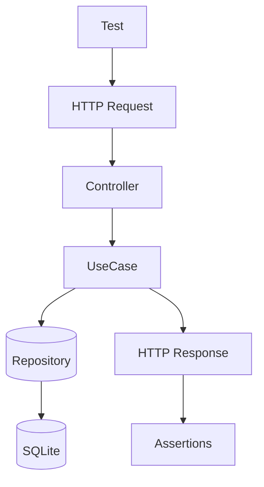

# Этап <X>. <Краткое название> — план для тестирования

## Цель этапа

- Что проверяем в этом этапе: …
- Какие критерии приемки закрываем: …

## Общие принципы тестирования

- Типы тестов: Unit, Integration, E2E.
- Разделяй ответственность тестов:
  - Unit — доменные правила/DTO/валидации без внешних зависимостей.
  - Integration — связка команд/запросов/репозиториев с БД.
  - E2E — HTTP-флоу от роутинга до ответа.

## Структура тестовых файлов

ModelFactory:

- `backend/tests/Stub/<ModuleName>/...Factory.php` — ...

Unit:

- `backend/tests/Suite/<ModuleName>/Domain/Entity/...Test.php` — ...
- `backend/tests/Suite/<ModuleName>/Domain/ValueObject/...Test.php` — ...

Integration:

- `backend/tests/Suite/<ModuleName>/Application/UseCase/...UseCaseTest.php` — ...
- `backend/tests/Suite/<ModuleName>/Infrastructure/Repository/...RepositoryTest.php` — ...

E2E:

- `backend/tests/Suite/<ModuleName>/Presentation/Http/Controller/...ControllerTest.php` — ...

## Сценарии

### Unit

1. **<Название сценария>**
   - Дано: …
   - Проверяемое: …
   - Ожидаемый результат: …

### Integration

1. **<Название сценария>**
   - Дано: …
   - Проверяемое: …
   - Ожидаемый результат: …

### E2E

1. **<Название сценария>**
   - Дано: …
   - Проверяемое: …
   - Ожидаемый результат: …

## Матрица покрытия требований

> Сопоставь критерии приемки из Spec.md с тестами.

- AC-1: … → `<TestClass>::<testMethod>()`
- AC-2: … → `<TestClass>::<testMethod>()`

## Диаграмма тестируемого потока (Mermaid)

> Диаграмма помогает тестировщику быстро понять, где проверять эффекты (БД/ответ/сайд-эффекты).

## Общие рекомендации

- Используй фабрики/фикстуры из проекта (если есть).
- Фиксируй время (если важно) и избегай флакки-тестов.
- Для E2E — проверяй не только статус-код, но и payload/контент.
