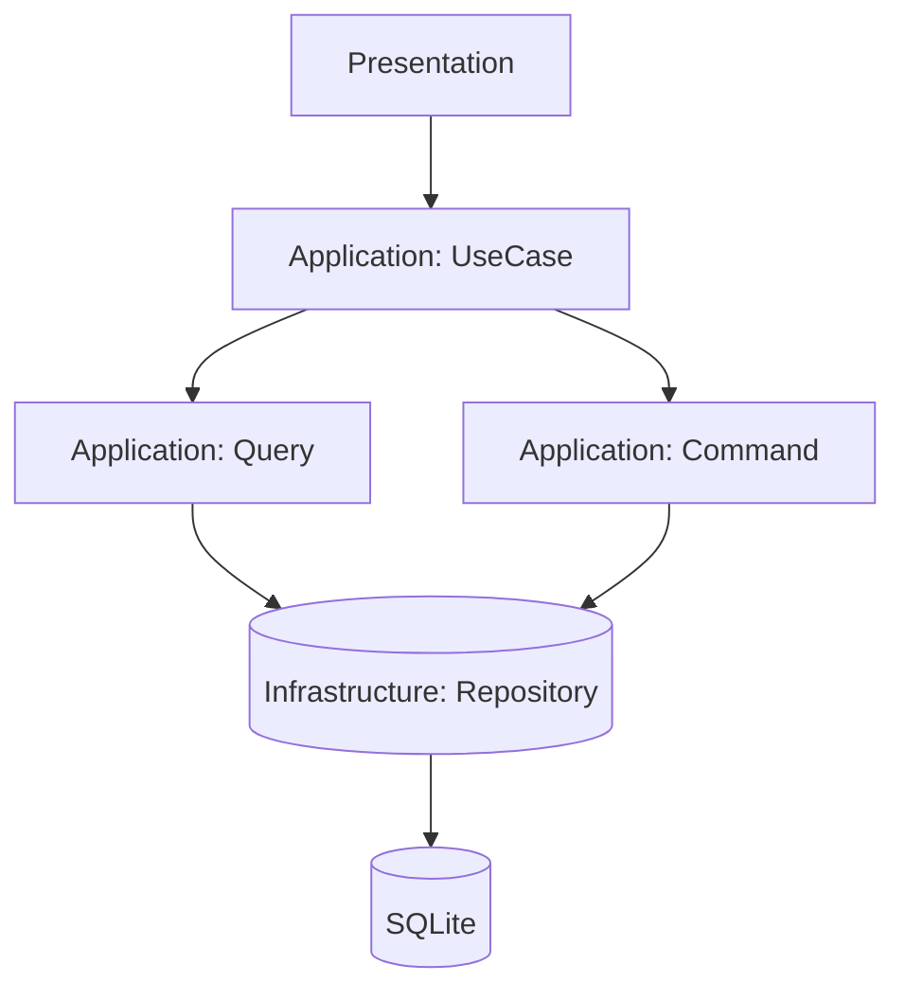

# Этап <X>. <Название фичи/подсистемы>

## Обзор

> Кратко опиши, что реализуем по [Spec.md](../FeatureList/{YYYY}/{MM}/{ISSUE_FOLDER}/Spec.md):

- Цель: …
- Пользовательская ценность: …
- Границы (вне scope): …

## Быстрая справка

- Кол-во задач: <N>
- Оценка времени: <X–Y часов> (ориентир)
- Зависимости: <миграции/модули/внешние сервисы>

## Связь с архитектурой и правилами

- Архитектура: [Architecture.md](/.ai/rules/Architecture.md)
- Процесс добавления фич: [FeatureWorkflow.md](/.ai/rules/FeatureWorkflow.md)
- PHP-правила: [CodeHints.md](/.ai/rules/CodeHints.md)
- Рекомендации по написанию тестов в [Testing.md](/.ai/rules/TestingHints.md)

## Структура модулей

> Краткое описание создаваемого или изменяемого модуля или модулей проекта.

## Номер задачи по реализации

> Каждый этап должен быть реализуем за один сеанс AI-агента.

Пример:

```markdown
1. **Задача <N>: <краткое название>**
   - <Описание функционала, которое будет реализовано>
   - [План для разработчика](TaskList/Task<N>_TaskForDev.md) | [План для тестирования](TaskList/Task<N>_TaskForTest.md)
```

## Диаграмма потока данных (Mermaid)

> Диаграмма должна дополнять текст (не заменять).
> Минимизируй количество узлов, используй названия слоев/компонентов проекта.
> Если требуется, то дополнительные файлы документации следует создавать в `/backend/src/{MODULE_FOLDER}/Domain/Doc`.



## Примечания

- Риски/ограничения: …
- Альтернативы (если есть): …
