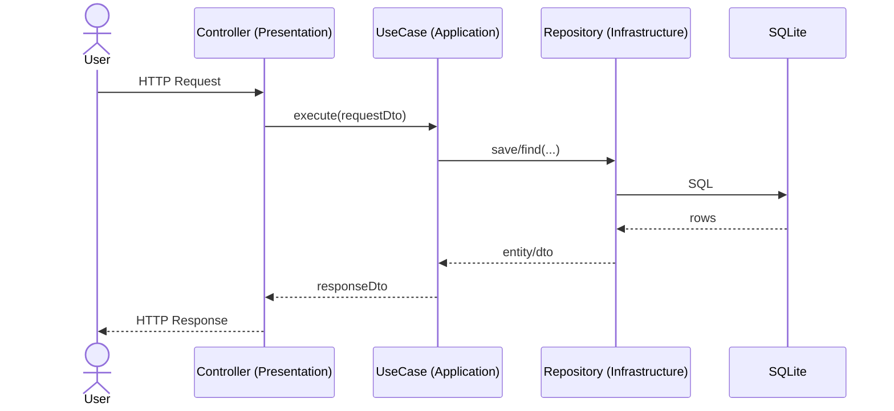

# Этап <X>. <Краткое название> — план для разработчика

## Цель этапа

- Что добавляем/меняем в этом этапе: …
- Что является критерием готовности: …

## Общие архитектурные принципы

- Clean Architecture, CQRS, модульный монолит, Laravel.
- Не смешивать ответственность слоёв (Domain/Application/Infrastructure/Presentation).
- Стабильные контракты между слоями: интерфейсы, DTO, исключения.

## Архитектурные решения

> Опиши, какие компоненты добавляются и где:

- **Domain**: Entity/ValueObject, доменные правила, доменные исключения, доменные события (если нужны).
- **Application**: Command/Query, UseCase, DTO, маппинг между слоями.
- **Infrastructure**: Eloquent/DBAL реализации репозиториев, миграции, интеграции.
- **Presentation**: Controllers/Requests/Resources/Routes/Policies.

## Структура модулей

1. Модуль: `<ModuleName>`

- Публичные точки входа: `<UseCase/Controller>`
- Зависимости от других модулей: …

## Модель предметной области

> Перечисли:

- **Сущности**: …
- **Value Objects**: …
- **DTO** (Application): …
- **Исключения**: …
- **Интерфейсы** (репозитории/шлюзы): …

## Контракты и потоки данных (Mermaid)

> Диаграмма нужна, чтобы быстро понять поток данных без чтения всего текста.
> Рекомендации:

- `flowchart TD` — для потока данных и трансформаций.
- `sequenceDiagram` — для шагов use-case (включая валидацию, авторизацию, обращение к репозиторию).

> Пример (sequence):

## Изменяемые файлы

> Список должен быть полным: что создать и что изменить.

Создать:

- `backend/src/<ModuleName>/...` — …
- `backend/database/migrations/...` — …

Изменить:

- `backend/routes/...` — …
- `backend/src/<ModuleName>/...` — …

## Последовательность действий

1. Doman слой:
   - …
2. Application слой:
   - …
3. Infrastructure слой:
   - …
4. Presentation слой:
   - …

## Риски и альтернативы

- Риск: … → Митигировать: …
- Альтернатива: … (почему не выбрали)

## Чек-лист архитектурного соответствия

- [ ] CQRS: команды не возвращают доменные сущности напрямую
- [ ] Domain не зависит от Laravel/Infrastructure
- [ ] Application зависит от Domain, но не от Presentation
- [ ] Infrastructure реализует интерфейсы Application/Domain
- [ ] Контроллер тонкий: оркестрация, валидация, вызов UseCase
- [ ] Все публичные контракты задокументированы (DTO/PHPDoc)
