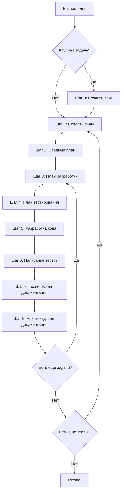

# Quick Start Guide: Мультиагентная разработка

Это практическое руководство покажет полный цикл разработки от бизнес-идеи до готового кода с тестами.

## Пример: Калькулятор валют

**Бизнес-потребность**: "Пользователи хотят конвертировать валюты в режиме реального времени для расчета стоимости
товаров в разных валютах."

## Анализ масштаба задачи

**Вопрос**: Нужен ли эпик или можно сразу создать фичу?

**Критерии для эпика**:

- Задача требует нескольких этапов реализации
- Нужно показывать промежуточные результаты стейкхолдерам
- Функционал можно разбить на независимые части

**Критерии для фичи**:

- Задача небольшая, можно реализовать за 1-2 этапа
- Не требуется поэтапная демонстрация
- Функционал атомарный

**Наш случай**: Калькулятор валют можно разбить на этапы (базовая конвертация → кеширование курсов → история
конвертаций), поэтому создаем **эпик**.

---

## Путь 1: Крупная задача (через эпик)

### Шаг 0: Создание эпика

**Команда**:

<!-- markdownlint-disable line-length -->
```bash
/ra-create-epic FD-100 "Пользователи хотят конвертировать валюты в режиме реального времени для расчета стоимости товаров в разных валютах"
```
<!-- markdownlint-restore -->

**Что происходит**:

1. Оркестратор запускает агента `epic-writer`
2. Агент создает структуру:

```text
/Doc/Backlog/2026/FD-100_Currency-Calculator/
├── EpicSummary.md
├── Stage1.md  # Базовая конвертация валют
├── Stage2.md  # Кеширование и обновление курсов
└── Stage3.md  # История конвертаций пользователя
```

1. Агент проводит самопроверку
2. Оркестратор запускает `markdownlint` для каждого файла

**Результат**: Получаем описание эпика с разбивкой на 3 этапа.

**Пример содержимого** EpicSummary.md:

```markdown
# Эпик: Калькулятор валют

## Бизнес-цель

Предоставить пользователям возможность конвертации валют в режиме реального времени...

## Этапы реализации

1. [Этап 1: Базовая конвертация валют](Stage1.md) - Приоритет: ВЫСОКИЙ
2. [Этап 2: Кеширование и обновление курсов](Stage2.md) - Приоритет: СРЕДНИЙ
3. [Этап 3: История конвертаций](Stage3.md) - Приоритет: НИЗКИЙ
```

**Ревью и коммит**:

```bash
# Проверьте созданные файлы
# Если всё ок, сделайте коммит в orchestrator:
сделай коммит
```

---

### Шаг 1: Создание спецификации для Этапа 1

**Команда**:

```bash
/ra-create-feature TZ1-101 @/Doc/Backlog/2026/FD-100_Currency-Calculator/EpicSummary.md 1
```

Где:

- `TZ1-101` - номер задачи из таск-трекера для этапа 1
- Путь к EpicSummary.md
- `1` - номер этапа (Stage1.md)

**Что происходит**:

1. Оркестратор запускает агента `feature-writer`
2. Агент создает структуру:

```text
/Doc/FeatureList/2026/02/TZ1-101_Currency-Converter-Basic/
└── Spec.md
```

1. Агент проводит самопроверку
2. Оркестратор запускает `markdownlint`

**Результат**: Получаем детальную спецификацию с функциональными требованиями.

**Пример содержимого** Spec.md:

```markdown
# Спецификация: Базовая конвертация валют

## Описание проблемы

Пользователи не могут конвертировать валюты...

## Функциональные требования

1. Система должна конвертировать сумму из одной валюты в другую
2. Система должна получать актуальные курсы из внешнего API...

## Модель предметной области

- **Entity**: CurrencyConversion
- **ValueObject**: Money, CurrencyCode, ExchangeRate
...
```

**Ревью и коммит**:

```bash
сделай коммит
```

---

### Шаг 2: Создание сводного технического плана

**Когда создавать**: Непосредственно перед разработкой (не заранее!)

**Команда**:

```bash
/ra-create-summary-plan @/Doc/FeatureList/2026/02/TZ1-101_Currency-Converter-Basic/Spec.md
```

**Что происходит**:

1. Оркестратор запускает агента `summary-plan-writer`
2. Агент анализирует Spec.md и архитектуру проекта
3. Создает файл TaskSummary.md с разбивкой на задачи

**Результат**:

```text
/Doc/FeatureList/2026/02/TZ1-101_Currency-Converter-Basic/
├── Spec.md
└── TaskSummary.md
```

**Пример содержимого** TaskSummary.md:

```markdown
# Сводный план разработки

## Архитектурное решение

Используем Clean Architecture + CQRS...

## Список задач

### Задача 1: Создание модели предметной области
- Domain слой: Entity, ValueObject, интерфейсы
- Файлы: CurrencyConversion.php, Money.php...

### Задача 2: Реализация бизнес-логики
- Application слой: Command, Query, UseCase
...
```

**Ревью и коммит**:

```bash
сделай коммит
```

---

### Шаг 3: Создание плана разработки для Задачи 1

**Команда**:

```bash
/ra-create-dev-plan 1 @/Doc/FeatureList/2026/02/TZ1-101_Currency-Converter-Basic
```

Где:

- `1` - номер задачи из TaskSummary.md
- Путь к папке с Spec.md и TaskSummary.md

**Что происходит**:

1. Оркестратор запускает агента `dev-plan-writer`
2. Агент создает детальный план разработки

**Результат**:

```text
/Doc/FeatureList/2026/02/TZ1-101_Currency-Converter-Basic/
├── Spec.md
├── TaskSummary.md
└── TaskList/
    └── Task1_TaskForDev.md
```

**Пример содержимого** Task1_TaskForDev.md:

```markdown
# План разработки: Модель предметной области

## Архитектурные решения

- Модуль: Currency
- Паттерны: ValueObject, Entity
- Слой: Domain

## Последовательность реализации

1. Создать ValueObject Money
   - Файл: backend/src/Currency/Domain/ValueObject/Money.php
   - Код: [детальное описание]

2. Создать ValueObject CurrencyCode
   - Файл: backend/src/Currency/Domain/ValueObject/CurrencyCode.php
...
```

**Ревью и коммит**:

```bash
сделай коммит
```

---

### Шаг 4: Создание плана тестирования для Задачи 1

**Команда**:

```bash
/ra-create-test-plan 1 @/Doc/FeatureList/2026/02/TZ1-101_Currency-Converter-Basic
```

**Что происходит**:

1. Оркестратор запускает агента `test-plan-writer`
2. Агент создает план тестирования со сценариями

**Результат**:

```text
/Doc/FeatureList/2026/02/TZ1-101_Currency-Converter-Basic/
└── TaskList/
    ├── Task1_TaskForDev.md
    └── Task1_TaskForTest.md
```

**Пример содержимого** Task1_TaskForTest.md:

```markdown
# План тестирования: Модель предметной области

## Тестовые файлы

### 1. MoneyTest.php
Путь: backend/tests/Suite/Currency/Domain/ValueObject/MoneyTest.php

**Сценарий 1: Создание денежной суммы**
- Дано: Сумма 100 и код валюты USD
- Проверяемое: Создание объекта Money
- Ожидаемый результат: Объект создан, amount = 100, currency = USD
...
```

**Ревью и коммит**:

```bash
сделай коммит
```

---

### Шаг 5: Разработка кода для Задачи 1

**Команда**:

```bash
/ra-php-implementation 1 @/Doc/FeatureList/2026/02/TZ1-101_Currency-Converter-Basic/TaskSummary.md
```

**Что происходит** (автоматически):

1. Агент `php-developer` создает код согласно Task1_TaskForDev.md
2. Агент проводит самопроверку
3. Агент `php-auto-fixer` запускает Rector и PHPCBF
4. Агент `phpstan-developer` проверяет типы
5. Агент `phpcs-developer` проверяет стиль кода

**Результат**: Созданы файлы PHP в `/backend/src/Currency/`

**Ревью и коммит**:

```bash
# Проверьте созданный код
# Если всё ок:
сделай коммит
```

---

### Шаг 6: Написание тестов для Задачи 1

**Команда**:

```bash
/ra-php-test-implementation 1 @/Doc/FeatureList/2026/02/TZ1-101_Currency-Converter-Basic/TaskSummary.md
```

**Что происходит** (автоматически):

1. Агент `php-test-developer` создает тесты согласно Task1_TaskForTest.md
2. Агент запускает PHPUnit
3. Агент проводит самопроверку
4. Агент `php-auto-fixer` исправляет стиль
5. Агент `phpstan-developer` проверяет типы
6. Агент `phpcs-developer` проверяет стиль
7. Агент повторно запускает PHPUnit для проверки

**Результат**: Созданы тесты в `/backend/tests/Suite/Currency/`, все тесты проходят.

**Ревью и коммит**:

```bash
сделай коммит
```

---

### Повторить Шаги 3-8 для остальных задач

Для каждой задачи из TaskSummary.md повторяем:

- Шаг 3: Создание плана разработки (`/ra-create-dev-plan`)
- Шаг 4: Создание плана тестирования (`/ra-create-test-plan`)
- Шаг 5: Разработка кода (`/ra-php-implementation`)
- Шаг 6: Написание тестов (`/ra-php-test-implementation`)
- Шаг 7: Создание технической документации (`/ra-create-tech-doc`)
- Шаг 8: Создание архитектурной документации (`/ra-create-arch-doc`)

---

### Шаг 7: Создание технической документации

**Когда**: После завершения всех задач для этапа.

**Команда**:

```bash
/ra-create-tech-doc @/Doc/FeatureList/2026/02/TZ1-101_Currency-Converter-Basic
```

**Что происходит**:

1. Агент `tech-doc-writer` анализирует реализованный код
2. Создает Readme.md для модуля Currency

**Результат**:

```text
/backend/src/Currency/
└── Readme.md  (с описанием архитектуры, API, примерами)
```

**Ревью и коммит**:

```bash
сделай коммит
```

---

### Шаг 8: Создание архитектурной документации

**Команда**:

```bash
/ra-create-arch-doc @/Doc/FeatureList/2026/02/TZ1-101_Currency-Converter-Basic
```

**Что происходит**:

1. Агент `arch-doc-writer` обновляет документацию DocHub
2. Добавляет компоненты, контексты, аспекты

**Результат**:

```text
/backend/src/Currency/
└── dochub.yaml

/Doc/Dochub/
├── Component/dochub.yaml  (обновлен)
├── Context/dochub.yaml    (обновлен)
└── Aspect/dochub.yaml     (обновлен)
```

**Ревью и коммит**:

```bash
сделай коммит
```

---

### Повторить для остальных этапов эпика

Для Stage 2 и Stage 3 повторяем весь цикл начиная с Шага 1.

---

## Путь 2: Небольшая задача (напрямую через фичу)

Если задача небольшая и не требует разбивки на этапы, **пропускаем Шаг 0** (создание эпика).

### Пример: Добавление кнопки "Экспорт в PDF"

**Команда**:

```bash
/ra-create-feature TZ1-150 "Добавить кнопку экспорта отчета в PDF"
```

**Далее**: Продолжаем с Шага 2 (создание сводного плана).

---

## Визуальная схема workflow



---

## Чеклист для каждого шага

### После создания эпика

- [ ] EpicSummary.md содержит все обязательные разделы
- [ ] Этапы приоритизированы корректно
- [ ] Для каждого этапа создан файл StageX.md
- [ ] Описание понятно нетехническому пользователю
- [ ] Коммит сделан

### После создания фичи

- [ ] Spec.md содержит все обязательные разделы
- [ ] Функциональные требования четко сформулированы
- [ ] Модель предметной области описана
- [ ] Сценарии использования приведены
- [ ] Коммит сделан

### После создания сводного плана

- [ ] TaskSummary.md содержит архитектурное решение
- [ ] Задачи последовательны и атомарны
- [ ] Диаграммы понятны
- [ ] Коммит сделан

### После разработки кода

- [ ] Код соответствует плану Task1_TaskForDev.md
- [ ] PHPStan не выдает ошибок
- [ ] PHPCS не выдает ошибок
- [ ] Код следует принципам Clean Architecture
- [ ] Коммит сделан

### После написания тестов

- [ ] Тесты соответствуют плану Task1_TaskForTest.md
- [ ] Все тесты проходят (PHPUnit)
- [ ] Покрытие кода ≥ 75%
- [ ] PHPStan и PHPCS не выдают ошибок
- [ ] Коммит сделан

---

## Типичные проблемы и решения

### Проблема: Агент не может найти файл

**Причина**: Неправильный путь или файл не существует.

**Решение**: Проверьте путь, используйте полный путь от корня репозитория.

### Проблема: PHPStan выдает много ошибок

**Причина**: Агент не учел все типы.

**Решение**: Агент `phpstan-developer` автоматически исправит. Если не помогло, запустите повторно.

### Проблема: Тесты не проходят

**Причина**: Код не соответствует ожиданиям тестов или тесты написаны неправильно.

**Решение**: Проверьте вручную, исправьте код или тесты, затем перезапустите `/ra-php-test-implementation`.

### Проблема: Агент задает слишком много вопросов

**Причина**: Недостаточно информации в исходном запросе.

**Решение**: Предоставьте более детальное описание бизнес-потребности сразу.

---

## Оценка времени

Для справки (может варьироваться):

| Этап | Время (примерно) |
|------|------------------|
| Шаг 0: Создание эпика | 5-10 минут |
| Шаг 1: Создание фичи | 5-10 минут |
| Шаг 2: Сводный план | 5-15 минут |
| Шаг 3: План разработки (одна задача) | 3-7 минут |
| Шаг 4: План тестирования (одна задача) | 3-7 минут |
| Шаг 5: Разработка кода (одна задача) | 10-30 минут |
| Шаг 6: Написание тестов (одна задача) | 10-30 минут |
| Шаг 7: Техническая документация | 10-20 минут |
| Шаг 8: Архитектурная документация | 10-20 минут |

**Итого для этапа с 3 задачами**: ~2-4 часа (с учетом ревью и коммитов).

---

## Следующие шаги

После освоения базового workflow:

1. Изучите [подробную документацию агентов](../agents/)
2. Изучите [правила архитектуры](../rules/Architecture.md)
3. Изучите [шаблоны файлов](../agents/Template/)
4. Адаптируйте workflow под свой проект

---

## Полезные ссылки

- [Основная документация](../Readme.md)
- [Описание всех команд](../commands/)
- [Примеры заполненных файлов](./filled-examples/)
