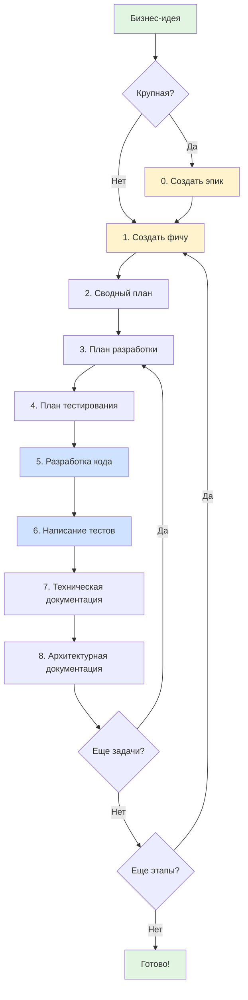

# Примеры и руководства

Эта папка содержит практические руководства и примеры для быстрого старта с мультиагентной разработкой.

## Начало работы

### Новичкам

Если вы впервые используете систему мультиагентной разработки:

1. **Начните с** [Quick Start Guide](QuickStartGuide.md)
   - Полное пошаговое руководство с примерами
   - Визуальные схемы workflow
   - Оценка времени на каждый этап

2. **Используйте** [Quick Start Checklist](QuickStartChecklist.md)
   - Краткий чек-лист для быстрой навигации
   - Список команд для каждого шага
   - Критерии завершения

3. **Изучите** [примеры заполненных файлов](filled-examples/)
   - Реальные примеры EpicSummary.md, Spec.md, TaskSummary.md
   - Понимание структуры и содержания
   - Шаблоны для копирования

4. **Обратитесь к** [FAQ](FAQ.md) при возникновении вопросов
   - Часто задаваемые вопросы
   - Типичные проблемы и решения
   - Советы по оптимизации

---

## Структура документации

```text
.ai/examples/
├── README.md                          # Этот файл - точка входа
├── QuickStartGuide.md                 # Подробное пошаговое руководство
├── QuickStartChecklist.md             # Краткий чек-лист
├── FAQ.md                             # Часто задаваемые вопросы
└── filled-examples/                   # Примеры заполненных файлов
    ├── README.md                      # Описание примеров
    ├── EpicSummary-example.md         # Пример эпика
    ├── Spec-example.md                # Пример спецификации
    └── TaskSummary-example.md         # Пример технического плана
```

---

## Быстрый старт

### Крупная задача (через эпик)

```bash
# Шаг 0: Создать эпик
/ra-create-epic FD-100 "Описание бизнес-потребности"

# Шаг 1: Создать спецификацию для этапа
/ra-create-feature TZ1-101 @/Doc/Backlog/2026/FD-100_Feature/EpicSummary.md 1

# Шаг 2: Создать сводный план (перед разработкой!)
/ra-create-summary-plan @/Doc/FeatureList/2026/02/TZ1-101_Feature/Spec.md

# Шаги 3-8: Для каждой задачи из сводного плана
/ra-create-dev-plan 1 @/Doc/FeatureList/2026/02/TZ1-101_Feature
/ra-create-test-plan 1 @/Doc/FeatureList/2026/02/TZ1-101_Feature
/ra-php-implementation 1 @/Doc/FeatureList/2026/02/TZ1-101_Feature/TaskSummary.md
/ra-php-test-implementation 1 @/Doc/FeatureList/2026/02/TZ1-101_Feature/TaskSummary.md
/ra-create-tech-doc @/Doc/FeatureList/2026/02/TZ1-101_Feature
/ra-create-arch-doc @/Doc/FeatureList/2026/02/TZ1-101_Feature
```

### Небольшая задача (напрямую)

```bash
# Шаг 1: Создать спецификацию
/ra-create-feature TZ1-150 "Описание небольшой задачи"

# Далее: Шаги 2-8 из примера выше
```

---

## Примеры использования

### Пример 1: Калькулятор валют

См. [QuickStartGuide.md](QuickStartGuide.md#пример-калькулятор-валют)

**Что демонстрирует**:

- Создание эпика с 3 этапами
- Приоритизация этапов
- Полный цикл разработки от идеи до кода

### Пример 2: Экспорт в PDF

**Команда**:

```bash
/ra-create-feature TZ1-200 "Добавить кнопку экспорта отчета в PDF формат"
```

**Что демонстрирует**:

- Небольшая задача без эпика
- Быстрый старт с фичи

---

## Структура файлов после работы

### После создания эпика

```text
Doc/Backlog/2026/FD-100_Currency-Calculator/
├── EpicSummary.md
├── Stage1.md
├── Stage2.md
└── Stage3.md
```

### После создания фичи

```text
Doc/FeatureList/2026/02/TZ1-101_Currency-Converter-Basic/
└── Spec.md
```

### После создания технических планов

```text
Doc/FeatureList/2026/02/TZ1-101_Currency-Converter-Basic/
├── Spec.md
├── TaskSummary.md
└── TaskList/
    ├── Task1_TaskForDev.md
    ├── Task1_TaskForTest.md
    ├── Task2_TaskForDev.md
    └── Task2_TaskForTest.md
```

### После разработки

```text
backend/src/Currency/
├── Domain/
│   ├── Entity/
│   ├── ValueObject/
│   ├── Repository/
│   └── Exception/
├── Application/
│   ├── Command/
│   ├── DTO/
│   └── UseCase/
├── Infrastructure/
│   └── ExchangeRate/
├── Presentation/
│   └── Http/
├── dochub.yaml
└── Readme.md

backend/tests/Suite/Currency/
├── Domain/
├── Application/
└── Infrastructure/
```

---

## Визуальная схема полного цикла



---

## Оценка времени

| Задача | Время |
|--------|-------|
| Шаг 0: Создание эпика | 5-10 мин |
| Шаг 1: Создание фичи | 5-10 мин |
| Шаг 2: Сводный план | 5-15 мин |
| Шаг 3: План разработки (1 задача) | 3-7 мин |
| Шаг 4: План тестирования (1 задача) | 3-7 мин |
| Шаг 5: Разработка кода (1 задача) | 10-30 мин |
| Шаг 6: Написание тестов (1 задача) | 10-30 мин |
| Шаг 7: Техническая документация | 10-20 мин |
| Шаг 8: Архитектурная документация | 10-20 мин |

**Этап с 3 задачами**: ~3-4.5 часа

**Эпик из 3 этапов**: ~10.5-13.5 часов

---

## Чеклист первого запуска

- [ ] Прочитал основную [документацию](../Readme.md)
- [ ] Прочитал [Quick Start Guide](QuickStartGuide.md)
- [ ] Посмотрел [примеры файлов](filled-examples/)
- [ ] Распечатал или открыл [Checklist](QuickStartChecklist.md)
- [ ] Установлен Claude Code CLI
- [ ] Настроен проект (git, окружение)
- [ ] Готов создать первый эпик или фичу!

---

## Типичные ошибки новичков

### ❌ Не делайте так

1. **Создавать все планы сразу** - создавайте перед разработкой
2. **Пропускать ревью** - всегда проверяйте результаты агентов
3. **Игнорировать ошибки** - исправляйте PHPStan/PHPCS сразу
4. **Документация в конце проекта** - создавайте после каждого этапа

### ✅ Делайте так

1. **Создавайте планы перед разработкой** - только когда готовы начать
2. **Ревью после каждого шага** - проверяйте, что получилось
3. **Исправляйте ошибки сразу** - не копите технический долг
4. **Документация по ходу** - после реализации этапа

---

## Поддержка и помощь

**Если застряли**:

1. Проверьте [FAQ](FAQ.md)
2. Перечитайте [Quick Start Guide](QuickStartGuide.md)
3. Посмотрите [примеры](filled-examples/)
4. Создайте issue в репозитории

**Дополнительные ресурсы**:

- [Основная документация](../Readme.md)
- [Документация агентов](../agents/)
- [Документация команд](../commands/)
- [Правила архитектуры](../rules/Architecture.md)

---

## Следующие шаги

После освоения Quick Start:

1. **Изучите детали агентов** - [Документация агентов](../agents/)
2. **Настройте под свой проект** - Адаптируйте правила и шаблоны
3. **Оптимизируйте workflow** - Автоматизируйте повторяющиеся действия
4. **Поделитесь опытом** - Создайте свои примеры и кейсы

---

## Обратная связь

Ваши отзывы важны для улучшения документации!

- Что неясно в руководствах?
- Каких примеров не хватает?
- Какие проблемы встретили?

Создавайте issues в репозитории проекта.

---

**Готовы начать?** → Откройте [Quick Start Guide](QuickStartGuide.md)
