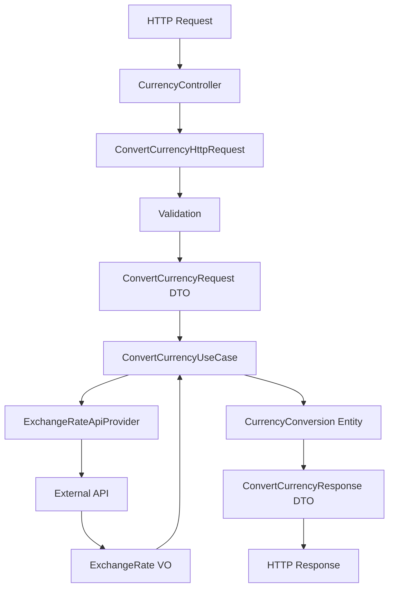
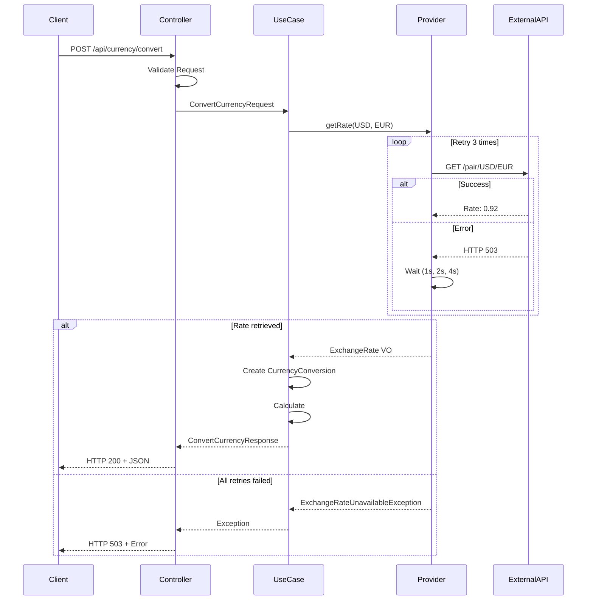

# Сводный технический план: Базовая конвертация валют

## Обзор

Реализация модуля Currency для конвертации валют с использованием Clean Architecture, CQRS и модульного монолита.

## Архитектурное решение

### Выбранный подход

**Архитектура**: Clean Architecture + CQRS + Модульный монолит

**Структура модуля**:

```text
backend/src/Currency/
├── Domain/
│   ├── Entity/
│   │   └── CurrencyConversion.php
│   ├── ValueObject/
│   │   ├── Money.php
│   │   ├── CurrencyCode.php
│   │   └── ExchangeRate.php
│   ├── Repository/
│   │   └── ExchangeRateProviderInterface.php
│   └── Exception/
│       ├── UnsupportedCurrencyException.php
│       ├── SameCurrencyException.php
│       ├── InvalidAmountException.php
│       └── ExchangeRateUnavailableException.php
├── Application/
│   ├── Command/
│   │   ├── ConvertCurrencyCommand.php
│   │   └── ConvertCurrencyCommandHandler.php
│   ├── DTO/
│   │   ├── ConvertCurrencyRequest.php
│   │   └── ConvertCurrencyResponse.php
│   └── UseCase/
│       └── ConvertCurrencyUseCase.php
├── Infrastructure/
│   └── ExchangeRate/
│       └── ExchangeRateApiProvider.php
└── Presentation/
    └── Http/
        ├── Controller/
        │   └── CurrencyController.php
        ├── Request/
        │   └── ConvertCurrencyHttpRequest.php
        └── Config/routes.php
```

### Потоки данных



### Принятые решения

**1. Использование ValueObject для Money**

- Обеспечивает инкапсуляцию и валидацию денежных сумм
- Исключает ошибки с неявным типом (float vs decimal)

**2. Retry механизм в Infrastructure**

- 3 попытки с экспоненциальным backoff
- Реализация в ExchangeRateApiProvider, не в Domain

**3. Separation of Concerns**

- Domain: чистая бизнес-логика
- Application: оркестрация и преобразование DTO
- Infrastructure: работа с внешним API
- Presentation: HTTP обработка и валидация

**4. Исключения на уровне Domain**

- Бизнес-правила выбрасывают Domain исключения
- Infrastructure преобразует технические ошибки в Domain исключения

## Список задач

### Задача 1: Создание модели предметной области (Domain)

**Описание**: Создать Entity, ValueObject и интерфейсы в Domain слое.

**Файлы для создания**:

- `backend/src/Currency/Domain/ValueObject/Money.php`
- `backend/src/Currency/Domain/ValueObject/CurrencyCode.php`
- `backend/src/Currency/Domain/ValueObject/ExchangeRate.php`
- `backend/src/Currency/Domain/Entity/CurrencyConversion.php`
- `backend/src/Currency/Domain/Repository/ExchangeRateProviderInterface.php`
- `backend/src/Currency/Domain/Exception/UnsupportedCurrencyException.php`
- `backend/src/Currency/Domain/Exception/SameCurrencyException.php`
- `backend/src/Currency/Domain/Exception/InvalidAmountException.php`
- `backend/src/Currency/Domain/Exception/ExchangeRateUnavailableException.php`

**Зависимости**: Нет

**Критерии выполнения**:

- [ ] Все ValueObject иммутабельны
- [ ] Валидация в конструкторах ValueObject
- [ ] Entity CurrencyConversion содержит бизнес-логику конвертации
- [ ] Интерфейс ExchangeRateProviderInterface определен в Domain
- [ ] Исключения extends базовых Domain исключений

**Приоритет**: ВЫСОКИЙ (блокирует остальные задачи)

---

### Задача 2: Реализация бизнес-логики (Application)

**Описание**: Создать UseCase, Command, Handler и DTO в Application слое.

**Файлы для создания**:

- `backend/src/Currency/Application/DTO/ConvertCurrencyRequest.php`
- `backend/src/Currency/Application/DTO/ConvertCurrencyResponse.php`
- `backend/src/Currency/Application/Command/ConvertCurrencyCommand.php`
- `backend/src/Currency/Application/Command/ConvertCurrencyCommandHandler.php`
- `backend/src/Currency/Application/UseCase/ConvertCurrencyUseCase.php`

**Зависимости**: Задача 1 (Domain слой)

**Критерии выполнения**:

- [ ] DTO содержат только данные, без логики
- [ ] UseCase оркестрирует работу Domain
- [ ] Command и Handler следуют CQRS паттерну
- [ ] Обработка исключений на уровне Application

**Приоритет**: ВЫСОКИЙ

---

### Задача 3: Интеграция с внешним API (Infrastructure)

**Описание**: Реализовать ExchangeRateApiProvider для работы с exchangerate-api.com.

**Файлы для создания**:

- `backend/src/Currency/Infrastructure/ExchangeRate/ExchangeRateApiProvider.php`
- `backend/config/currency.php` (конфигурация)
- Добавить в `.env.example`: `EXCHANGE_RATE_API_KEY=`

**Зависимости**: Задача 1 (Domain интерфейс)

**Критерии выполнения**:

- [ ] Реализует ExchangeRateProviderInterface из Domain
- [ ] HTTP запросы через Guzzle с таймаутом 5 секунд
- [ ] Retry механизм (3 попытки, экспоненциальный backoff)
- [ ] Обработка HTTP ошибок (401, 429, 500, 503)
- [ ] Логирование запросов и ошибок
- [ ] API ключ загружается из env

**Приоритет**: ВЫСОКИЙ

---

### Задача 4: HTTP API (Presentation)

**Описание**: Создать Controller, HTTP Request и маршруты.

**Файлы для создания**:

- `backend/src/Currency/Presentation/Http/Controller/CurrencyController.php`
- `backend/src/Currency/Presentation/Http/Request/ConvertCurrencyHttpRequest.php`
- `backend/src/Currency/Presentation/Http/Config/routes.php`

**Изменяемые файлы**:

- `backend/routes/api.php` (подключение модульных маршрутов)

**Зависимости**: Задача 2 (Application UseCase)

**Критерии выполнения**:

- [ ] Controller тонкий, только вызывает UseCase
- [ ] FormRequest валидирует входные данные
- [ ] Маршрут: `POST /api/currency/convert`
- [ ] Response в формате JSON
- [ ] HTTP коды: 200 (успех), 400 (валидация), 503 (API недоступен)

**Приоритет**: СРЕДНИЙ

---

### Задача 5: Регистрация сервисов (Dependency Injection)

**Описание**: Настроить Service Provider для модуля Currency.

**Файлы для создания**:

- `backend/src/Currency/Presentation/Config/CurrencyServiceProvider.php`

**Изменяемые файлы**:

- `backend/config/app.php` (регистрация провайдера)

**Зависимости**: Задачи 1-4 (все предыдущие)

**Критерии выполнения**:

- [ ] ExchangeRateProviderInterface → ExchangeRateApiProvider в контейнере
- [ ] Загрузка конфигурации модуля
- [ ] Регистрация маршрутов
- [ ] Провайдер зарегистрирован в app.php

**Приоритет**: СРЕДНИЙ

---

## Диаграмма взаимодействия



## Конфигурация

**Переменные окружения** (добавить в `.env.example`):

```env
# Currency module
EXCHANGE_RATE_API_KEY=your_api_key_here
EXCHANGE_RATE_API_URL=https://v6.exchangerate-api.com/v6
EXCHANGE_RATE_TIMEOUT=5
EXCHANGE_RATE_RETRY_ATTEMPTS=3
```

**Файл конфигурации** (`backend/config/currency.php`):

```php
return [
    'exchange_rate' => [
        'api_key' => env('EXCHANGE_RATE_API_KEY'),
        'api_url' => env('EXCHANGE_RATE_API_URL', 'https://v6.exchangerate-api.com/v6'),
        'timeout' => env('EXCHANGE_RATE_TIMEOUT', 5),
        'retry_attempts' => env('EXCHANGE_RATE_RETRY_ATTEMPTS', 3),
    ],
    'supported_currencies' => ['USD', 'EUR', 'RUB', 'CNY', 'GBP', 'JPY'],
];
```

## Тестирование

**Структура тестов**:

```text
backend/tests/Suite/Currency/
├── Domain/
│   ├── ValueObject/
│   │   ├── MoneyTest.php
│   │   ├── CurrencyCodeTest.php
│   │   └── ExchangeRateTest.php
│   └── Entity/
│       └── CurrencyConversionTest.php
├── Application/
│   └── UseCase/
│       └── ConvertCurrencyUseCaseTest.php
└── Infrastructure/
    └── ExchangeRate/
        └── ExchangeRateApiProviderTest.php
```

**Покрытие**:

- Unit тесты: Domain и Application слои (>85%)
- Integration тесты: Infrastructure (>75%)
- E2E тесты: полный цикл через HTTP (>3 сценария)

## Риски и альтернативы

**Риск 1**: Лимит внешнего API (1500 запросов/месяц в бесплатном плане)

- **Вероятность**: Высокая при активном использовании
- **Влияние**: Критичное (сервис перестанет работать)
- **Митигация**: Этап 2 - добавить кеширование курсов

**Риск 2**: Изменение структуры ответа API

- **Вероятность**: Низкая (стабильный API)
- **Влияние**: Критичное
- **Митигация**: Версионирование API, unit тесты с фикстурами

**Альтернативы**:

1. **Использовать другой провайдер курсов** (fixer.io, currencyapi.com)
   - Плюсы: больше бесплатных запросов
   - Минусы: другая структура API, нужна перереализация Provider
2. **Хранить курсы в БД и обновлять по расписанию**
   - Плюсы: независимость от внешнего API
   - Минусы: сложность, актуальность данных
   - Решение: отложено до Этапа 2

## Критерии завершения

- [ ] Все 5 задач выполнены
- [ ] Unit тесты покрывают >80% кода
- [ ] Integration тесты проходят успешно
- [ ] PHPStan level 8 без ошибок
- [ ] PHPCS без ошибок
- [ ] Документация API создана
- [ ] Конфигурация добавлена в .env.example
- [ ] Модуль успешно интегрирован в приложение
