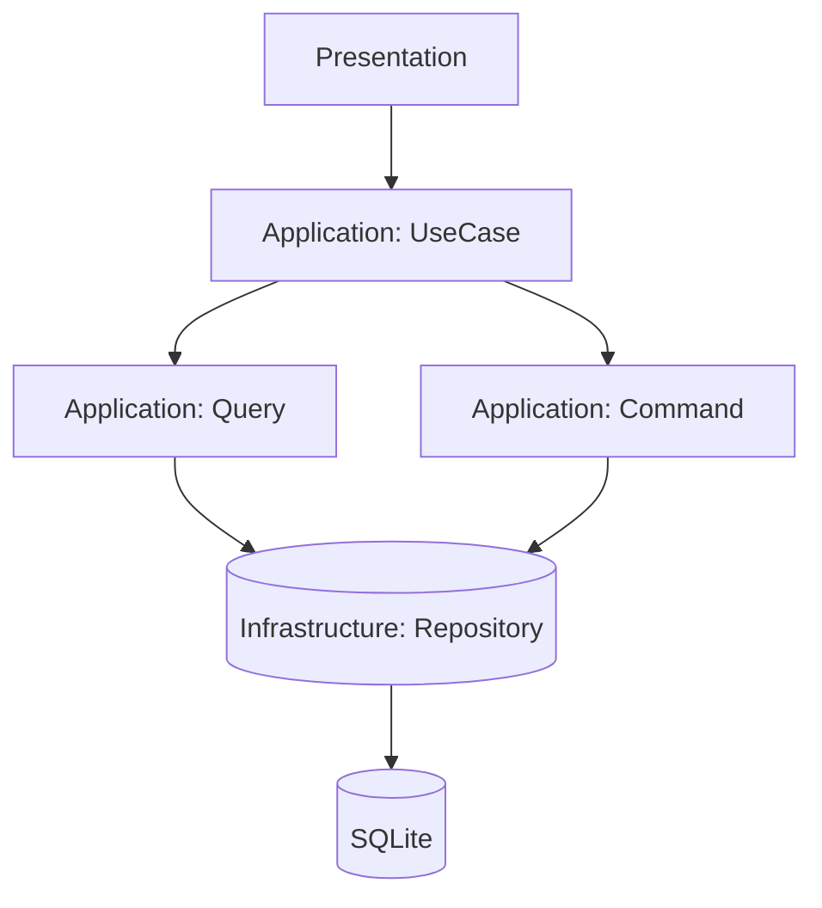

# Этап <X>. <Название фичи/подсистемы>

## Обзор

> Кратко опиши, что реализуем по [Spec.md](../Issue/{YYYY}/{MM}/{ISSUE_FOLDER}/Spec.md):

- Цель: …
- Пользовательская ценность: …
- Границы (вне scope): …

## Быстрая справка

- Кол-во этапов: <N>
- Оценка времени: <X–Y часов> (ориентир)
- Зависимости: <миграции/модули/внешние сервисы>

## Связь с архитектурой и правилами

- Архитектура: [Architecture.md](/.ai/Rule/Architecture.md)
- Процесс добавления фич: [FeatureWorkflow.md](/.ai/Rule/FeatureWorkflow.md)
- PHP-правила: [CodeHints.md](/.ai/Rule/CodeHints.md)
- Рекомендации по написанию тестов в [Testing.md](/.ai/Rule/Testing.md)

## Структура модулей

> Краткое описание создаваемого или изменяемого модуля или модулей проекта.

## Этапы реализации

> Каждый этап должен быть реализуем за один сеанс AI-агента.

Пример:
```markdown
1. **Этап 1: <краткое название>**
   - <краткое описание>
   - [План для разработчика](Stages/Stage1_TaskForDev.md) | [План для тестирования](Stages/Stage1_TaskForTest.md)
```

## Диаграмма потока данных (Mermaid)

> Диаграмма должна дополнять текст (не заменять). 
> Минимизируй количество узлов, используй названия слоев/компонентов проекта.
> Если требуется, то дополнительные файлы документации следует создавать в `/backend/src/{MODULE_FOLDER}/Domain/Doc`.



## Примечания

- Риски/ограничения: …
- Альтернативы (если есть): …
