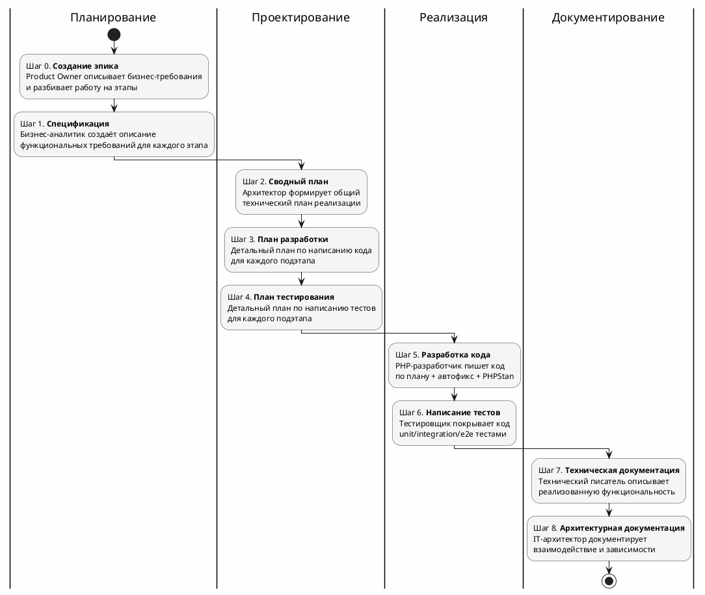
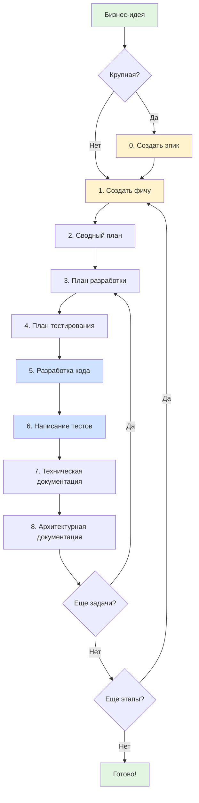

# Мультиагентная разработка: от хотелок до продакшена

## Аннотация


## Вступление

AI плотно входит в нашу жизнь.
Еще год назад, по большей части, использовать AI в работе было затруднительно. Да — можно, но не удобно. <br>
Но к началу 2026 год инструменты работы с AI превратились в хорошего помощника. 
Так что хотим мы этого или нет, а надо учиться работать с новыми инструментами.

Так как я PHP-разработчик, то 90% своего рабочего времени провожу в PHPStorm и первый мой агент-плагин для работы с AI был [zencoder.ai](https://docs.zencoder.ai/features/integration). 

В дальнейшем я пробовал [RooCode](https://docs.roocode.com/), [KiloCode](https://kilo.ai/docs/getting-started), [SourceCraft Code Assistant](https://sourcecraft.dev/portal/code-assistant/). Все 3 плагина для VSCode — братья: настройки и функционала совпадают на 90%.

Потом настала очередь [Claude Code](https://code.claude.com/docs/ru/overview) и [OpenCode](https://opencode.ai/docs). 
Claude Code - основной инструмент, а OpenCode + [z.AI](https://docs.z.ai/devpack/overview) - на подхвате.

Так же пробовал [Cursor](https://cursor.com/docs) и [Antigravity](https://antigravity.google/docs/get-started) — не зашли, в первую очередь, из-за отсутствия агентов. <br>
*А вот к Курсор можно и опять попробовать вернуться - в январе 2026 вышло обновление: [Subagents, Skills, and Image Generation](https://cursor.com/changelog/2-4)

Есть еще [GitHub Copilot](https://code.visualstudio.com/docs/copilot/overview) - это у меня в планах попробовать,
у него в феврале вышло серьезное обновление, в котором завезли агентов, субагентов и другой нечисти.

Однако, независимо от используемого инструмента, у большинства использующих AI для работы возникали, примерно, одинаковые проблемы:

### Проблема 1: AI пишет код настолько правильно, насколько широко и подробно была поставлена задача

Для её решения мировое сообщество выработало подход [Specification-Driven Development](https://github.com/github/spec-kit/blob/main/spec-driven.md) — **спецификация первична, а код вторичен**. 

Самые популярные инструменты для работы с этим подходом это:

- [Spec Kit](https://github.com/github/spec-kit):
  - Спецификации определяют "что", прежде чем код определит "как".
  - Много шаговое уточнение вместо генерации кода из одного промпта.
- [OpenSpec](https://github.com/Fission-AI/OpenSpec):
  - Разделение "источника истины" (`specs/`) и "предложений" (`changes/`).
  - Каждая фича — независимый мини-проект.

Об этих инструментах ранее уже писали:

- [GitHub SpecKit: вайб-кодинг на основе спецификаций](https://habr.com/ru/articles/964368/)
- [Spec Kit от GitHub: как превратить хаотичную работу с AI в структурированную разработку](https://fulcrumlabs.ru/blog/spec-kit-ot-github-kak-prevratit-haotichnuyu-rabotu-s-ai-v-strukturirovannuyu-razrabotku/)
- [Не болтайте ерундой](https://habr.com/ru/articles/983062/)

К сожалению, у меня не получилось встроить SDD в существующие бизнес процессы.
Не укладывается этот подход, когда в команде несколько человек и у каждого своя роль.

### Проблема 2: Размывается фокус или AI забывает часть контекста

Тут приходится искать баланс между длиной контекста, который накапливается как снежный ком при каждом запросе к AI и полнотой описания задачи. 
Те надо максимально детально поставить задачу AI, чтобы получить качественный результат, но при этом AI не должен забывать базовые правила и рекомендации. А это регулярно происходит, даже с крутыми моделями.

И нам на помощь приходит возможность создания кастомных агентов ([claude](https://code.claude.com/docs/ru/sub-agents), [opencode](https://opencode.ai/docs/agents/), [roocode](https://docs.roocode.com/features/custom-modes), [copilot](https://code.visualstudio.com/docs/copilot/agents/subagents), [cursor](https://cursor.com/docs/context/subagents)) и возможность запускать агентов в новом контексте - оркестрировать.

Ключевой принцип: **один агент — одна ответственность**.

Это позволяет:

- Держать промпты компактными — меньше инструкций, меньше ошибок, меньше размытия фокуса.
- Легко отлаживать — понятно, какой агент накосячил.
- Переиспользовать — например, агент `phpstan-developer` работает и после `php-developer`, и после `php-test-developer`.

Второй принцип: **изоляции контекста**.

Каждый агент запускается в чистом контексте. Он не знает, что делали другие агенты — только умеет читать артефакты 
(файлы), которые они создали.

Это даёт несколько преимуществ:

- **Независимость** — агент знает только то что надо для работы, а не весь "снежный ком" взаимодействия с AI.
- **Воспроизводимость** — можно перезапустить любой этап с теми же входными данными.
- **Контроль качества** - выявить и устранить ошибки можно на более ранних этапах, те меньше придется переделывать.

### Проблема 3: Качество кода часто оставляет желать лучшего. Те код работает корректно, но вот поддерживать его в будущем — сложно

Эту проблему можно решить не только обучением AI стандартам принятым в команде, 
но и внедрением автоматических проверок с помощью статических анализаторов кода. <br>
Оркестратор запускает нужных агентов и они сами находят где и что надо исправить без привлечения человека.

### Проблема 4: Не ты владелец кода. И как следствие, не знаешь, как он работает

Как бы дотошно ты ни проводил code review, код остается чужим.
Часто свой код через полгода забываешь, а тут только "рядом стоял". <br>
К сожалению, на момент написания статьи, решения я не нашел.

А ведь так хочется просто написать: "Сделай всё хорошо" :).

## Свой велосипед

На тему субагентов выпущено много материалов, Эти, на мой взгляд, самые информативные:

- [Skills, Sub-agents и Hooks. Как делать Code Review с помощью AI](https://www.youtube.com/watch?v=guSs80sefNo)
- [Мультиагентная разработка в Cursor: как заставить субагентов работать на большие проекты](https://habr.com/ru/articles/971620/)
- [LLM — не один большой «мозг», а команда ролей. Как собрать AI-workflow в Claude Code и уйти от вайб-коддинга](https://habr.com/ru/articles/974924/)
- [Изоляция контекста через субагенты: архитектурный паттерн для долгосрочной работы с Claude Code](https://habr.com/ru/articles/974448/)

Авторы предлагают создавать агентов по навыкам.
И это правильно - чем более узкую специализацию имеет агент, тем лучше он работает.
Сложность, в этом случае, лишь в том, как организовать управляемый процесс передачи артефактов от одного агента к другому.
Тут можно вспомнить про "Specification-Driven Development" - ведь там всё четко структурировано.
Но вопрос: как это интегрировать в существующие бизнес процессы, остается открытым.

И я решил подойти к этому с другой стороны: а что, если "организовать" агентов как обычных сотрудников.<br>
Вернее выстроить полноценный процесс разработки — как в настоящей команде, только с AI-агентами вместо людей.

Ниже я поделюсь своим видением специализированных AI-агентов и организации работы с ними.

### Немного терминов

**Бизнес-потребность** — это цель или идея, для выполнения которой нужно выполнить определённые действия.
Бизнес описывает свою **Боль** или почему это надо сделать.<br>
Например: «Операторы тратят 4 часа в день на ручной перенос данных из Excel в CRM».

**Бизнес-требования** — это высокоуровневые цели, которые бизнес стремится достичь.
Product Owner описывает **Цель** или что надо сделать.<br>
Например: «Автоматизировать синхронизацию данных, чтобы сократить ручной труд до 10 минут в день».

**Функциональные требования** - конкретные действия, которые программа должна выполнять.
Бизнес-аналитик формирует **Решение** или как надо сделать.<br>
Например: «Система должна иметь кнопку "Импорт", принимающую файлы .csv и валидирующую поля А и Б».

**Epic (эпик)** — это крупная пользовательская история.
Описывает значимую функциональность или бизнес-цель, достижение которой приносит ценность продукту.

**Feature (фича)** — это законченная единица функциональности программного продукта, которая приносит измеримую
пользу конечному пользователю или бизнесу.

**Task (задача)** — это конкретная единица работы с чётко определённым результатом, которую можно выполнить за
ограниченное время.

### Вариант структуры хранения артефактов

Артефакты хранятся в `Doc/`:

```markdown
Doc/
├── Backlog/                       # Эпики
│   └── 2026/
│       └── TZ1_Genealogy-Tree-Website/
│           ├── EpicSummary.md     # Описание эпика
│           ├── Stage1.md          # Описание этапа 1
│           └── Stage2.md          # Описание этапа 2
│
└── FeatureList/                   # Фичи
    └── 2026/
        └── 01/
            └── TZ1_01_Database-Schema-Migration/
                ├── Spec.md        # Спецификация
                ├── TaskSummary.md # Сводный план
                └── TaskList/      # Задачи
                    ├── Task1_TaskForDev.md
                    └── Task1_TaskForTest.md
```

### Пример бизнес процесса по разработке программного обеспечения

1. Заказчик рассказывает о своих хотелках (бизнес-потребности).
2. Владелец продукта формализует полученную информацию в бизнес-требования и предлагает поэтапное выполнение.
3. Бизнес аналитик на основе бизнес-требований прорабатывает как будут реализованы предлагаемые фичи.
4. Системный аналитик совместно с IT архитектором составляют общий план разработки фичи.
5. Системный аналитик и техлид формируют список задач командам разработки и тестирования.
6. Разработка программного обеспечения.
7. Тестирование программного обеспечения.
8. Составление технической документации по разработанному функционалу.
9. Обновление документации по архитектуре всей информационной системы.
10. Сдача/приема разработанного функционала заказчику.
11. Сборка ПО для продакшена.
12. Деплой.

И всеми этими процессами управляет проджект-менеджер.

То есть, фактически, каждый пункт из этого списка это отдельная роль, которую можно оформить как prompt для AI.
А в некоторых случая, над решением работают 2 роли одновременно.

### Product Owner

**Product Owner** или «владелец продукта» — это специалист, который представляет интересы бизнеса и пользователей,
отвечая за видение продукта, его ценность и развитие.

**Функция:** [Описание бизнес потребностей и планирование этапов эпика](https://github.com/vendelev/MyDrevo/tree/master/.ai/agents/epic-writer.md)

### Бизнес аналитик

**Бизнес-аналитик** — это специалист, который занимается анализом бизнес-процессов и требований, предлагает решения,
помогая переводить бизнес-идеи в технические решения.

**Функция**: Описание бизнес-требований [prompt](https://github.com/vendelev/MyDrevo/tree/master/.ai/agents/feature-writer.md)

### Системный аналитик + IT архитектор

**Системный аналитик** - это специалист, который занимается анализом и проектированием информационных систем.
Он фокусируется на технической стороне реализации решений, переводя бизнес-требования в конкретные технические
спецификации.

**IT архитектор** — это высококвалифицированный специалист, который проектирует техническую архитектуру системы
(из каких компонентов она состоит и как они взаимодействуют) и отвечает за то,
чтобы решение можно было надежно реализовать и развивать.

**Функция:** [Формирование сводного технического плана](https://github.com/vendelev/MyDrevo/tree/master/.ai/agents/summary-plan-writer.md)

### Системный аналитик + PHP Техлид

**Технический лидер** или «техлид» — это наиболее компетентный инженер в команде, который отвечает за качество
технической реализации проекта.

**Функция:** [Формирование технического плана по разработке кода](https://github.com/vendelev/MyDrevo/tree/master/.ai/agents/dev-plan-writer.md)

### Системный аналитик + Техлид тестировщик

**Функция:** [Формирование технического плана по написанию тестов](https://github.com/vendelev/MyDrevo/tree/master/.ai/agents/test-plan-writer.md)

### PHP разработчик

**Функция:** [Разработка программного кода](https://github.com/vendelev/MyDrevo/tree/master/.ai/agents/php-developer.md)

### Разработчик тестов

**Функция:** [Разработка тестов](https://github.com/vendelev/MyDrevo/tree/master/.ai/agents/php-test-developer.md)

### Технический писатель

**Технический писатель** — это специалист, который собирает информацию о продукте/системе и превращает её в понятную,
точную и структурированную документацию.

**Функция:** [Создание технической документации](https://github.com/vendelev/MyDrevo/tree/master/.ai/agents/tech-doc-writer.md)

### IT архитектор

**Функция:** [Создание архитектурной документации](https://github.com/vendelev/MyDrevo/tree/master/.ai/agents/arch-doc-writer.md)

### Project Manager или Оркестратор

Оркестратор — это не просто еще один агент. Это **точка входа** для человека и **координатор** всей команды агентов.

**Функции:**

1. **Принимает задачу** от человека
2. **Декомпозирует** её на подзадачи для специализированных агентов
3. **Запускает агентов** в правильной последовательности
4. **Передаёт контекст** — указывает агенту, какие файлы читать
5. **Обрабатывает результаты** — анализирует, что агент вернул
6. **Управляет циклами** — если нужна доработка, запускает агента повторно
7. **Останавливается** при блокирующих вопросах и спрашивает человека

Человек остаётся в роли **супервизора**: запускает оркестратора, проводит ревью и принимает решения в неоднозначных 
ситуациях.

#### Паттерн работы с оркестратором

1. Создаём новый контекст
2. Даём команду с указанием агента и входных данных
3. Оркестратор запускает агента, получает результат
4. Запускает второго агента для перепроверки и исправления
5. Проводим ревью, делаем коммит

### Pipeline процесса разработки ПО

Весь процесс разбит на несколько последовательных шагов.



#### Шаг 0. Описание бизнес требований и планирование этапов эпика

**Агент:** `epic-writer` (Product Owner)

Пример команды оркестратору:

```text
/ra-create-epic
Номер эпика: TZ1.
Описание: Создать веб-сайт для ведения семейного генеалогического древа.
Есть заготовка структуры БД в backend/database/migrations/structure.sql.
```

На входе — описание бизнес-потребности от человека.
На выходе — структурированный эпик с разбивкой на этапы реализации, путь к EpicSummary.md.

#### Шаг 1. Описание функциональных требований для каждого этапа

**Агент:** `feature-writer` (Бизнес-аналитик)

Пример команды оркестратору:

```text
/ra-create-feature
Номер задачи: TZ1_01
Путь к эпику: Doc/Backlog/2026/TZ1_Genealogy-Tree-Website/EpicSummary.md
Номер этапа: 1
```

На входе — номер задачи, путь к описанию эпика и номер этапа из эпика.
На выходе — детальная спецификация функциональных требований, путь к Spec.md.

#### Шаг 2. Формирование сводного технического плана

**Агент:** `summary-plan-writer` (Системный аналитик + Архитектор)

Пример команды оркестратору:

```text
/ra-create-summary-plan
Путь к спецификации: Doc/FeatureList/2026/01/TZ1_01_Database-Schema-Migration/Spec.md
```

На входе — путь к файлу со спецификацией функциональных требований.
На выходе — сводный технический план с разбивкой на задачи `TaskSummary.md`.

Рекомендую план создавать **непосредственно перед реализацией**, а не заранее.
Иначе есть шанс, что после реализации предыдущего этапа план устареет.

Так как технический план разбивается на задачи, то Шаги 3-8 повторяются для каждой задачи.

#### Шаги 3-4. Детальные планы

**Агенты:** `dev-plan-writer`, `test-plan-writer`

Пример команды оркестратору для `dev-plan-writer`:

```text
/ra-create-dev-plan
Номер задачи: 1
Путь к папке: Doc/FeatureList/2026/01/TZ1_01_Database-Schema-Migration
```

Пример команды оркестратору для `test-plan-writer`:

```text
/ra-create-test-plan
Номер задачи: 1
Путь к папке: Doc/FeatureList/2026/01/TZ1_01_Database-Schema-Migration
```

На входе — номер задачи из сводного плана и путь к папке с документацией.
На выходе — детальные планы разработки и тестирования:

- `Task1_TaskForDev.md` — что именно кодить, какие классы создавать
- `Task1_TaskForTest.md` — какие тесты писать, какие кейсы покрывать

На этих этапах очень помогла [универсальная структура PHP-проекта](https://habr.com/ru/articles/905008/).<br>
Когда проект имеет:

- **Модульную структуру** — агент понимает границы задачи ("работай только в модуле Person")
- **Слои с чёткими зависимостями** — агент знает, какие классы где создавать
- **Единые правила именования** — агент генерирует консистентный код
- **Статические анализаторы** — PHPStan ловит ошибки типов, которые агент пропустил
- **Проверку стиля кода** — PHPCS и Rector автоматически исправляют форматирование
- **Архитектурные тесты** — автоматическая проверка, что агент не нарушил правила организации модуля

В итоге, оказалось, что чёткая архитектура проекта — это не только "чистый код для людей".
Это ещё и **фундамент для работы AI-агентов**.

#### Шаг 5. Разработка кода

**Агенты:** `php-developer`, `php-auto-fixer`, `phpstan-developer`, `phpcs-developer`

Пример команды оркестратору:

```text
/ra-php-implementation
Номер задачи: 1
Путь к сводному плану: Doc/FeatureList/2026/01/TZ1_01_Database-Schema-Migration/TaskSummary.md
```

На входе — номер задачи из сводного плана и путь к TaskSummary.md.
На выходе — реализованный код с пройденными проверками качества.

Это самый насыщенный этап. Последовательность:

1. `php-developer` — пишет код по плану
2. `php-developer` — самопроверка на соответствие плану
3. `php-auto-fixer` — автоматическое исправление (Rector + PHPCBF)
4. `phpstan-developer` — статический анализ типов и исправление ошибок
5. `phpcs-developer` — исправление code style

Каждый инструмент запускается отдельным агентом.

#### Шаг 6. Написание тестов

**Агенты:** `php-test-developer` + те же инструменты качества

Пример команды оркестратору:

```text
/ra-php-test-implementation
Номер задачи: 1
Путь к сводному плану: Doc/FeatureList/2026/01/TZ1_01_Database-Schema-Migration/TaskSummary.md
```

На входе — номер задачи из сводного плана и путь к TaskSummary.md.
На выходе — тесты с покрытием кода и успешным прохождением PHPUnit.

Это аналогичный процесс как для кода:

1. Написание тестов по плану
2. Самопроверка
3. Автофикс + статический анализ
4. Запуск PHPUnit для проверки

#### Шаги 7-8. Документация

**Агенты:** `tech-doc-writer`, `arch-doc-writer`

Пример команды оркестратору для `tech-doc-writer`:

```text
/ra-create-tech-doc
Путь к папке: Doc/FeatureList/2026/01/TZ1_01_Database-Schema-Migration
```

Пример команды оркестратору для `arch-doc-writer`:

```text
/ra-create-arch-doc
Путь к папке: Doc/FeatureList/2026/01/TZ1_01_Database-Schema-Migration
```

Финальные этапы — создание человекочитаемой документации:

- **TechDoc** — описание функциональности для разработчиков
- **ArchDoc** — архитектурные диаграммы и описание взаимодействий

### Визуальная схема процесса



### Технические детали

Для отладки этого подхода я использовал [Учебный проект по созданию генеалогического древа](https://github.com/vendelev/MyDrevo)

Вся конфигурация мультиагентной системы хранится в папке `.ai/`:

```text
.ai/
├── agents/              # Описание AI-агентов (промпты)
│   ├── Template/        # Шаблоны документов
│   │   ├── TaskSummary.md           # Шаблон сводного технического плана
│   │   ├── TaskX_TaskForDev.md      # Шаблон плана для разработчика
│   │   ├── TaskX_TaskForTest.md     # Шаблон плана для тестировщика
│   │   ├── component-template.yaml  # Шаблон компонента для DocHub
│   │   ├── context-template.yaml    # Шаблон контекста для DocHub
│   │   └── aspect-template.yaml     # Шаблон аспекта для DocHub
│   ├── epic-writer.md          # Product Owner: описание эпиков
│   ├── feature-writer.md       # Бизнес-аналитик: описание фич
│   ├── summary-plan-writer.md  # Системный аналитик + Архитектор: сводный план
│   ├── dev-plan-writer.md      # Системный аналитик + Техлид: план разработки
│   ├── test-plan-writer.md     # Системный аналитик + Техлид тестировщик: план тестирования
│   ├── php-developer.md        # PHP разработчик: написание кода
│   ├── php-test-developer.md   # Разработчик тестов: написание тестов
│   ├── tech-doc-writer.md      # Технический писатель: техническая документация
│   ├── arch-doc-writer.md      # IT архитектор: архитектурная документация
│   ├── php-auto-fixer.md       # Автоисправление кода (Rector + PHPCBF)
│   ├── phpstan-developer.md    # Исправление ошибок PHPStan
│   ├── phpcs-developer.md      # Исправление ошибок PHPCS
│   └── markdownlint.md         # Исправление ошибок Markdown
│
├── commands/            # Команды для оркестрации
│   ├── ra-create-epic.md              # Команда создания эпика (Шаг 0)
│   ├── ra-create-feature.md           # Команда создания фичи (Шаг 1)
│   ├── ra-create-summary-plan.md      # Команда создания сводного плана (Шаг 2)
│   ├── ra-create-dev-plan.md          # Команда создания плана разработки (Шаг 3)
│   ├── ra-create-test-plan.md         # Команда создания плана тестирования (Шаг 4)
│   ├── ra-php-implementation.md       # Команда разработки кода (Шаг 5)
│   ├── ra-php-test-implementation.md  # Команда написания тестов (Шаг 6)
│   ├── ra-create-tech-doc.md          # Команда создания техдокументации (Шаг 7)
│   ├── ra-create-arch-doc.md          # Команда создания арх.документации (Шаг 8)
│   ├── ra-php-auto-fixer.md           # Команда автоисправления кода
│   └── ra-phpcs-developer.md          # Команда исправления code style
│
├── rules/               # Правила разработки
│   ├── Architecture.md              # Clean Architecture, CQRS, модульный монолит
│   ├── ArchitecturalCompromises.md  # Осознанные компромиссы
│   ├── CodeHints.md                 # Рекомендации по работе с PHP
│   ├── CodeStyle.md                 # Принятый стиль кода
│   ├── TestingHints.md              # Рекомендации по написанию тестов
│   └── FeatureWorkflow.md           # Workflow добавления новых фич
│
├── CustomModes.yaml     # Конфигурация кастомных агентов для Roo Code
└── Readme.md            # Главный файл с инструкциями и обзором системы
```

#### 1. Агенты (`agents/`)

Каждый файл в этой папке содержит детальный промпт для специализированного AI-агента.
Промпт описывает роль агента, его функции, входные параметры, последовательность действий и критерии завершения работы.

#### 2. Команды (`commands/`)

Файлы с алгоритмами оркестрации процесса разработки. Каждая команда описывает:

- Последовательность запуска агентов
- Передачу артефактов между агентами
- Точки проверки качества
- Условия остановки при ошибках

Команды соответствуют шагам процесса разработки (0-8).

#### 3. Правила (`rules/`)

Централизованное хранилище всех правил и соглашений проекта:

- **Architecture.md** — архитектурные принципы, структура слоев, правила зависимостей
- **CodeHints.md** — особенности PHP 8.5, работа с типами, null safety
- **CodeStyle.md** — стандарты именования, форматирования, комментирования
- **TestingHints.md** — подходы к тестированию, моки, fixtures, структура тестов
- **FeatureWorkflow.md** — процесс добавления новой функциональности

Эти файлы используются агентами как источники знаний о проекте и гарантируют единообразие кода.

#### Подключение в Claude Code

Создавая папку ".ai" я старался абстрагироваться от конкретного инструмента, тк на вкус и цвет все фломастеры разные.  

На примере Claude Code покажу как ".ai" скрестить с любым инструментом.
Если кому-то интересно, то в учебном проекте настроена интеграция с KiloCode, RooCode, OpenCode и CodeAssistant.

##### 1. Пользователь вызывает команду

```text
/ra-create-epic
Номер эпика: TZ1
Описание: Создать веб-сайт для генеалогического древа
```

##### 2. Claude Code ищет skill

Claude находит файл [.claude/skills/ra-create-epic/SKILL.md](https://github.com/vendelev/MyDrevo/blob/master/.claude/skills/ra-create-epic/SKILL.md):

```markdown
---
name: ra-create-epic
description: Создание эпика — описание бизнес-требований и разбивка на этапы
model: haiku
allowed-tools: Task
---

Инструкции находятся в файле: @.ai/commands/ra-create-epic.md
```

##### 3. Claude читает алгоритм оркестрации

В файле [.ai/commands/ra-create-epic.md](https://github.com/vendelev/MyDrevo/blob/masterhttps://github.com/vendelev/MyDrevo/tree/master/.ai/commands/ra-create-epic.md)
описана последовательность действий:

```markdown
### Шаг 1. Создание эпика

Вызови Task tool (switch_mode) для описания бизнес-требований:

- `subagent_type`: `epic-writer`
- `prompt`: "Входные данные: $ARGUMENTS. Верни список созданных файлов"

...
```

##### 4. Claude запускает первого агента

При вызове `Task tool` с `subagent_type: epic-writer` Claude:

- Читает конфигурацию [.claude/agents/epic-writer.md](https://github.com/vendelev/MyDrevo/blob/master/.claude/agents/epic-writer.md):

```markdown
---
name: epic-writer
description: Агент по описанию бизнес-требований и планированию этапов эпика
tools: Read, Write, Edit, Glob, Grep, Bash
model: sonnet
---

Инструкции находятся в файле: @.ai/agents/epic-writer.md
```

- Загружает детальные инструкции из [.ai/agents/epic-writer.md](https://github.com/vendelev/MyDrevo/blob/masterhttps://github.com/vendelev/MyDrevo/tree/master/.ai/agents/epic-writer.md)


Основные преимущества такого подхода:

- это разделение ответственности: `.ai/` — бизнес-логика (инструкции и алгоритмы), а `.claude/` — конфигурация для Claude Code (метаданные).
- масштабируемость: легко добавить новую команду, skill или агента

## Грабли и выводы

### Контекст всё равно заканчивается

Агент начинает "забывать" инструкции к концу длинной сессии.
Даже при изоляции контекста, если план реализации слишком большой,
агент не удерживает в фокусе все детали.

Тут поможет создание более мелких этапов и задач или более дорогая модель.

### Циклы исправлений

Сколько раз агент уходил в цикл на PHPStan → исправление → новые ошибки → PHPStan → ...
Хорошо консоль работала на втором мониторе и я замечал это.

Тут надо более точно писать prompt: "Если после 2 циклов ошибки остаются — передать человеку" или "Повторяй перезапуск не более 2-х раз".

### Разные агенты — разный стиль

Как бы я не старался указать правила написания кода: Код от разных запусков агента выглядит по-разному.

Иногда, на этапе ревью помогала инструкция: Изучи существующий код в backend/src/Person/Domain/ и следуй тому же стилю.
А большей частью я просто принимал это как неизбежность, как нового разработчика в команде.
Ведь каждый человек пишет код по своему и со временем я даже могу угадать кто написал тот или иной кусок кода.

### Оверинжиниринг

Агент любит создавать абстракции "на будущее", которые не нужны сейчас.
Скорее всего где-то в спецификации закрались слова про "расширяемость" и "гибкость".

Поможет только одно: Review и еще раз Review.
Как вариант создать отдельного агента, который будет проверять на оверинжиниринг.

### Итого

Мультиагентная разработка — это не "AI пишет код за меня".
Это **автоматизация рутины** с сохранением контроля человека.

Человек по-прежнему:

- Формулирует требования
- Принимает архитектурные решения
- Проводит code review
- Исправляет сложные баги

Агенты берут на себя:

- Структурирование требований в документы
- Генерацию boilerplate кода
- Прогон линтеров и автоисправления
- Написание базовых тестов
- Создание документации

## PS

Если у вас есть опыт мультиагентной разработки или по настройке по настройке агентов пишите в комментариях.
Буду рад обсудить.
