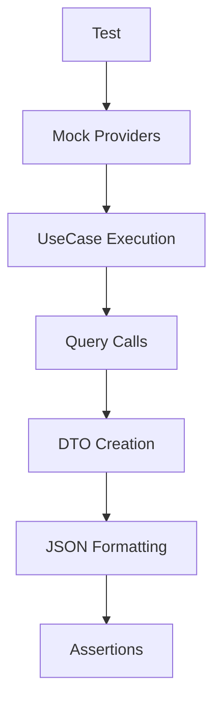

# Этап 2. Application слой экспорта — план для тестирования

## Цель этапа

- Что проверяем в этом этапе: Корректность UseCase, Query и DTO для сбора и форматирования данных экспорта.
- Какие критерии приемки закрываем: UseCase формирует JSON с данными.

## Общие принципы тестирования

- Типы тестов: Unit, Integration, E2E.
- Разделяй ответственность тестов: Unit — доменные правила/DTO/валидации без внешних зависимостей.
- Каждый сценарий описывай в формате: **Дано → Проверяемое → Ожидаемый результат**.

## Структура тестовых файлов

Unit:

- `backend/tests/Suite/Export/Application/ExportUserDataTest.php` — Тесты для UseCase.
- `backend/tests/Suite/Export/Application/GetUserDataQueryTest.php` — Тесты для Query.
- `backend/tests/Suite/Export/Application/ExportRequestDtoTest.php` — Тесты для DTO.

Integration:

- `backend/tests/Suite/Export/Integration/ExportUseCaseIntegrationTest.php` — Интеграция с mock интерфейсами.

E2E:

- Нет на этом этапе.

## Сценарии

### Unit

1. **ExportUseCase собирает данные из Query**
   - Дано: Mock для Query с данными.
   - Проверяемое: Выполнение UseCase.
   - Ожидаемый результат: ExportData создана с правильными данными.

2. **GetUserDataQuery вызывает интерфейс**
   - Дано: Mock UserDataProviderInterface.
   - Проверяемое: Выполнение Query.
   - Ожидаемый результат: Возвращает UserDataDto.

3. **DTO валидация полей**
   - Дано: Валидные данные для ExportRequestDto.
   - Проверяемое: Создание DTO.
   - Ожидаемый результат: DTO создана, поля доступны.

### Integration

1. **UseCase с mock провайдерами**
   - Дано: Mock всех DataProviderInterface.
   - Проверяемое: Полный флоу экспорта.
   - Ожидаемый результат: JSON сформирован корректно.

## Матрица покрытия требований

- AC-2: Скачивание файла → `ExportUseCaseIntegrationTest::testGeneratesJsonFile()`
- AC-4: Формат JSON → `ExportUseCaseTest::testFormatsToJson()`

## Чек-лист выполнения (локально/CI)

- `make php-run CMD="php artisan test --filter=Export"`
- `make php-run CMD="vendor/bin/phpstan analyse src/Export"`

## Диаграмма тестируемого потока (Mermaid)

## Общие рекомендации

- Используй фабрики/фикстуры из проекта (если есть).
- Фиксируй время (если важно) и избегай флакки-тестов.
- Для E2E — проверяй не только статус-код, но и payload/контент.