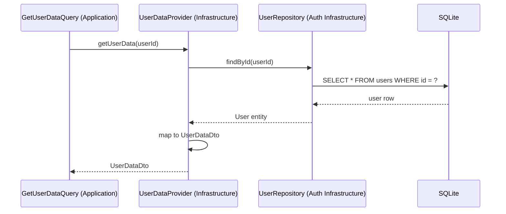

# Этап 3. Infrastructure слой экспорта — план для разработчика

## Цель этапа

- Что добавляем/меняем в этом этапе: Реализация репозиториев и адаптеров для доступа к данным пользователя из модуля Auth.
- Что является критерием готовности: Репозитории могут извлекать данные из БД и преобразовывать в DTO.

## Общие архитектурные принципы

- Clean Architecture, CQRS, модульный монолит, Laravel.
- Не смешивать ответственность слоёв (Domain, Application, Infrastructure, Presentation).
- Стабильные контракты между слоями: интерфейсы, DTO, исключения.

## Архитектурные решения

- **Domain**: Используем интерфейсы.
- **Application**: Используем Query из этапа 2.
- **Infrastructure**: Реализация UserDataProviderInterface через адаптер к Auth модулю, заглушки для Family и Media.
- **Presentation**: Пока не затрагиваем.

## Структура модулей

- Модуль: `Export`
- Публичные точки входа: Нет.
- Зависимости от других модулей: Auth (для UserRepositoryInterface).

## Модель предметной области

- **Сущности**: Используем из Domain.
- **Value Objects**: Используем из Domain.
- **DTO** (Application): Используем из Application.
- **Исключения**: ExportFailedException.
- **Интерфейсы** (репозитории/шлюзы): Реализуем UserDataProviderInterface.

## Контракты и потоки данных (Mermaid)

## Изменяемые файлы

Создать:

- `backend/src/Export/Infrastructure/Adapter/UserDataProvider.php` — Адаптер для получения данных пользователя.
- `backend/src/Export/Infrastructure/Adapter/FamilyDataProvider.php` — Заглушка для данных семьи.
- `backend/src/Export/Infrastructure/Adapter/MediaDataProvider.php` — Заглушка для медиа.
- `backend/src/Export/Presentation/Config/ExportServiceProvider.php` — Регистрация зависимостей.

Изменить:

- `backend/bootstrap/providers.php` — Добавить ExportServiceProvider.

## Последовательность действий

1. Создать ExportServiceProvider и зарегистрировать в providers.php.
2. Реализовать UserDataProvider, используя интерфейс UserRepositoryInterface из Auth.
3. Создать заглушки для FamilyDataProvider и MediaDataProvider (возвращают пустые DTO).
4. Добавить маппинг из Entity в DTO.
5. Обработать исключения при доступе к БД.
6. Проверить, что инфраструктура реализует интерфейсы Domain.

## Риски и альтернативы

- Риск: Изменения в Auth модуле → Митигировать: Использовать стабильные интерфейсы.
- Альтернатива: Прямой доступ к БД без интерфейсов (не выбрали, чтобы сохранить архитектуру).

## Чек-лист архитектурного соответствия

- [x] CQRS: Не применимо.
- [x] Domain не зависит от Laravel/Infrastructure.
- [x] Application зависит от Domain, но не от Presentation.
- [x] Infrastructure реализует интерфейсы Application/Domain.
- [x] Контроллер тонкий: Не применимо.
- [x] Все публичные контракты задокументированы (DTO/PHPDoc).