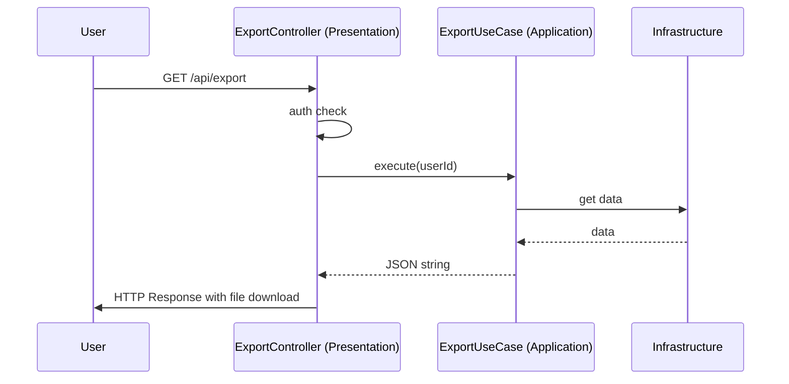

# Этап 4. Presentation слой экспорта — план для разработчика

## Цель этапа

- Что добавляем/меняем в этом этапе: Создание контроллера, роута и интеграции с аутентификацией для экспорта.
- Что является критерием готовности: HTTP запрос приводит к скачиванию JSON файла.

## Общие архитектурные принципы

- Clean Architecture, CQRS, модульный монолит, Laravel.
- Не смешивать ответственность слоёв (Domain, Application, Infrastructure, Presentation).
- Стабильные контракты между слоями: интерфейсы, DTO, исключения.

## Архитектурные решения

- **Domain**: Используем.
- **Application**: Используем ExportUseCase.
- **Infrastructure**: Используем.
- **Presentation**: ExportController, роут /export, middleware auth.

## Структура модулей

- Модуль: `Export`
- Публичные точки входа: /api/export (GET).
- Зависимости от других модулей: Auth (для middleware).

## Модель предметной области

- **Сущности**: ExportData.
- **Value Objects**: ExportFormat.
- **DTO** (Application): ExportRequestDto.
- **Исключения**: ExportFailedException.
- **Интерфейсы**: Нет новых.

## Контракты и потоки данных (Mermaid)

## Изменяемые файлы

Создать:

- `backend/src/Export/Presentation/Http/Controller/ExportController.php` — Контроллер для экспорта.
- `backend/src/Export/Presentation/Http/Request/ExportRequest.php` — Request валидация (если нужна).

Изменить:

- `backend/routes/api.php` — Добавить роут /export.
- `backend/src/Export/Presentation/Config/ExportServiceProvider.php` — Добавить роуты.

## Последовательность действий

1. Создать ExportController с методом export().
2. Добавить middleware auth.
3. Получить userId из auth.
4. Вызвать ExportUseCase.
5. Вернуть Response с JSON и headers для скачивания.
6. Обработать исключения и вернуть 500 с сообщением.
7. Зарегистрировать роут в ServiceProvider.

## Риски и альтернативы

- Риск: Утечка данных при неправильной авторизации → Митигировать: Строгая проверка userId.
- Альтернатива: POST вместо GET (не выбрали, так как экспорт не меняет состояние).

## Чек-лист архитектурного соответствия

- [x] CQRS: Не применимо.
- [x] Domain не зависит от Laravel/Infrastructure.
- [x] Application зависит от Domain, но не от Presentation.
- [x] Infrastructure реализует интерфейсы Application/Domain.
- [x] Контроллер тонкий: Только оркестрация, вызов UseCase.
- [x] Все публичные контракты задокументированы (DTO/PHPDoc).