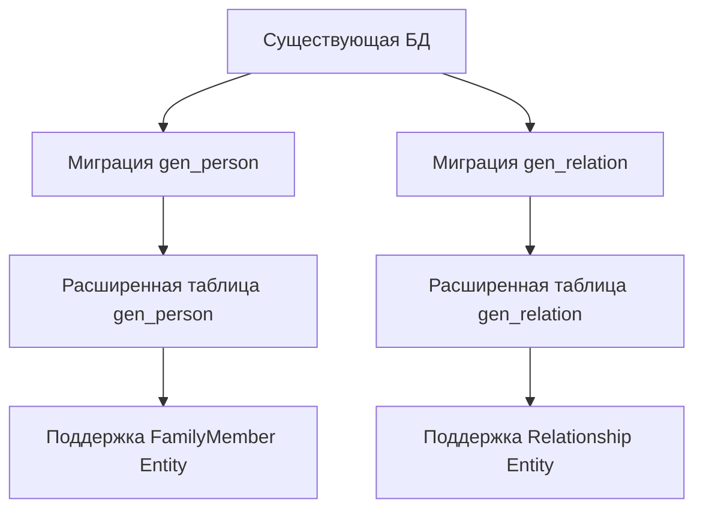

# Технический план реализации: Этап 1 - Подготовка базы данных

## Общие архитектурные принципы
- **Clean Architecture:** Разделение на слои (Domain, Application, Infrastructure, Presentation).
- **CQRS:** Разделение команд (изменения состояния) и запросов (чтение данных).
- **Модульный монолит:** Функциональность организована в модули (FamilyMember, Relationship).
- **Laravel:** Использование фреймворка для инфраструктуры (миграции, роутинг, DI).

## Архитектурные решения
- Использовать Laravel миграции для изменения схемы.
- Добавить поля в существующие таблицы без нарушения данных.
- Обеспечить обратную совместимость с существующими данными.

## Структура модулей
- **FamilyMember Module:** Управление профилями членов семьи.
- **Relationship Module:** Управление семейными связями.
- **Core Module:** Общие интерфейсы, базовые классы CQRS.

## Модель предметной области
На данном этапе подготовки базы данных новые сущности и интерфейсы не создаются. Модель предметной области будет реализована в последующих этапах. Однако, подготовка включает расширение существующих таблиц для поддержки будущих сущностей:

- **FamilyMember Entity:** Будет маппиться на расширенную таблицу `gen_person` с новыми полями (gender, birth_place, death_place, timestamps).
- **Relationship Entity:** Будет маппиться на расширенную таблицу `gen_relation` с полем metadata для дополнительных атрибутов связей.
- **Value Objects:** FullName и LifePeriod будут реализованы в следующих этапах для валидации и бизнес-логики.

## Сценарии интеграции
- **Интеграция с существующей БД:** Миграции должны быть совместимы с текущей структурой SQLite базы данных.
- **Интеграция с Auth Module:** Новые поля userId в gen_person обеспечивают связь с аутентификацией пользователей.
- **Подготовка для Core Module:** Расширения таблиц создают основу для будущих репозиториев и CQRS паттернов.

## Изменяемые файлы
- `backend/database/migrations/` (новые миграции для добавления полей)

## Последовательность действий
1. Создать миграцию для таблицы `gen_person`: добавить поля `gender` (enum: male, female), `birth_place` (string, nullable), `death_place` (string, nullable), `created_at` (timestamp), `updated_at` (timestamp).
2. Создать миграцию для таблицы `gen_relation`: добавить поле `metadata` (json, nullable).
3. Запустить миграции: `php artisan migrate`.
4. Проверить структуру БД через SQLite браузер или команду `php artisan tinker`.
5. Создать rollback миграции для тестирования отката.

## Диаграммы

## Миграции и конфигурация
- **Создание миграций:** Использовать `php artisan make:migration add_fields_to_gen_person_table` и аналогично для gen_relation.
- **Типы полей:**
  - gender: enum ('male', 'female') с дефолтом 'male'
  - birth_place, death_place: string, nullable
  - created_at, updated_at: timestamps
  - metadata: json, nullable
- **Откат миграций:** Реализовать метод down() в миграциях для удаления добавленных полей. Тестировать откат командой `php artisan migrate:rollback`.
- **Конфигурация:** Убедиться, что database.php конфигурация поддерживает SQLite и новые поля.

## Общие рекомендации
- Каждый этап тестировать unit и integration тестами.
- Следовать PSR-4 для автозагрузки.
- Использовать Laravel's service container для DI.
- Документировать код PHPDoc.

## Чек-лист архитектурного соответствия
- ✅ Миграции не нарушают существующие данные
- ✅ Обратная совместимость с текущей структурой
- ✅ Подготовка для Clean Architecture слоев
- ✅ CQRS паттерны учтены для будущих команд/запросов
- ✅ Модульная структура поддержана
