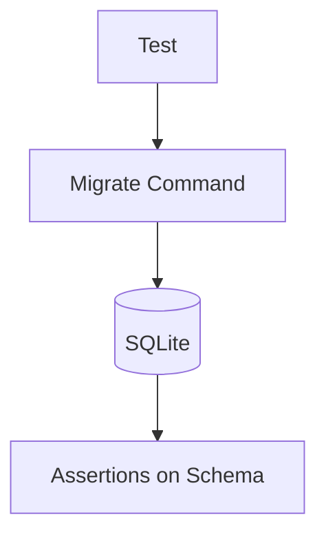

# Этап 1. Подготовка базы данных — план для тестирования

## Цель этапа

- Что проверяем в этом этапе: Корректность применения миграций для добавления новых полей в таблицы `gen_person` и `gen_relation`.
- Какие критерии приемки закрываем: Изменения в структуре БД соответствуют модели предметной области.

## Общие принципы тестирования

- Типы тестов: Unit, Integration, E2E.
- Разделяй ответственность тестов:
  - Unit — доменные правила/DTO/валидации без внешних зависимостей.
  - Integration — связка команд/запросов/репозиториев с БД.
  - E2E — HTTP-флоу от роутинга до ответа.
- Каждый сценарий описывай в формате: **Дано → Проверяемое → Ожидаемый результат**.

## Структура тестов

Unit:

- `backend/tests/Suite/Family/Domain/MigrationTest.php` — Тесты на корректность SQL запросов миграций.

Integration:

- `backend/tests/Suite/Family/Integration/MigrationApplicationTest.php` — Проверка применения миграций и структуры таблиц.

E2E:

- Не применимо для этого этапа (нет API).

## Тесты

### Unit
- Тесты на корректность SQL запросов миграций: Проверка, что миграции содержат правильные ALTER TABLE statements для добавления полей.

### Integration
- Проверка применения миграций и структуры таблиц: После запуска миграций проверить наличие новых полей в таблицах `gen_person` и `gen_relation`.

### E2E
- Не применимо.

## Сценарии

### Unit

1. **Корректность миграции для gen_person**
   - Дано: Миграция с добавлением полей gender, birth_place, death_place, created_at, updated_at.
   - Проверяемое: SQL запрос миграции.
   - Ожидаемый результат: Запрос корректен и добавляет указанные поля.

2. **Корректность миграции для gen_relation**
   - Дано: Миграция с добавлением поля metadata.
   - Проверяемое: SQL запрос миграции.
   - Ожидаемый результат: Запрос корректен и добавляет поле metadata типа JSON.

### Integration

1. **Применение миграций без ошибок**
   - Дано: Чистая БД.
   - Проверяемое: Запуск `php artisan migrate`.
   - Ожидаемый результат: Миграции применяются без ошибок.

2. **Наличие новых полей в gen_person**
   - Дано: Миграции применены.
   - Проверяемое: Структура таблицы gen_person.
   - Ожидаемый результат: Поля gender, birth_place, death_place, created_at, updated_at присутствуют.

3. **Наличие новых полей в gen_relation**
   - Дано: Миграции применены.
   - Проверяемое: Структура таблицы gen_relation.
   - Ожидаемый результат: Поле metadata присутствует.

### E2E

Не применимо для этого этапа.

## Матрица покрытия требований

- Изменения в структуре БД: `MigrationApplicationTest::testMigrationAppliesWithoutErrors()`, `MigrationApplicationTest::testNewFieldsExistInGenPerson()`, `MigrationApplicationTest::testNewFieldsExistInGenRelation()`

## Изменяемые файлы

- `backend/tests/Suite/Core/Domain/MigrationTest.php` (создать)
- `backend/tests/Suite/Core/Integration/MigrationApplicationTest.php` (создать)

## Чек-лист выполнения (локально/CI)

- `make php-run CMD="php artisan test"`
- `make php-run CMD="vendor/bin/phpstan analyse"` (если включено в пайплайн)

## Диаграмма тестируемого потока (Mermaid)

## Общие рекомендации

- Использовать фабрики для тестовых данных.
- Тестировать исключения и edge cases.
- Запускать тесты после каждого этапа.
- Интеграция с CI/CD для автоматического тестирования.
