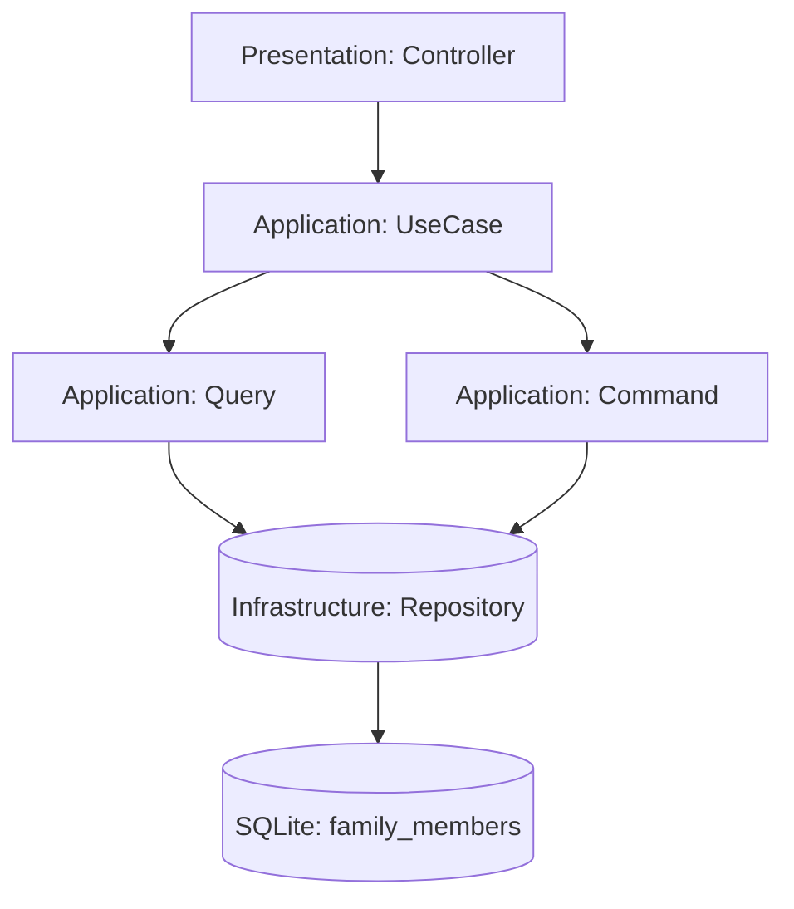
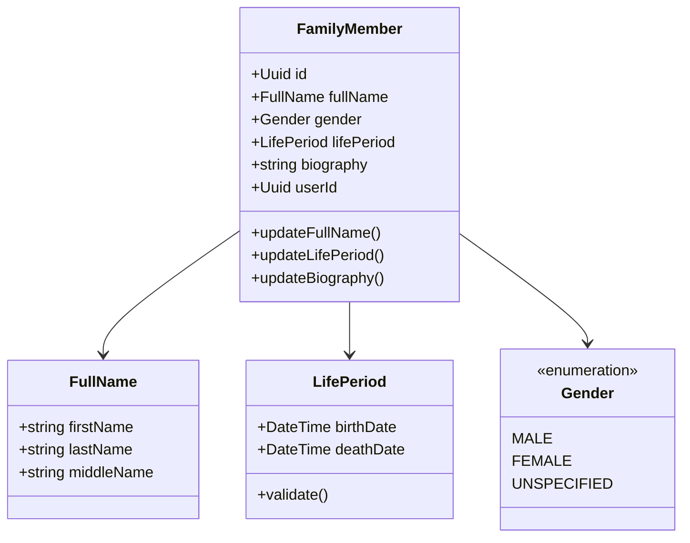

# Технический план реализации: Этап 2 - Реализация модели FamilyMember

## Общие архитектурные принципы
- **Clean Architecture:** Разделение на слои (Domain, Application, Infrastructure, Presentation).
- **CQRS:** Разделение команд (изменения состояния) и запросов (чтение данных).
- **Модульный монолит:** Функциональность организована в модули (FamilyMember, Relationship).
- **Laravel:** Использование фреймворка для инфраструктуры (миграции, роутинг, DI).

## Архитектурные решения
- Сущность `FamilyMember` в Domain слое.
- Value Objects для неизменяемых данных.
- Репозиторий интерфейс в Domain, реализация в Infrastructure.

## Структура модулей
- **FamilyMember Module:** Управление профилями членов семьи.
- **Relationship Module:** Управление семейными связями.
- **Core Module:** Общие интерфейсы, базовые классы CQRS.

## Модель предметной области
Основные компоненты модели предметной области для модуля FamilyMember:

### Сущности и Value Objects
- **FamilyMember** (Entity): Агрегат с ID, FullName, Gender, LifePeriod, biography, userId, timestamps.
  - Методы: updateFullName(), updateLifePeriod(), updateBiography().
- **FullName** (Value Object): Содержит firstName, lastName, middleName. Неизменяемый.
- **LifePeriod** (Value Object): Содержит birthDate, deathDate. Включает валидацию (дата смерти не раньше рождения).
- **Gender** (Enum): Мужской, Женский, Не указан.

### Интерфейсы
- **FamilyMemberRepositoryInterface**: Определяет методы для сохранения, обновления, удаления и поиска FamilyMember.
  - Методы: save(FamilyMember), findById(Uuid), findByUserId(Uuid), delete(Uuid).

### Исключения
- **InvalidLifePeriodException**: Выбрасывается при некорректных датах в LifePeriod.

### Взаимосвязи
- FamilyMember связан с пользователем через userId (ссылка на Auth модуль).
- Репозиторий реализуется в Infrastructure слое с использованием Eloquent.

## Сценарии интеграции
Новый модуль FamilyMember интегрируется следующим образом:
- **С Auth модулем:** FamilyMember ссылается на userId из User сущности. При создании FamilyMember проверяется существование пользователя.
- **С Relationship модулем:** В будущем FamilyMember будет использоваться для создания связей между членами семьи.
- **С Presentation слоем:** Контроллеры будут использовать Use Cases из Application слоя для CRUD операций.
- **С Infrastructure:** Репозиторий использует Eloquent для работы с БД, миграции создают таблицу family_members.

## Изменяемые файлы
- `backend/src/Family/Domain/Entity/FamilyMember.php`
- `backend/src/Family/Domain/ValueObject/FullName.php`
- `backend/src/Family/Domain/ValueObject/LifePeriod.php`
- `backend/src/Family/Domain/FamilyMemberRepositoryInterface.php`
- `backend/src/Family/Domain/Exception/InvalidLifePeriodException.php`
- `backend/src/Family/Infrastructure/Repository/EloquentFamilyMemberRepository.php`

## Последовательность действий
1. Создать namespace `App\Modules\FamilyMember\Domain`.
2. Определить enum `Gender`.
3. Создать Value Object `FullName` (firstName, lastName, middleName).
4. Создать Value Object `LifePeriod` (birthDate, deathDate) с методами валидации.
5. Создать Entity `FamilyMember` с методами для обновления данных.
6. Создать интерфейс `FamilyMemberRepository` в Domain.
7. Реализовать `EloquentFamilyMemberRepository` в Infrastructure.

## Диаграммы
### Диаграмма потока данных

### Диаграмма классов предметной области

## Миграции и конфигурация
- **Миграция:** Создать миграцию для таблицы `family_members` с полями: id (uuid), first_name, last_name, middle_name, gender (enum), birth_date (date), death_date (date nullable), biography (text), user_id (uuid foreign key to users), timestamps.
- **Конфигурация:** Добавить сервис-провайдер для Family модуля в `config/app.php` или создать отдельный `FamilyServiceProvider.php` для регистрации репозитория в DI контейнере.

## Общие рекомендации
- Каждый этап тестировать unit и integration тестами.
- Следовать PSR-4 для автозагрузки.
- Использовать Laravel's service container для DI.
- Документировать код PHPDoc.
