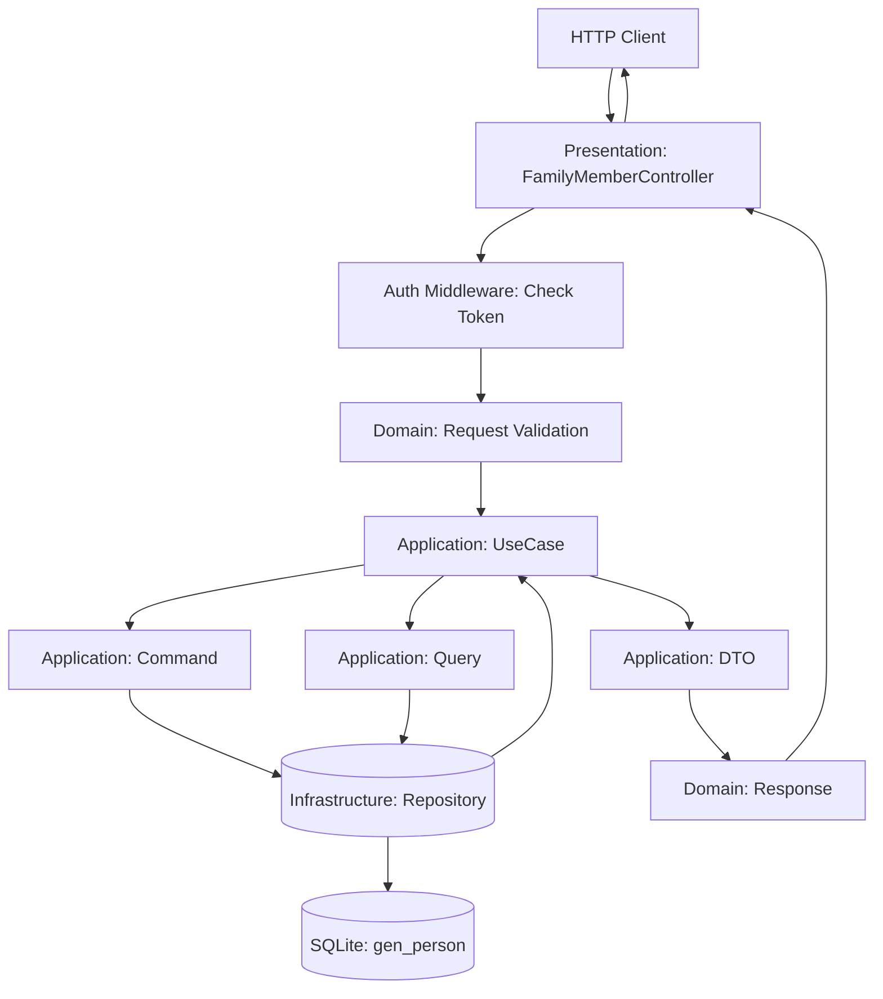
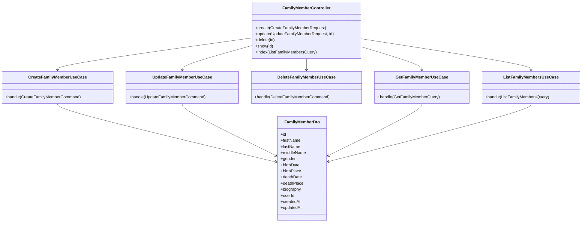

# Технический план реализации: Этап 3 - CRUD API для профилей

## Общие архитектурные принципы
- **Clean Architecture:** Разделение на слои (Domain, Application, Infrastructure, Presentation).
- **CQRS:** Разделение команд (изменения состояния) и запросов (чтение данных).
- **Модульный монолит:** Функциональность организована в модули (FamilyMember, Relationship).
- **Laravel:** Использование фреймворка для инфраструктуры (миграции, роутинг, DI).

## Структура модулей
- **FamilyMember Module:** Управление профилями членов семьи.
- **Relationship Module:** Управление семейными связями.
- **Core Module:** Общие интерфейсы, базовые классы CQRS.

## Архитектурные решения
- Команды для создания/обновления/удаления.
- Запросы для чтения.
- DTO для передачи данных между слоями.
- Контроллеры в Presentation слое.

## Последовательность действий
1. Создать команды: `CreateFamilyMemberCommand`, `UpdateFamilyMemberCommand`, `DeleteFamilyMemberCommand`.
2. Создать запросы: `GetFamilyMembersQuery`, `GetFamilyMemberQuery`.
3. Создать DTO: `FamilyMemberDto`, `CreateFamilyMemberDto`.
4. Реализовать обработчики команд и запросов в Application слое.
5. Создать контроллер `FamilyMemberController` с эндпоинтами.
6. Настроить роутинг в Laravel.

## Диаграммы
### Диаграмма потока данных для CRUD операций

### Диаграмма классов для CRUD API

## Миграции и конфигурация
- **Миграции:** Изменения в БД выполнены в этапе 1 (добавлены поля в gen_person). Дополнительные миграции не требуются.
- **Конфигурация роутов:** Добавить API роуты в `backend/routes/api.php`:
  - `POST /api/v1/family-members` -> FamilyMemberController@create
  - `GET /api/v1/family-members` -> FamilyMemberController@index
  - `GET /api/v1/family-members/{id}` -> FamilyMemberController@show
  - `PUT /api/v1/family-members/{id}` -> FamilyMemberController@update
  - `DELETE /api/v1/family-members/{id}` -> FamilyMemberController@delete
- **Middleware:** Применить `auth:sanctum` middleware к роутам для аутентификации.
- **Service Provider:** Обновить `FamilyServiceProvider` для регистрации новых Use Cases и DTO в DI контейнере.

## Модель предметной области
Основные компоненты модели предметной области для CRUD операций с профилями FamilyMember:

### Команды (Commands)
- **CreateFamilyMemberCommand**: Содержит данные для создания нового профиля (firstName, lastName, middleName, gender, birthDate, birthPlace, deathDate, deathPlace, biography).
- **UpdateFamilyMemberCommand**: Содержит ID и обновляемые поля для редактирования профиля.
- **DeleteFamilyMemberCommand**: Содержит ID профиля для удаления.

### Запросы (Queries)
- **GetFamilyMemberQuery**: Содержит ID для получения детальной информации о профиле.
- **ListFamilyMembersQuery**: Содержит параметры фильтрации (по имени, фамилии) для получения списка профилей.

### DTO (Data Transfer Objects)
- **FamilyMemberDto**: Для передачи данных профиля между слоями (id, firstName, lastName, middleName, gender, birthDate, birthPlace, deathDate, deathPlace, biography, userId, createdAt, updatedAt).
- **CreateFamilyMemberDto**: Для входящих данных при создании (firstName, lastName, middleName, gender, birthDate, birthPlace, deathDate, deathPlace, biography).
- **UpdateFamilyMemberDto**: Для входящих данных при обновлении (firstName, lastName, middleName, gender, birthDate, birthPlace, deathDate, deathPlace, biography).

### Use Cases (Application слой)
- **CreateFamilyMemberUseCase**: Обрабатывает команду создания, валидирует данные, сохраняет через репозиторий.
- **UpdateFamilyMemberUseCase**: Обрабатывает команду обновления, проверяет существование, обновляет данные.
- **DeleteFamilyMemberUseCase**: Обрабатывает команду удаления, проверяет зависимости (связи), удаляет профиль.
- **GetFamilyMemberUseCase**: Обрабатывает запрос на получение одного профиля.
- **ListFamilyMembersUseCase**: Обрабатывает запрос на список профилей с фильтрацией.

### Взаимосвязи
- Команды и запросы передаются в Use Cases из Presentation слоя (контроллеров).
- Use Cases взаимодействуют с Domain сущностями (FamilyMember) и репозиториями.
- DTO используются для передачи данных между слоями без нарушения инкапсуляции Domain.
- Валидация происходит в Domain (Value Objects) и Application (Use Cases).

## Сценарии интеграции
Новый CRUD API для профилей интегрируется следующим образом:
- **С Auth модулем:** Все эндпоинты требуют аутентификации пользователя. User ID из токена используется для фильтрации профилей (пользователь видит только свои профили).
- **С FamilyMember модулем (Domain):** Use Cases взаимодействуют с FamilyMember сущностями и репозиториями для выполнения бизнес-логики.
- **С Core модулем:** Используются базовые интерфейсы CQRS (CommandBus, QueryBus) для обработки команд и запросов.
- **С Presentation слоем:** Контроллеры принимают HTTP запросы, валидируют входные данные через Request классы, вызывают Use Cases и возвращают Response с DTO.
- **С Infrastructure:** Репозитории используют Eloquent для работы с расширенной таблицей gen_person (из этапа 1).

## Изменяемые файлы
- `backend/src/Family/Application/UseCase/CreateFamilyMember.php`
- `backend/src/Family/Application/UseCase/UpdateFamilyMember.php`
- `backend/src/Family/Application/UseCase/DeleteFamilyMember.php`
- `backend/src/Family/Application/UseCase/GetFamilyMember.php`
- `backend/src/Family/Application/UseCase/ListFamilyMembers.php`
- `backend/src/Family/Application/Dto/FamilyMemberDto.php`
- `backend/src/Family/Application/Dto/CreateFamilyMemberDto.php`
- `backend/src/Family/Application/Dto/UpdateFamilyMemberDto.php`
- `backend/src/Family/Presentation/Http/Controller/FamilyMemberController.php`
- `backend/src/Family/Domain/Request/CreateFamilyMemberRequest.php`
- `backend/src/Family/Domain/Request/UpdateFamilyMemberRequest.php`
- `backend/src/Family/Domain/Response/FamilyMemberResponse.php`
- `backend/src/Family/Domain/Response/FamilyMemberListResponse.php`
- `backend/src/Family/Presentation/Config/FamilyServiceProvider.php`
- `backend/routes/api.php` (добавление роутов)

## Общие рекомендации
- Каждый этап тестировать unit и integration тестами.
- Следовать PSR-4 для автозагрузки.
- Использовать Laravel's service container для DI.
- Документировать код PHPDoc.
