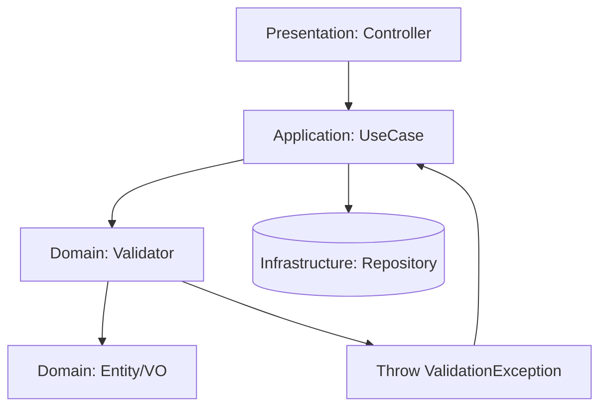

# Технический план реализации: Этап 4 - Валидация профилей

## Общие архитектурные принципы
- **Clean Architecture:** Разделение на слои (Domain, Application, Infrastructure, Presentation).
- **CQRS:** Разделение команд (изменения состояния) и запросов (чтение данных).
- **Модульный монолит:** Функциональность организована в модули (FamilyMember, Relationship).
- **Laravel:** Использование фреймворка для инфраструктуры (миграции, роутинг, DI).

## Структура модулей
- **FamilyMember Module:** Управление профилями членов семьи.
- **Relationship Module:** Управление семейными связями.
- **Core Module:** Общие интерфейсы, базовые классы CQRS.

## Архитектурные решения
- Валидация в Domain слое через методы сущностей.
- Исключения для ошибок валидации.

## Модель предметной области
- **Интерфейсы:**
  - `ValidationInterface`: Интерфейс для валидаторов с методом `validate()`.
- **DTO:**
  - `CreateFamilyMemberRequest`: DTO для запроса создания с валидацией полей.
  - `UpdateFamilyMemberRequest`: DTO для запроса обновления с валидацией.
  - `CreateRelationshipRequest`: DTO для запроса создания связи с валидацией.
- **Исключения:**
  - `ValidationException`: Базовое исключение для ошибок валидации.
  - `InvalidDateRangeException`: Для некорректных дат (смерть раньше рождения).
  - `CyclicRelationshipException`: Для циклических связей.
  - `LogicalInconsistencyException`: Для логических несоответствий (ребенок старше родителя).
  - `DuplicateRelationshipException`: Для дублированных связей.
- **Взаимосвязи:** DTO используют валидаторы, которые выбрасывают исключения при ошибках.

## Сценарии интеграции
- Валидация интегрируется в существующие Use Cases (`CreateFamilyMember`, `UpdateFamilyMember`, `CreateRelationship`).
- При вызове команд валидация выполняется перед сохранением данных.
- Исключения валидации обрабатываются в Presentation слое и возвращаются как HTTP ошибки.

## Диаграммы

## Последовательность действий
1. Добавить методы валидации в `LifePeriod` (дата смерти после рождения).
2. Добавить валидацию обязательных полей в командах.
3. Создать кастомные исключения для валидации.
4. Обновить обработчики для обработки исключений.

## Миграции и конфигурация
- Нет новых миграций, валидация на существующих данных.
- Конфигурация: Добавить обработку исключений в `ExceptionHandler` Laravel.

## Изменяемые файлы
### Новые файлы:
- `backend/src/Family/Domain/Exception/ValidationException.php` (базовое исключение валидации)
- `backend/src/Family/Domain/Exception/InvalidDateRangeException.php` (исключение для некорректных дат)
- `backend/src/Family/Domain/Exception/CyclicRelationshipException.php` (исключение для циклических связей)
- `backend/src/Family/Domain/Exception/LogicalInconsistencyException.php` (исключение для логических несоответствий)
- `backend/src/Family/Domain/Exception/DuplicateRelationshipException.php` (исключение для дублированных связей)
- `backend/src/Family/Domain/Interface/ValidationInterface.php` (интерфейс для валидаторов)
- `backend/src/Family/Application/DTO/CreateFamilyMemberRequest.php` (DTO для создания с валидацией)
- `backend/src/Family/Application/DTO/UpdateFamilyMemberRequest.php` (DTO для обновления с валидацией)
- `backend/src/Family/Application/DTO/CreateRelationshipRequest.php` (DTO для создания связи с валидацией)
- `backend/src/Family/Domain/Service/RelationshipValidator.php` (сервис для валидации связей)
- `backend/src/Family/Domain/Service/DateValidator.php` (сервис для валидации дат)

### Обновляемые файлы:
- `backend/src/Family/Domain/Entity/FamilyMember.php` (добавление валидации)
- `backend/src/Family/Domain/ValueObject/LifePeriod.php` (добавление валидации)
- `backend/src/Family/Application/UseCase/CreateFamilyMember.php` (добавление валидации)
- `backend/src/Family/Application/UseCase/UpdateFamilyMember.php` (добавление валидации)
- `backend/src/Family/Application/UseCase/CreateRelationship.php` (добавление валидации)
- `backend/src/Core/Presentation/Config/ExceptionHandler.php` (добавление обработки ValidationException)

## Общие рекомендации
- Каждый этап тестировать unit и integration тестами.
- Следовать PSR-4 для автозагрузки.
- Использовать Laravel's service container для DI.
- Документировать код PHPDoc.
