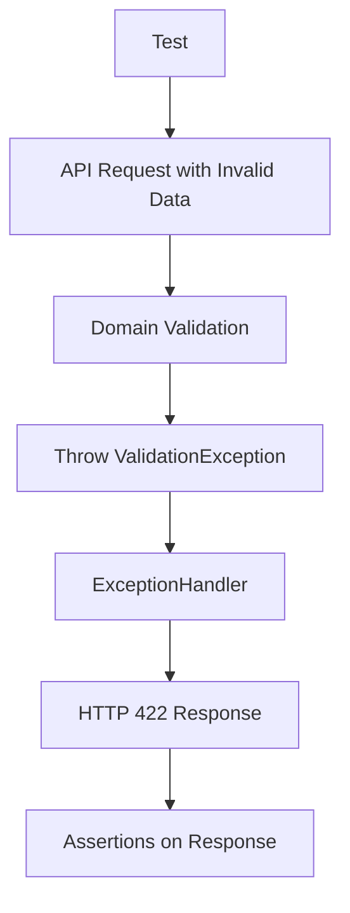

# Этап 4. Валидация профилей — план для тестирования

## Цель этапа

- Что проверяем в этом этапе: Корректность валидации данных профилей членов семьи и семейных отношений в соответствии с бизнес-правилами.
- Какие критерии приемки закрываем: Валидация предотвращает создание некорректных данных, выбрасывает соответствующие исключения и возвращает понятные ошибки через API.

## Общие принципы тестирования

- Типы тестов: Unit, Integration, E2E.
- Разделяй ответственность тестов:
  - Unit — доменные правила/DTO/валидации без внешних зависимостей.
  - Integration — связка команд/запросов/репозиториев с валидацией.
  - E2E — HTTP-флоу от роутинга до ответа с обработкой ошибок.
- Каждый сценарий описывай в формате: **Дано → Проверяемое → Ожидаемый результат**.

## Структура тестов

Unit:

- `backend/tests/Suite/Family/Domain/FamilyMemberValidationTest.php` — Тесты валидации сущности FamilyMember.
- `backend/tests/Suite/Family/Domain/LifePeriodValidationTest.php` — Тесты валидации ValueObject LifePeriod.
- `backend/tests/Suite/Family/Domain/RelationshipValidationTest.php` — Тесты валидации связей.
- `backend/tests/Suite/Family/Domain/ExceptionTest.php` — Тесты исключений валидации.
- `backend/tests/Suite/Family/Application/DTOValidationTest.php` — Тесты DTO с валидацией.

Integration:

- `backend/tests/Suite/Family/Integration/CreateFamilyMemberValidationTest.php` — Тесты команды создания с валидацией.
- `backend/tests/Suite/Family/Integration/UpdateFamilyMemberValidationTest.php` — Тесты команды обновления с валидацией.
- `backend/tests/Suite/Family/Integration/CreateRelationshipValidationTest.php` — Тесты команды создания связи с валидацией.

E2E:

- `backend/tests/Suite/Family/E2E/FamilyMemberValidationApiTest.php` — Тесты API создания/обновления профилей с валидацией.
- `backend/tests/Suite/Family/E2E/RelationshipValidationApiTest.php` — Тесты API создания связей с валидацией.

## Тесты

### Unit
- Тесты методов валидации в сущностях: Проверка, что методы валидации правильно проверяют данные и выбрасывают исключения.
- Тесты ValueObject: Валидация дат рождения/смерти, обязательных полей.
- Тесты исключений: Корректность сообщений и типов исключений.
- Тесты DTO: Валидация входных данных в DTO.

### Integration
- Тесты обработчиков команд: Проверка, что команды выполняют валидацию перед сохранением и выбрасывают исключения при ошибках.
- Тесты с репозиториями: Валидация не сохраняет некорректные данные в БД.

### E2E
- Тесты API эндпоинтов: Проверка, что API возвращает корректные HTTP коды и сообщения об ошибках при невалидных данных.

## Сценарии

### Unit

1. **Валидация даты смерти после рождения в LifePeriod**
   - Дано: LifePeriod с датой смерти раньше даты рождения.
   - Проверяемое: Метод validate() в LifePeriod.
   - Ожидаемый результат: Выбрасывается InvalidDateRangeException.

2. **Валидация обязательных полей в FamilyMember**
   - Дано: FamilyMember без имени.
   - Проверяемое: Метод validate() в FamilyMember.
   - Ожидаемый результат: Выбрасывается ValidationException.

3. **Валидация циклических связей**
   - Дано: Попытка создать связь, где человек является потомком самого себя.
   - Проверяемое: RelationshipValidator::validateNoCycles().
   - Ожидаемый результат: Выбрасывается CyclicRelationshipException.

4. **Валидация логических несоответствий (ребенок старше родителя)**
   - Дано: Ребенок с датой рождения раньше родителя.
   - Проверяемое: RelationshipValidator::validateLogicalConsistency().
   - Ожидаемый результат: Выбрасывается LogicalInconsistencyException.

5. **Валидация дублированных связей**
   - Дано: Попытка создать существующую связь.
   - Проверяемое: RelationshipValidator::validateNoDuplicates().
   - Ожидаемый результат: Выбрасывается DuplicateRelationshipException.

6. **Валидация DTO CreateFamilyMemberRequest**
   - Дано: DTO с некорректными данными.
   - Проверяемое: Метод validate() в DTO.
   - Ожидаемый результат: Выбрасывается ValidationException.

### Integration

1. **Валидация в команде CreateFamilyMember**
   - Дано: Команда с датой смерти до рождения.
   - Проверяемое: Обработчик CreateFamilyMemberCommand.
   - Ожидаемый результат: Выбрасывается InvalidDateRangeException, данные не сохраняются.

2. **Валидация в команде UpdateFamilyMember**
   - Дано: Команда обновления с отсутствующими обязательными полями.
   - Проверяемое: Обработчик UpdateFamilyMemberCommand.
   - Ожидаемый результат: Выбрасывается ValidationException, данные не обновляются.

3. **Валидация в команде CreateRelationship**
   - Дано: Команда создания циклической связи.
   - Проверяемое: Обработчик CreateRelationshipCommand.
   - Ожидаемый результат: Выбрасывается CyclicRelationshipException, связь не создается.

### E2E

1. **API создание профиля с невалидными датами**
   - Дано: POST /api/family-members с датой смерти до рождения.
   - Проверяемое: HTTP ответ API.
   - Ожидаемый результат: Статус 422, JSON с сообщением об ошибке.

2. **API обновление профиля без обязательных полей**
   - Дано: PUT /api/family-members/{id} без имени.
   - Проверяемое: HTTP ответ API.
   - Ожидаемый результат: Статус 422, JSON с сообщением об ошибке.

3. **API создание связи с логическими несоответствиями**
   - Дано: POST /api/relationships с ребенком старше родителя.
   - Проверяемое: HTTP ответ API.
   - Ожидаемый результат: Статус 422, JSON с сообщением об ошибке.

## Матрица покрытия требований

- Валидация дат: `LifePeriodValidationTest::testDeathAfterBirth()`, `CreateFamilyMemberValidationApiTest::testInvalidDatesReturn422()`
- Обязательные поля: `FamilyMemberValidationTest::testRequiredFields()`, `UpdateFamilyMemberValidationApiTest::testMissingFieldsReturn422()`
- Циклические связи: `RelationshipValidationTest::testNoCycles()`, `CreateRelationshipValidationApiTest::testCycleReturns422()`
- Логические несоответствия: `RelationshipValidationTest::testLogicalConsistency()`, `CreateRelationshipValidationApiTest::testInconsistencyReturns422()`
- Дублированные связи: `RelationshipValidationTest::testNoDuplicates()`, `CreateRelationshipValidationApiTest::testDuplicateReturns422()`

## Изменяемые файлы

- `backend/tests/Suite/Family/Domain/FamilyMemberValidationTest.php` (создать)
- `backend/tests/Suite/Family/Domain/LifePeriodValidationTest.php` (создать)
- `backend/tests/Suite/Family/Domain/RelationshipValidationTest.php` (создать)
- `backend/tests/Suite/Family/Domain/ExceptionTest.php` (создать)
- `backend/tests/Suite/Family/Application/DTOValidationTest.php` (создать)
- `backend/tests/Suite/Family/Integration/CreateFamilyMemberValidationTest.php` (создать)
- `backend/tests/Suite/Family/Integration/UpdateFamilyMemberValidationTest.php` (создать)
- `backend/tests/Suite/Family/Integration/CreateRelationshipValidationTest.php` (создать)
- `backend/tests/Suite/Family/E2E/FamilyMemberValidationApiTest.php` (создать)
- `backend/tests/Suite/Family/E2E/RelationshipValidationApiTest.php` (создать)

## Чек-лист выполнения (локально/CI)

- `make php-run CMD="php artisan test --testsuite=Family"`
- `make php-run CMD="vendor/bin/phpstan analyse src/Family/"` (если включено в пайплайн)
- `make php-run CMD="vendor/bin/phpcs --standard=PSR12 src/Family/"` (если включено в пайплайн)

## Диаграмма тестируемого потока (Mermaid)

## Общие рекомендации

- Использовать фабрики для тестовых данных.
- Тестировать исключения и edge cases.
- Запускать тесты после каждого этапа.
- Интеграция с CI/CD для автоматического тестирования.
