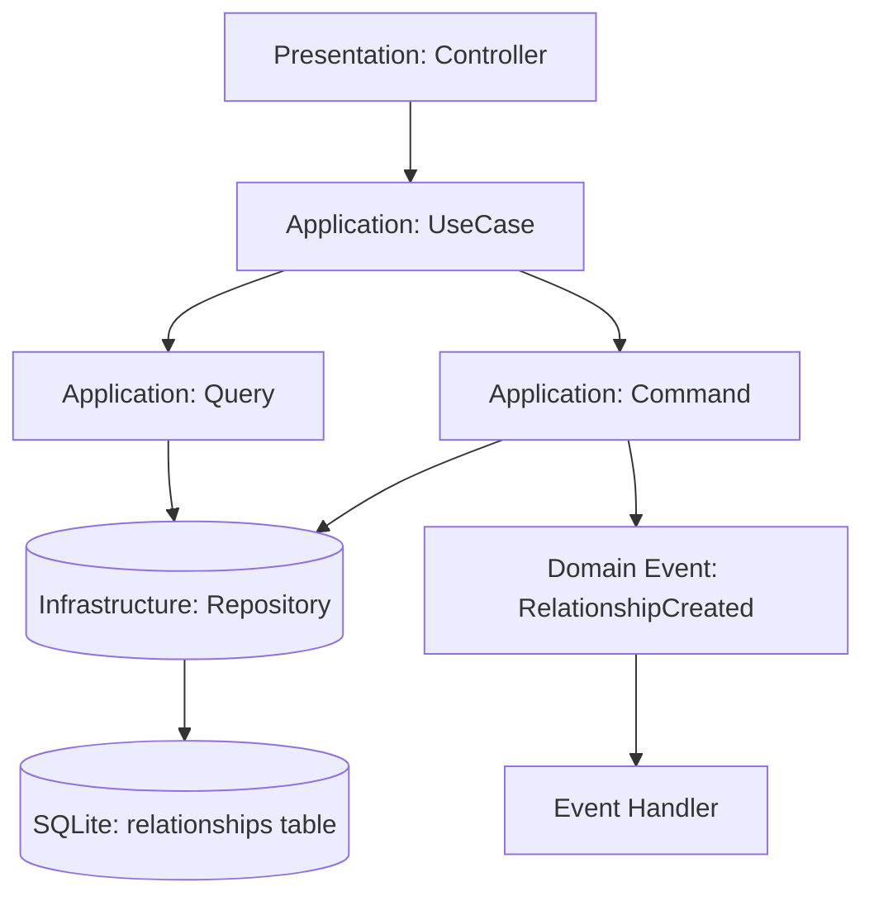
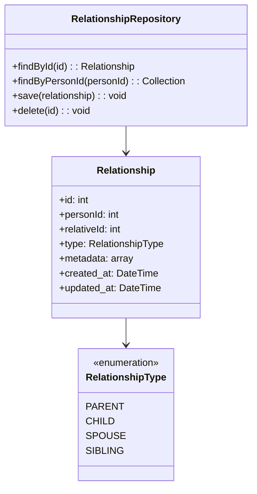

# Технический план реализации: Этап 5 - Реализация модели Relationship

## Общие архитектурные принципы
- **Clean Architecture:** Разделение на слои (Domain, Application, Infrastructure, Presentation).
- **CQRS:** Разделение команд (изменения состояния) и запросов (чтение данных).
- **Модульный монолит:** Функциональность организована в модули (FamilyMember, Relationship).
- **Laravel:** Использование фреймворка для инфраструктуры (миграции, роутинг, DI).

## Структура модулей
- **FamilyMember Module:** Управление профилями членов семьи.
- **Relationship Module:** Управление семейными связями.
- **Core Module:** Общие интерфейсы, базовые классы CQRS.

## Архитектурные решения
- Сущность `Relationship` как агрегат.
- Enum для типов связей.
- Репозиторий аналогично FamilyMember.

## Последовательность действий
1. Создать namespace `App\Modules\Relationship\Domain`.
2. Определить enum `RelationshipType` (parent, child, spouse).
3. Создать Entity `Relationship` с personId, relativeId, type, metadata.
4. Создать интерфейс `RelationshipRepository`.
5. Реализовать `EloquentRelationshipRepository`.

## Диаграммы

### Диаграмма потока данных для Relationship

### Диаграмма классов Relationship модуля

## Модель предметной области
- **Entity `Relationship`**: Агрегат с ID, personId (ссылка на FamilyMember), relativeId (ссылка на FamilyMember), type (RelationshipType), metadata (JSON для дополнительных данных).
- **Enum `RelationshipType`**: Определяет типы связей: parent, child, spouse, sibling и т.д.
- **Interface `RelationshipRepository`**: Определяет методы для работы с отношениями (findByPersonId, save, delete).
- **DTO `RelationshipDTO`**: Для передачи данных между слоями, содержит все поля Relationship.
- **Value Object `RelationshipMetadata`**: Для валидации и работы с метаданными.
- **Domain Events**: `RelationshipCreated`, `RelationshipUpdated`, `RelationshipDeleted` для CQRS.

## Сценарии интеграции
- **Интеграция с FamilyMember модулем**: Relationship зависит от существования FamilyMember сущностей. При создании Relationship проверяется наличие personId и relativeId в FamilyMemberRepository.
- **CQRS взаимодействие**: Команды для создания/обновления Relationship публикуют события, которые могут быть обработаны другими модулями (например, для обновления дерева семьи).
- **Валидация связей**: Проверка на циклические зависимости и корректность типов связей (например, нельзя быть одновременно родителем и ребенком в одной связи).
- **Кэширование**: Использование кэша для часто запрашиваемых отношений членов семьи.

## Изменяемые файлы
- `backend/src/Family/Domain/Entity/Relationship.php`
- `backend/src/Family/Domain/RelationshipRepositoryInterface.php`
- `backend/src/Family/Infrastructure/Repository/EloquentRelationshipRepository.php`

## Миграции и конфигурация
- **Миграция таблицы relationships**: Создать миграцию для таблицы `relationships` с полями: id (primary key), person_id (foreign key to family_members), relative_id (foreign key to family_members), type (enum: parent, child, spouse, sibling), metadata (json), timestamps.
- **Индексы**: Добавить индексы на person_id, relative_id и type для оптимизации запросов.
- **Внешние ключи**: Настроить foreign key constraints для person_id и relative_id с каскадным удалением.
- **Конфигурация модели**: В Eloquent модели Relationship указать fillable поля, casts для metadata как json, и отношения belongsTo к FamilyMember.
- **Сервис провайдер**: Зарегистрировать RelationshipRepository в сервис контейнере Laravel.

## Общие рекомендации
- Каждый этап тестировать unit и integration тестами.
- Следовать PSR-4 для автозагрузки.
- Использовать Laravel's service container для DI.
- Документировать код PHPDoc.
