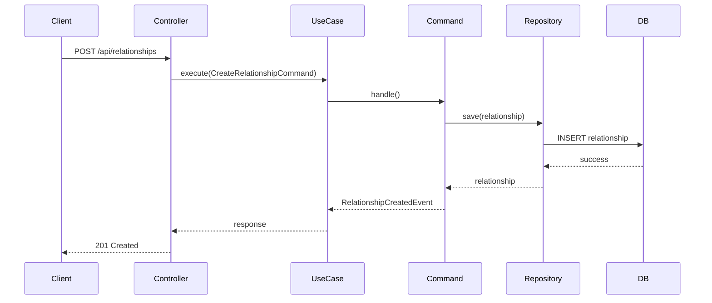
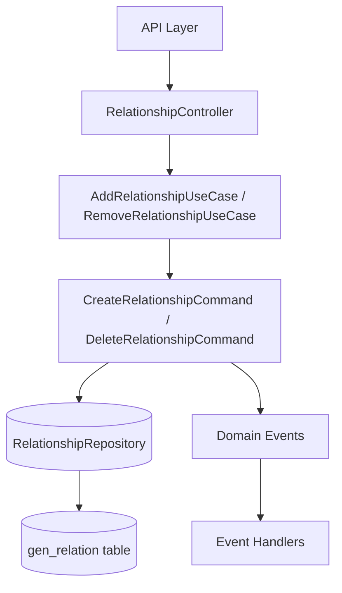

# Технический план реализации: Этап 6 - API для связей

## Общие архитектурные принципы
- **Clean Architecture:** Разделение на слои (Domain, Application, Infrastructure, Presentation).
- **CQRS:** Разделение команд (изменения состояния) и запросов (чтение данных).
- **Модульный монолит:** Функциональность организована в модули (FamilyMember, Relationship).
- **Laravel:** Использование фреймворка для инфраструктуры (миграции, роутинг, DI).

## Структура модулей
- **FamilyMember Module:** Управление профилями членов семьи.
- **Relationship Module:** Управление семейными связями.
- **Core Module:** Общие интерфейсы, базовые классы CQRS.

## Архитектурные решения
- Команды для создания/удаления связей.
- Логика обратных связей в обработчиках.

## Сценарии интеграции
- **Интеграция с FamilyMember модулем:** API для связей зависит от существования профилей членов семьи. При создании связи проверяется наличие personId и relativeId через FamilyMemberRepository.
- **CQRS взаимодействие:** Команды публикуют события (RelationshipCreatedEvent), которые могут быть обработаны для обновления кэша или других модулей.
- **Валидация:** Проверка на циклические связи и корректность типов (например, автоматическое создание обратной связи parent-child).
- **Обработка ошибок:** Возврат соответствующих HTTP статусов и сообщений об ошибках при нарушении бизнес-правил.

## Последовательность действий
1. Создать команды: `CreateRelationshipCommand`, `DeleteRelationshipCommand`.
2. Реализовать обработчики с логикой создания обратных связей (например, при parent автоматически child).
3. Создать контроллер `RelationshipController`.
4. Настроить роутинг.

## Диаграммы

### Диаграмма последовательности для создания связи

### Диаграмма потока данных API связей

## Модель предметной области
- **Команды (Commands):** `CreateRelationshipCommand` (с полями personId, relativeId, type, metadata), `DeleteRelationshipCommand` (с полем id).
- **DTO:** `RelationshipDTO` для передачи данных между слоями, содержащий все поля Relationship.
- **Domain Events:** `RelationshipCreatedEvent`, `RelationshipDeletedEvent` для уведомления о изменениях.
- **Use Cases:** `AddRelationshipUseCase` для создания связи с валидацией и логикой обратных связей, `RemoveRelationshipUseCase` для удаления с проверкой зависимостей.
- **Queries:** `GetRelationshipsByPersonQuery` для получения связей конкретного человека.
- **Exceptions:** `RelationshipNotFoundException`, `InvalidRelationshipException` для обработки ошибок.

## Изменяемые файлы
- `backend/src/Family/Application/Command/CreateRelationshipCommand.php` - новая команда для создания связи.
- `backend/src/Family/Application/Command/DeleteRelationshipCommand.php` - новая команда для удаления связи.
- `backend/src/Family/Application/UseCase/AddRelationship.php` - обновление use case для обработки команд и логики обратных связей.
- `backend/src/Family/Application/UseCase/RemoveRelationship.php` - обновление use case для обработки удаления с валидацией.
- `backend/src/Family/Presentation/Http/Controller/RelationshipController.php` - новый контроллер с методами store и destroy для API эндпоинтов.
- `backend/routes/api.php` - обновление для добавления роутов POST /api/relationships и DELETE /api/relationships/{id}.

## Миграции и конфигурация
- **Миграции:** Если требуются изменения в таблице gen_relation (добавление поля metadata), создать миграцию для добавления этого поля.
- **Конфигурация роутов:** Регистрация новых API роутов в routes/api.php с middleware для аутентификации.
- **Сервис провайдер:** Обновление RelationshipServiceProvider для регистрации новых команд и use cases в DI контейнере.

## Общие рекомендации
- Каждый этап тестировать unit и integration тестами.
- Следовать PSR-4 для автозагрузки.
- Использовать Laravel's service container для DI.
- Документировать код PHPDoc.
