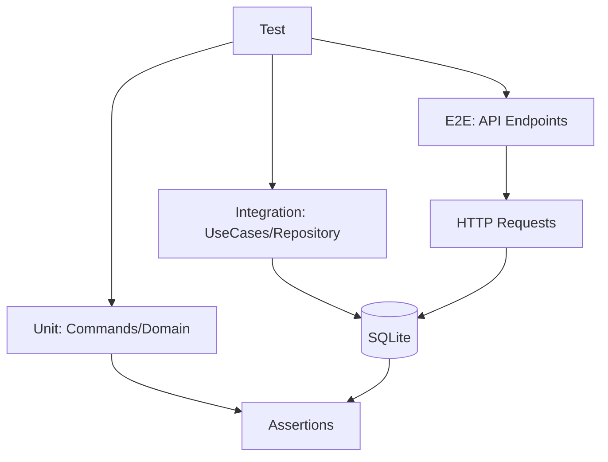

# План тестирования: Этап 6 - API для связей

## Цель этапа

- Что проверяем в этом этапе: Корректность реализации команд создания и удаления связей, логики обратных связей, API эндпоинтов для управления семейными связями.
- Какие критерии приемки закрываем: API позволяет создавать и удалять связи с автоматической обработкой обратных связей, валидацией и обработкой ошибок.

## Общие принципы тестирования

- Типы тестов: Unit, Integration, E2E.
- Разделяй ответственность тестов:
  - Unit — доменные правила/DTO/валидации/команды без внешних зависимостей.
  - Integration — связка команд/запросов/репозиториев с БД.
  - E2E — HTTP-флоу от роутинга до ответа.
- Каждый сценарий описывай в формате: **Дано → Проверяемое → Ожидаемый результат**.
- Фреймворк: PHPUnit для unit/integration, Laravel HTTP тесты для E2E.
- Покрытие: Минимум 80% кода.

## Структура тестов

Unit:

- `backend/tests/Suite/Family/Domain/RelationshipTest.php` — Тесты на доменные правила связей.
- `backend/tests/Suite/Family/Application/Command/CreateRelationshipCommandTest.php` — Тесты команды создания связи.
- `backend/tests/Suite/Family/Application/Command/DeleteRelationshipCommandTest.php` — Тесты команды удаления связи.

Integration:

- `backend/tests/Suite/Family/Integration/AddRelationshipUseCaseTest.php` — Тесты use case создания связи с репозиторием.
- `backend/tests/Suite/Family/Integration/RemoveRelationshipUseCaseTest.php` — Тесты use case удаления связи с репозиторием.
- `backend/tests/Suite/Family/Integration/RelationshipRepositoryTest.php` — Тесты репозитория связей.

E2E:

- `backend/tests/Suite/Family/E2E/RelationshipApiTest.php` — Тесты API эндпоинтов для связей.

## Тесты

### Unit
- Тесты команд связей: Проверка валидации входных данных, создания DTO, обработки исключений в командах CreateRelationshipCommand и DeleteRelationshipCommand.
- Тесты доменных правил: Проверка логики автоматического создания обратных связей, валидации типов связей.

### Integration
- Тесты обработчиков с логикой обратных связей: Проверка взаимодействия use cases с репозиториями, сохранения связей в БД, публикации событий.
- Тесты репозитория: Проверка CRUD операций для связей, включая поиск по personId.

### E2E
- Тесты API создания/удаления связей: Проверка HTTP запросов POST /api/relationships и DELETE /api/relationships/{id}, включая аутентификацию, валидацию, ответы и состояние БД.

## Сценарии

### Unit

1. **Валидация команды создания связи**
   - Дано: CreateRelationshipCommand с некорректными данными (отсутствующий personId).
   - Проверяемое: Валидация команды.
   - Ожидаемый результат: Исключение InvalidRelationshipException.

2. **Создание обратной связи в команде**
   - Дано: CreateRelationshipCommand с типом parent-child.
   - Проверяемое: Логика команды.
   - Ожидаемый результат: Создаются две связи (прямая и обратная).

3. **Валидация команды удаления связи**
   - Дано: DeleteRelationshipCommand с несуществующим id.
   - Проверяемое: Валидация команды.
   - Ожидаемый результат: Исключение RelationshipNotFoundException.

### Integration

1. **Создание связи через use case**
   - Дано: AddRelationshipUseCase с валидными данными.
   - Проверяемое: Выполнение use case и сохранение в репозиторий.
   - Ожидаемый результат: Связь сохранена в БД, опубликовано событие RelationshipCreatedEvent.

2. **Удаление связи через use case**
   - Дано: RemoveRelationshipUseCase с существующим id.
   - Проверяемое: Выполнение use case и удаление из репозитория.
   - Ожидаемый результат: Связь удалена из БД, опубликовано событие RelationshipDeletedEvent.

3. **Получение связей по personId**
   - Дано: Репозиторий с существующими связями.
   - Проверяемое: Метод getRelationshipsByPersonId.
   - Ожидаемый результат: Возвращены корректные связи для указанного personId.

### E2E

1. **Создание связи через API**
   - Дано: Аутентифицированный запрос POST /api/relationships с данными связи.
   - Проверяемое: HTTP ответ и состояние БД.
   - Ожидаемый результат: Статус 201, связь создана в БД с обратной связью.

2. **Удаление связи через API**
   - Дано: Аутентифицированный запрос DELETE /api/relationships/{id}.
   - Проверяемое: HTTP ответ и состояние БД.
   - Ожидаемый результат: Статус 204, связь удалена из БД.

3. **Ошибка при создании связи с несуществующим personId**
   - Дано: Запрос POST /api/relationships с несуществующим personId.
   - Проверяемое: HTTP ответ.
   - Ожидаемый результат: Статус 400, сообщение об ошибке.

## Матрица покрытия требований

- Создание связи с обратной: `AddRelationshipUseCaseTest::testCreatesRelationshipWithReverse()`, `RelationshipApiTest::testCreatesRelationship()`
- Удаление связи: `RemoveRelationshipUseCaseTest::testRemovesRelationship()`, `RelationshipApiTest::testDeletesRelationship()`
- Валидация и ошибки: `CreateRelationshipCommandTest::testValidatesInput()`, `RelationshipApiTest::testHandlesInvalidInput()`

## Изменяемые файлы

- `backend/tests/Suite/Family/Domain/RelationshipTest.php` (создать)
- `backend/tests/Suite/Family/Application/Command/CreateRelationshipCommandTest.php` (создать)
- `backend/tests/Suite/Family/Application/Command/DeleteRelationshipCommandTest.php` (создать)
- `backend/tests/Suite/Family/Integration/AddRelationshipUseCaseTest.php` (создать)
- `backend/tests/Suite/Family/Integration/RemoveRelationshipUseCaseTest.php` (создать)
- `backend/tests/Suite/Family/Integration/RelationshipRepositoryTest.php` (создать)
- `backend/tests/Suite/Family/E2E/RelationshipApiTest.php` (создать)

## Чек-лист выполнения (локально/CI)

- `make php-run CMD="php artisan test --testsuite=Family"`
- `make php-run CMD="vendor/bin/phpstan analyse"` (если включено в пайплайн)

## Диаграмма тестируемого потока (Mermaid)

## Общие рекомендации

- Использовать фабрики для тестовых данных (например, FamilyMemberFactory, RelationshipFactory).
- Тестировать исключения и edge cases (циклические связи, дубликаты).
- Запускать тесты после каждого этапа.
- Интеграция с CI/CD для автоматического тестирования.
