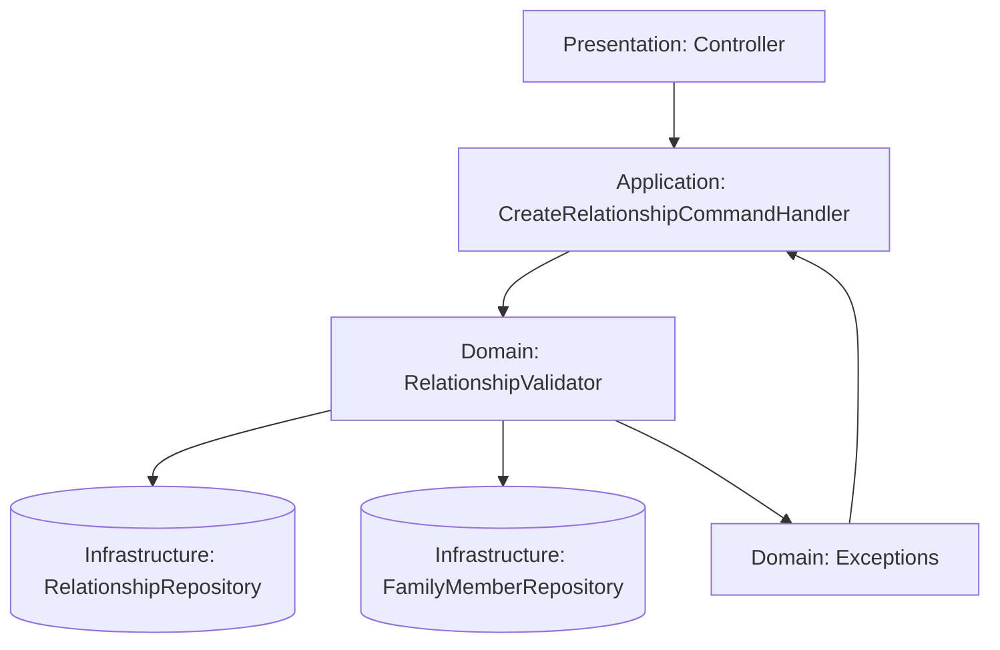

# Технический план реализации: Этап 7 - Валидация связей

## Общие архитектурные принципы
- **Clean Architecture:** Разделение на слои (Domain, Application, Infrastructure, Presentation).
- **CQRS:** Разделение команд (изменения состояния) и запросов (чтение данных).
- **Модульный монолит:** Функциональность организована в модули (FamilyMember, Relationship).
- **Laravel:** Использование фреймворка для инфраструктуры (миграции, роутинг, DI).

## Структура модулей
- **FamilyMember Module:** Управление профилями членов семьи.
- **Relationship Module:** Управление семейными связями.
- **Core Module:** Общие интерфейсы, базовые классы CQRS.

## Архитектурные решения
- Сервис в Domain для проверки связей.
- Алгоритмы для обнаружения циклов (DFS).

## Модель предметной области
- **Интерфейс RelationshipValidator:** Определяет методы для валидации связей (проверка на циклы, дубли, логическую целостность).
- **DTO RelationshipValidationRequest:** Содержит данные для валидации (personId, relativeId, type).
- **Исключения:** CyclicRelationshipException, DuplicateRelationshipException, InvalidAgeRelationshipException.
- **Value Object LifePeriod:** Для проверки дат рождения/смерти.

## Сценарии интеграции
- Валидация вызывается в обработчиках команд CreateRelationshipCommand и UpdateRelationshipCommand перед сохранением.
- Интеграция с репозиториями для получения данных о датах рождения для проверки возраста.
- Исключения валидации передаются в Presentation слой для отображения пользователю.

## Диаграммы

## Миграции и конфигурация
- Миграции не требуются, так как валидация работает с существующими данными.
- Конфигурация: Возможно, добавить параметры для настройки строгости валидации в config файлы.

## Последовательность действий
1. Создать интерфейс `RelationshipValidator` в Domain слое.
2. Реализовать `RelationshipValidatorImpl` с методами проверки циклов (DFS), дублей и возраста.
3. Создать DTO `RelationshipValidationRequest` для передачи данных валидации.
4. Добавить исключения: `CyclicRelationshipException`, `DuplicateRelationshipException`, `InvalidAgeRelationshipException`.
5. Интегрировать валидацию в `CreateRelationshipCommandHandler` и `UpdateRelationshipCommandHandler`.
6. Обновить репозитории для получения данных о датах рождения для проверки возраста.

## Изменяемые файлы
- `backend/src/Family/Domain/Service/RelationshipValidator.php` (интерфейс)
- `backend/src/Family/Domain/Service/RelationshipValidatorImpl.php` (реализация)
- `backend/src/Family/Domain/DTO/RelationshipValidationRequest.php`
- `backend/src/Family/Domain/Exception/CyclicRelationshipException.php`
- `backend/src/Family/Domain/Exception/DuplicateRelationshipException.php`
- `backend/src/Family/Domain/Exception/InvalidAgeRelationshipException.php`
- `backend/src/Family/Application/Command/CreateRelationshipCommandHandler.php` (добавить вызов валидации)
- `backend/src/Family/Application/Command/UpdateRelationshipCommandHandler.php` (добавить вызов валидации)
- `backend/src/Family/Infrastructure/Repository/FamilyMemberRepository.php` (метод для получения дат рождения)

## Общие рекомендации
- Каждый этап тестировать unit и integration тестами.
- Следовать PSR-4 для автозагрузки.
- Использовать Laravel's service container для DI.
- Документировать код PHPDoc.
