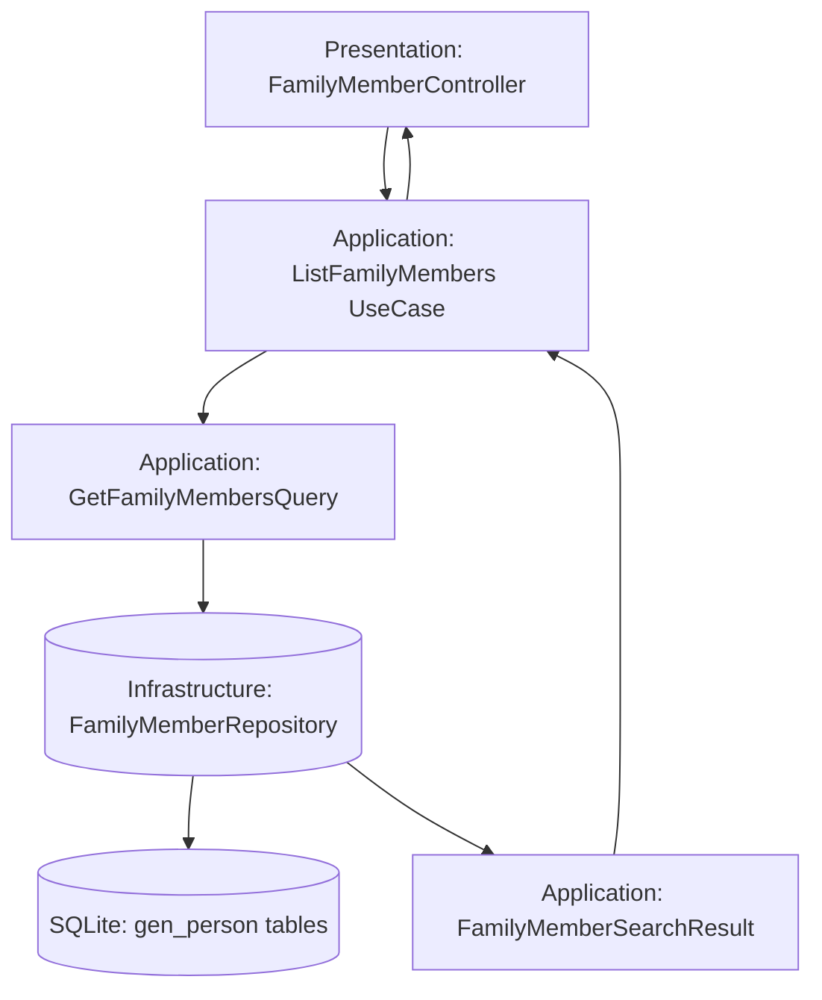

# Технический план реализации: Этап 8 - Поиск и фильтрация

## Общие архитектурные принципы
- **Clean Architecture:** Разделение на слои (Domain, Application, Infrastructure, Presentation).
- **CQRS:** Разделение команд (изменения состояния) и запросов (чтение данных).
- **Модульный монолит:** Функциональность организована в модули (FamilyMember, Relationship).
- **Laravel:** Использование фреймворка для инфраструктуры (миграции, роутинг, DI).

## Структура модулей
- **FamilyMember Module:** Управление профилями членов семьи.
- **Relationship Module:** Управление семейными связями.
- **Core Module:** Общие интерфейсы, базовые классы CQRS.

## Архитектурные решения
- Расширение запросов с параметрами поиска.
- Использование Eloquent scopes для фильтрации.
- DTO для параметров поиска в Application слое.

## Модель предметной области
- **Интерфейс FamilyMemberRepository:** Определяет методы для поиска и фильтрации членов семьи.
- **DTO FamilyMemberSearchRequest:** Содержит параметры поиска (имя, фамилия, пол и т.д.).
- **DTO FamilyMemberSearchResult:** Содержит результаты поиска с пагинацией.
- **Value Object SearchCriteria:** Для валидации и нормализации параметров поиска.

## Сценарии интеграции
- Поиск интегрируется в UseCase ListFamilyMembers, который вызывает репозиторий с параметрами поиска.
- Контроллер обрабатывает HTTP параметры и передает их в UseCase.
- Результаты поиска возвращаются в Presentation слой для отображения.

## Диаграммы

## Миграции и конфигурация
- Миграции не требуются, так как поиск работает с существующими полями (имя, фамилия).
- Конфигурация: Добавить параметры для лимита результатов поиска в config файлы Laravel.

## Последовательность действий
1. Создать DTO `FamilyMemberSearchRequest` в Application слое для параметров поиска.
2. Обновить `GetFamilyMembersQuery` для приема и обработки параметров поиска.
3. Реализовать scope в `FamilyMemberRepository` для фильтрации по имени/фамилии с использованием Eloquent.
4. Обновить `ListFamilyMembers` UseCase для применения поиска.
5. Обновить контроллер для обработки параметров запроса (query params) и передачи в UseCase.

## Изменяемые файлы
- `backend/src/Family/Application/DTO/FamilyMemberSearchRequest.php` (новый)
- `backend/src/Family/Application/Query/GetFamilyMembersQuery.php` (обновление)
- `backend/src/Family/Application/UseCase/ListFamilyMembers.php` (обновление для поиска)
- `backend/src/Family/Infrastructure/Repository/FamilyMemberRepository.php` (добавление scope для поиска)
- `backend/src/Family/Presentation/Http/Controller/FamilyMemberController.php` (обновление для обработки параметров поиска)

## Общие рекомендации
- Каждый этап тестировать unit и integration тестами.
- Следовать PSR-4 для автозагрузки.
- Использовать Laravel's service container для DI.
- Документировать код PHPDoc.
- Обеспечить пагинацию для результатов поиска при большом объеме данных.
