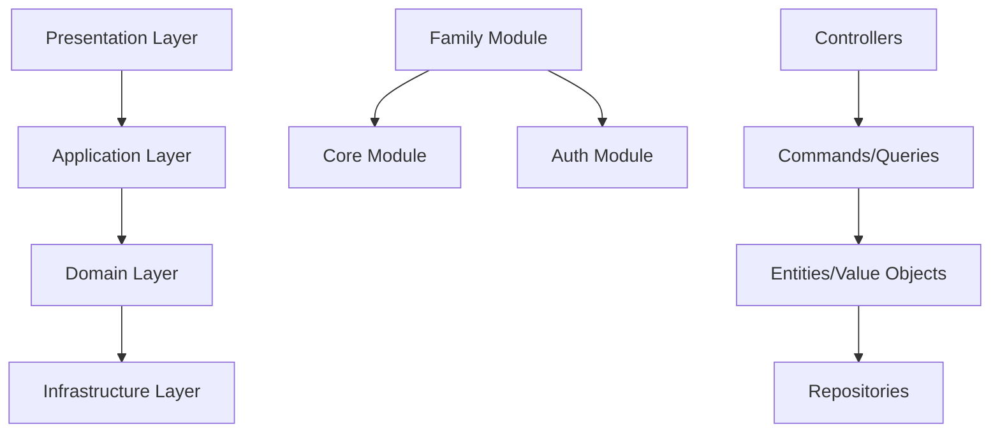
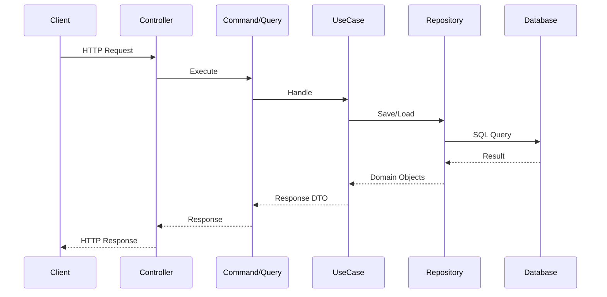

# Указатель задач: Создание и управление профилями членов семьи (Этап 2)

## Быстрая справка
- **Количество файлов**: 17 (1 основной Task.md + 8 TaskForDev.md + 8 TaskForTest.md)
- **Количество фаз**: 8 последовательных этапов
- **Примерное время реализации**: 40-60 часов (по 5-7.5 часов на этап, включая разработку, тестирование и документацию)

## Обзор
Спецификация разбита на 8 последовательных этапов для инкрементальной реализации. Каждый этап фокусируется на конкретной функциональности, позволяя AI-агенту реализовывать код поэтапно с возможностью тестирования и валидации на каждом шаге.

## Этапы реализации

1. **Этап 1: Подготовка базы данных**
   - Создание миграций для добавления необходимых полей в таблицы `gen_person` и `gen_relation`.
   - Обновление структуры БД для поддержки модели предметной области.
   - [План для разработчика](Stages/Stage1_TaskForDev.md) | [План для тестирования](Stages/Stage1_TaskForTest.md)
   - ✅ Этап завершён

2. **Этап 2: Реализация модели FamilyMember**
   - Создание сущности `FamilyMember`, value objects `FullName` и `LifePeriod`.
   - Реализация репозитория для работы с профилями членов семьи.
   - [План для разработчика](Stages/Stage2_TaskForDev.md) | [План для тестирования](Stages/Stage2_TaskForTest.md)

3. **Этап 3: CRUD API для профилей**
   - Реализация команд и запросов для операций создания, чтения, обновления и удаления профилей.
   - Создание контроллеров, DTO и обработчиков CQRS.
   - [План для разработчика](Stages/Stage3_TaskForDev.md) | [План для тестирования](Stages/Stage3_TaskForTest.md)

4. **Этап 4: Валидация профилей**
   - Добавление серверной валидации для полей профилей (даты, обязательные поля).
   - Интеграция валидации в команды создания и обновления.
   - [План для разработчика](Stages/Stage4_TaskForDev.md) | [План для тестирования](Stages/Stage4_TaskForTest.md)

5. **Этап 5: Реализация модели Relationship**
   - Создание сущности `Relationship` для семейных связей.
   - Реализация репозитория для работы со связями.
   - [План для разработчика](Stages/Stage5_TaskForDev.md) | [План для тестирования](Stages/Stage5_TaskForTest.md)

6. **Этап 6: API для связей**
   - Реализация команд для создания и удаления связей.
   - Логика автоматического создания обратных связей.
   - [План для разработчика](Stages/Stage6_TaskForDev.md) | [План для тестирования](Stages/Stage6_TaskForTest.md)

7. **Этап 7: Валидация связей**
   - Добавление проверок на циклические связи, дублирование, логическую целостность.
   - Интеграция валидации в команды связей.
   - [План для разработчика](Stages/Stage7_TaskForDev.md) | [План для тестирования](Stages/Stage7_TaskForTest.md)

8. **Этап 8: Поиск и фильтрация**
    - Реализация поиска профилей по имени/фамилии.
    - Добавление фильтрации в API списка профилей.
    - [План для разработчика](Stages/Stage8_TaskForDev.md) | [План для тестирования](Stages/Stage8_TaskForTest.md)

## Структура модулей

Проект использует модульный монолит с Clean Architecture и CQRS. Основные модули:

- **Core**: Общепроектный код, базовые интерфейсы, утилиты и инфраструктурные компоненты.
- **Auth**: Модуль аутентификации и авторизации пользователей.
- **Family**: Новый модуль для управления профилями членов семьи и семейными связями (реализуется в данном этапе).

Каждый модуль следует структуре:
- **Domain**: Бизнес-логика, сущности, value objects, доменные сервисы.
- **Application**: Команды, запросы, use cases, DTO (CQRS паттерн).
- **Presentation**: Контроллеры, маршруты, представления, конфигурация.
- **Infrastructure**: Репозитории, внешние сервисы, интеграции.

## Диаграммы

### Архитектура модулей

### Поток данных CRUD операций

## Риски и альтернативы

### Возможные риски:
- **Изменения в структуре БД**: Возможные корректировки в таблицах `gen_person` и `gen_relation` могут потребовать пересмотра миграций.
  - **Альтернатива**: Использовать гибкие миграции с откатом, проводить ревью изменений БД перед применением.
- **Сложность валидации связей**: Логическая валидация семейных связей (циклы, дубли) может быть сложной.
  - **Альтернатива**: Внедрить доменные сервисы для валидации, использовать графовые алгоритмы для проверки связей.
- **Производительность поиска**: Поиск по большому количеству профилей может быть медленным без индексов.
  - **Альтернатива**: Добавить полнотекстовый поиск с Elasticsearch или оптимизировать SQL-запросы с индексами.
- **Изменения требований**: Бизнес-требования могут эволюционировать во время разработки.
  - **Альтернатива**: Использовать инкрементальную разработку с частыми релизами и обратной связью.

### Стратегия минимизации рисков:
- Регулярное тестирование на каждом этапе.
- Code review и статический анализ.
- Документирование всех изменений.

## Зависимости между этапами
- Этап 1 является фундаментом для всех последующих.
- Этапы 2-4 реализуют базовую функциональность профилей.
- Этапы 5-7 добавляют управление связями.
- Этап 8 завершает функциональность поиском.

Каждый этап включает соответствующие тесты и документацию.
