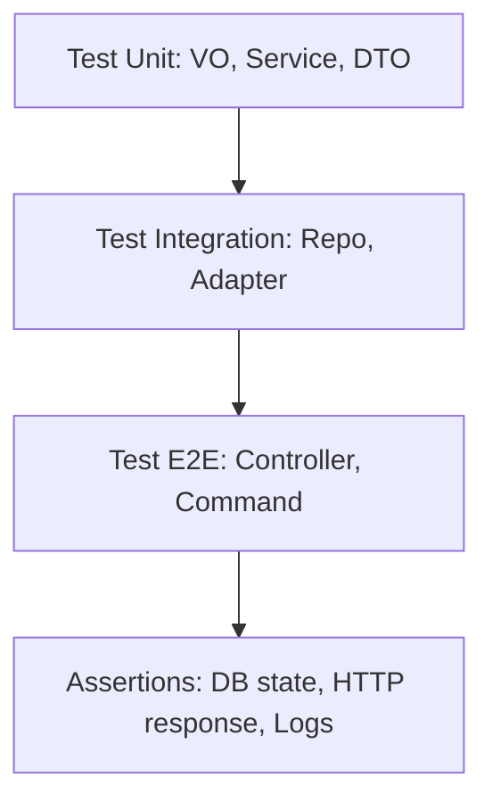

# Этап 1. Написание тестов для модуля Example — план для тестирования

## Цель этапа

- Что проверяем в этом этапе: Полное покрытие Unit, Integration и E2E тестами для всего модуля Example согласно принципам Clean Architecture и CQRS.
- Какие критерии приемки закрываем: Все публичные методы протестированы, тесты стабильны, покрытие 100% для логики, интеграция с БД и внешними сервисами проверена.

## Общие принципы тестирования

- Типы тестов: Unit (изоляция, моки), Integration (с БД), E2E (полный HTTP/консоль поток).
- Разделяй ответственность: Unit для бизнес-логики без зависимостей, Integration для репозиториев и адаптеров, E2E для контроллеров и команд.
- Каждый сценарий: **Дано** → **Проверяемое** → **Ожидаемый результат**.
- Минимальное покрытие: Позитивные сценарии, валидация исключений, edge cases.

## Структура тестовых файлов

> Укажи точные пути и назначение.

Unit:

- `backend/tests/Suite/Example/Domain/SubtractNumbersVOTest.php` — Тест ValueObject с валидацией
- `backend/tests/Suite/Example/Domain/InvalidSubtractNumbersExceptionTest.php` — Тест фабричного метода исключения
- `backend/tests/Suite/Example/Domain/ExampleNotFoundExceptionTest.php` — Тест фабричного метода исключения
- `backend/tests/Suite/Example/Application/ExampleUseCaseTest.php` — Тест UseCase с моками зависимостей
- `backend/tests/Suite/Example/Application/SubtractExampleUseCaseTest.php` — Тест UseCase с моками
- `backend/tests/Suite/Example/Application/ExampleOutboxCommandTest.php` — Тест Command с DB моками
- `backend/tests/Suite/Example/Application/GetExampleQueryTest.php` — Тест Query с DB моками
- `backend/tests/Suite/Example/Application/ExampleCalcServiceTest.php` — Тест Service логики
- `backend/tests/Suite/Example/Application/ExampleReportResponderTest.php` — Тест Responder с файлами
- `backend/tests/Suite/Example/Application/ExampleRequestFactoryTest.php` — Тест Factory с валидацией

Integration:

- `backend/tests/Suite/Example/Infrastructure/EloquentExampleRepositoryTest.php` — Тест Repository с реальной БД
- `backend/tests/Suite/Example/Infrastructure/ClickhouseLoggerTest.php` — Тест Adapter с моками PSR Logger

E2E:

- `backend/tests/Suite/Example/Presentation/ExampleControllerTest.php` — Тест HTTP эндпоинтов
- `backend/tests/Suite/Example/Presentation/SubtractExampleCommandTest.php` — Тест консольной команды
- `backend/tests/Suite/Example/Presentation/ExampleMiddlewareTest.php` — Тест middleware
- `backend/tests/Suite/Example/Presentation/ExampleCreatedListenerTest.php` — Тест event listener

## Сценарии

### Unit

1. **Тест SubtractNumbersVO конструктора**
   - Дано: Два разных числа (1.0, 2.0)
   - Проверяемое: Создание VO без исключений
   - Ожидаемый результат: VO создан, свойства установлены

2. **Тест SubtractNumbersVO с равными числами**
   - Дано: Два равных числа (1.0, 1.0)
   - Проверяемое: Создание VO
   - Ожидаемый результат: InvalidSubtractNumbersException выброшено

3. **Тест InvalidSubtractNumbersException фабричный метод**
   - Дано: Вызов numbersEqual()
   - Проверяемое: Создание исключения
   - Ожидаемый результат: Экземпляр с правильным сообщением

4. **Тест ExampleNotFoundException фабричный метод**
   - Дано: Вызов byId(123)
   - Проверяемое: Создание исключения
   - Ожидаемый результат: Экземпляр с сообщением содержащим ID

5. **Тест ExampleUseCase createExample**
   - Дано: Моки всех зависимостей, валидный CreateExampleRequest
   - Проверяемое: Вызов createExample
   - Ожидаемый результат: Repository store вызван, Command insert вызван, Event dispatched, возвращен CreatedIdVO

6. **Тест ExampleUseCase getExampleViewData найден**
   - Дано: Query возвращает ExampleDto
   - Проверяемое: Вызов getExampleViewData
   - Ожидаемый результат: Возвращен ExampleDto

7. **Тест ExampleUseCase getExampleViewData не найден**
   - Дано: Query возвращает null
   - Проверяемое: Вызов getExampleViewData
   - Ожидаемый результат: ExampleNotFoundException выброшено

8. **Тест SubtractExampleUseCase subtractAndMakeReport**
   - Дано: Моки Service и Responder, SubtractNumbersVO
   - Проверяемое: Вызов subtractAndMakeReport
   - Ожидаемый результат: Service subtract вызван дважды, Responder render вызван с Calculated массивом

9. **Тест ExampleOutboxCommand insert**
   - Дано: Мок DB Connection, ExampleDto
   - Проверяемое: Вызов insert
   - Ожидаемый результат: JSON encoded данные вставлены в таблицу, возвращен ID

10. **Тест GetExampleQuery getById найден**
    - Дано: Мок DB возвращает stdClass с name и comment
    - Проверяемое: Вызов getById
    - Ожидаемый результат: Возвращен ExampleDto с данными

11. **Тест GetExampleQuery getById не найден**
    - Дано: Мок DB возвращает null
    - Проверяемое: Вызов getById
    - Ожидаемый результат: Возвращен null

12. **Тест ExampleCalcService subtract**
    - Дано: Два числа 5.0 и 3.0
    - Проверяемое: Вызов subtract
    - Ожидаемый результат: Возвращено 2.0

13. **Тест ExampleReportResponder render md**
    - Дано: Массив Calculated, format='md'
    - Проверяемое: Вызов render
    - Ожидаемый результат: Шаблон прочитан, плейсхолдер заменен на строки данных

14. **Тест ExampleReportResponder render не md**
    - Дано: Любой массив, format='txt'
    - Проверяемое: Вызов render
    - Ожидаемый результат: Возвращено '-'

15. **Тест ExampleRequestFactory createRequest успешный**
    - Дано: Мок ValidationFactory возвращает validated данные, валидный JSON массив
    - Проверяемое: Вызов createRequest
    - Ожидаемый результат: Validation make вызван с правилами, возвращен CreateExampleRequest с данными

16. **Тест ExampleRequestFactory createRequest невалидный**
    - Дано: Мок ValidationFactory throws ValidationException
    - Проверяемое: Вызов createRequest
    - Ожидаемый результат: ValidationException проброшено

### Integration

1. **Тест EloquentExampleRepository store**
   - Дано: Реальная тестовая БД, CreateExampleDto
   - Проверяемое: Вызов store
   - Ожидаемый результат: Запись создана в таблице examples, возвращен ID

2. **Тест ClickhouseLogger log**
   - Дано: Мок PSR Logger, apiKey, сообщение
   - Проверяемое: Вызов log
   - Ожидаемый результат: Logger log вызван с INFO уровнем, контекст содержит apiKey

### E2E

1. **Тест ExampleController create успешный**
   - Дано: Авторизованный пользователь, валидный JSON в POST /api/examples
   - Проверяемое: HTTP запрос
   - Ожидаемый результат: Статус 200, JSON с ID, запись в БД, outbox, event

2. **Тест ExampleController create невалидный**
   - Дано: Авторизованный пользователь, невалидный JSON
   - Проверяемое: HTTP запрос
   - Ожидаемый результат: ValidationException, статус 422

3. **Тест ExampleController show найден**
   - Дано: ID существующего примера, GET /examples/{id}
   - Проверяемое: HTTP запрос
   - Ожидаемый результат: Статус 200, View с данными примера

4. **Тест ExampleController show не найден**
   - Дано: Несуществующий ID, GET /examples/{id}
   - Проверяемое: HTTP запрос
   - Ожидаемый результат: ExampleNotFoundException, ошибка 404

5. **Тест SubtractExampleCommand успешный**
   - Дано: Аргументы числа, запуск команды
   - Проверяемое: Консольный вывод
   - Ожидаемый результат: Markdown отчет в stdout

6. **Тест SubtractExampleCommand равные числа**
   - Дано: Равные числа, запуск команды
   - Проверяемое: Консольный вывод
   - Ожидаемый результат: Ошибка с сообщением

7. **Тест ExampleMiddleware**
   - Дано: Запрос с middleware
   - Проверяемое: Middleware логика
   - Ожидаемый результат: Лог записан, запрос продолжен

8. **Тест ExampleCreatedListener**
   - Дано: Dispatched ExampleCreated event
   - Проверяемое: Listener реакция
   - Ожидаемый результат: Логгер вызван с сообщением
   - Дано: Авторизованный пользователь, валидный JSON в POST /api/examples
   - Проверяемое: HTTP запрос
   - Ожидаемый результат: Статус 200, JSON с ID, запись в БД, outbox, event

2. **Тест ExampleController create невалидный**
   - Дано: Авторизованный пользователь, невалидный JSON
   - Проверяемое: HTTP запрос
   - Ожидаемый результат: ValidationException, статус 422

3. **Тест ExampleController show найден**
   - Дано: ID существующего примера, GET /examples/{id}
   - Проверяемое: HTTP запрос
   - Ожидаемый результат: Статус 200, View с данными примера

4. **Тест ExampleController show не найден**
   - Дано: Несуществующий ID, GET /examples/{id}
   - Проверяемое: HTTP запрос
   - Ожидаемый результат: ExampleNotFoundException, ошибка 404

5. **Тест SubtractExampleCommand успешный**
   - Дано: Аргументы числа, запуск команды
   - Проверяемое: Консольный вывод
   - Ожидаемый результат: Markdown отчет в stdout

6. **Тест SubtractExampleCommand равные числа**
   - Дано: Равные числа, запуск команды
   - Проверяемое: Консольный вывод
   - Ожидаемый результат: Ошибка с сообщением

7. **Тест ExampleMiddleware**
   - Дано: Запрос с middleware
   - Проверяемое: Middleware логика
   - Ожидаемый результат: Лог записан, запрос продолжен

8. **Тест ExampleCreatedListener**
   - Дано: Dispatched ExampleCreated event
   - Проверяемое: Listener реакция
   - Ожидаемый результат: Логгер вызван с сообщением

## Матрица покрытия требований

- **CRUD примеров**: ExampleUseCaseTest, GetExampleQueryTest, ExampleOutboxCommandTest, EloquentExampleRepositoryTest, ExampleControllerTest, ExampleRequestFactoryTest
- **Валидация данных**: SubtractNumbersVOTest, InvalidSubtractNumbersExceptionTest, ExampleRequestFactoryTest
- **Обработка ошибок**: ExampleNotFoundExceptionTest, UseCase исключения
- **Внешняя интеграция**: ClickhouseLoggerTest
- **Отчеты**: ExampleCalcServiceTest, ExampleReportResponderTest, SubtractExampleUseCaseTest, SubtractExampleCommandTest
- **События**: ExampleCreatedListenerTest
- **Middleware**: ExampleMiddlewareTest

## Чек-лист выполнения

- `make php-run CMD="vendor/bin/phpunit --coverage-text --testsuite=Example"` (проверка покрытия)

## Диаграмма тестируемого потока

## Общие рекомендации

- Используй фабрики из backend/tests/Stub/ModelFactory для тестовых данных.
- Моки: RepositoryInterface, LoggerInterface, ConnectionInterface.
- Для E2E: Используй RefreshDatabase, проверяй JSON структуры и View рендеринг.
- Избегай flaky тестов: фиксируй время если нужно.
