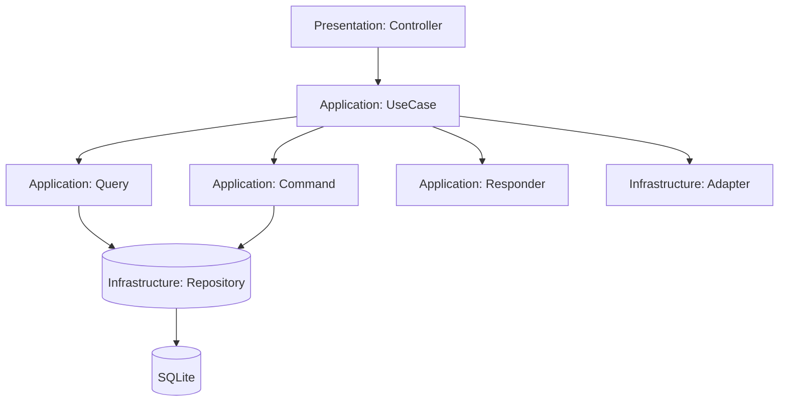

# Указатель задач: План написания тестов для модуля Example (Этап 2)

## Обзор

- Цель: Создание полного набора тестов (Unit, Integration, E2E) для модуля Example, эталонного модуля реализации Clean Architecture и CQRS.
- Пользовательская ценность: Обеспечение надежности и качества кода, демонстрация лучших практик тестирования.
- Границы (вне scope): Не включает изменения в код модуля, только тесты.

## Быстрая справка

- Кол-во этапов: 1
- Примерное кол-во файлов (создать/изменить): 12/0 (все файлы тестов)
- Оценка времени: 4–5 часов (ориентир)
- Зависимости: Модуль Example, тестовые фабрики

## Связь с архитектурой и правилами

- Архитектура: [Architecture.md](/.ai/rules/Architecture.md)
- Процесс добавления фич: [FeatureWorkflow.md](/.ai/rules/FeatureWorkflow.md)
- PHP-правила: [CodeHints.md](/.ai/rules/CodeHints.md)
- Тестирование: [Testing.md](/.ai/rules/Testing.md)

## Этапы реализации

> Каждый этап должен быть реализуем за один сеанс AI-агента.

1. **Этап 1: Написание тестов для модуля Example**
   - Создание полного набора Unit, Integration и E2E тестов для всех компонентов модуля Example.
   - [План для тестирования](Stages/Stage1_TaskForTest.md)

## Зависимости между этапами

Этапы независимы, так как все тесты пишутся в одном этапе.

## Диаграмма потока данных (Mermaid)

> Диаграмма должна дополнять текст (не заменять). Минимизируй количество узлов, используй названия слоев/компонентов проекта.

## Примечания

- Риски/ограничения: Требуется наличие тестовых баз данных и фабрик.
- Альтернативы (если есть): Можно использовать существующие фабрики или создать новые.
