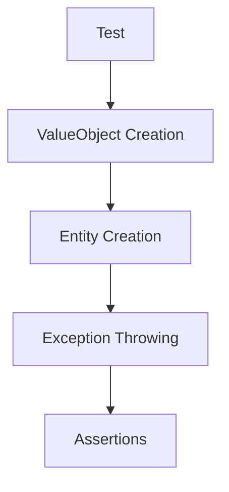

# Этап 1. Доменная модель экспорта — план для тестирования

## Цель этапа

- Что проверяем в этом этапе: Корректность доменных сущностей, ValueObject и интерфейсов экспорта.
- Какие критерии приемки закрываем: Базовые структуры данных определены правильно.

## Общие принципы тестирования

- Типы тестов: Unit, Integration, E2E.
- Разделяй ответственность тестов: Unit — доменные правила/DTO/валидации без внешних зависимостей.
- Каждый сценарий описывай в формате: **Дано → Проверяемое → Ожидаемый результат**.

## Структура тестовых файлов

Unit:

- `backend/tests/Suite/Export/Domain/ExportDataTest.php` — Тесты для ExportData entity.
- `backend/tests/Suite/Export/Domain/ExportFormatTest.php` — Тесты для ExportFormat ValueObject.
- `backend/tests/Suite/Export/Domain/MediaMetadataTest.php` — Тесты для MediaMetadata ValueObject.
- `backend/tests/Suite/Export/Domain/ExportFailedExceptionTest.php` — Тесты для исключения.

Integration:

- Нет на этом этапе.

E2E:

- Нет на этом этапе.

## Сценарии

### Unit

1. **Создание ExportData с валидными данными**
   - Дано: Массив данных пользователя, семьи, медиа.
   - Проверяемое: Создание ExportData entity.
   - Ожидаемый результат: Entity создана без ошибок, данные доступны через геттеры.

2. **ExportFormat поддерживает JSON**
   - Дано: Значение 'json'.
   - Проверяемое: Создание ExportFormat.
   - Ожидаемый результат: ValueObject создан, метод isJson() возвращает true.

3. **MediaMetadata валидация**
   - Дано: Имя файла, тип, дата загрузки.
   - Проверяемое: Создание MediaMetadata.
   - Ожидаемый результат: ValueObject создан, поля immutable.

4. **ExportFailedException содержит сообщение**
   - Дано: Сообщение об ошибке.
   - Проверяемое: Бросание исключения.
   - Ожидаемый результат: Исключение содержит правильное сообщение.

## Матрица покрытия требований

- AC-4: JSON формат → `ExportFormatTest::testSupportsJson()`
- AC-7: Корректное имя файла → `MediaMetadataTest::testFileNameValidation()`

## Чек-лист выполнения (локально/CI)

- `make php-run CMD="php artisan test --filter=Export"`
- `make php-run CMD="vendor/bin/phpstan analyse src/Export"`

## Диаграмма тестируемого потока (Mermaid)

## Общие рекомендации

- Используй фабрики/фикстуры из проекта (если есть).
- Фиксируй время (если важно) и избегай флакки-тестов.
- Для E2E — проверяй не только статус-код, но и payload/контент.