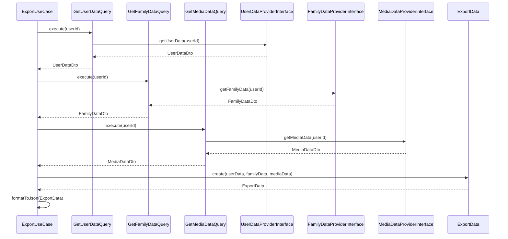

# Этап 2. Application слой экспорта — план для разработчика

## Цель этапа

- Что добавляем/меняем в этом этапе: Реализация UseCase для экспорта, Command и Query для сбора данных из разных модулей.
- Что является критерием готовности: UseCase может собрать данные и сформировать JSON без инфраструктуры.

## Общие архитектурные принципы

- Clean Architecture, CQRS, модульный монолит, Laravel.
- Не смешивать ответственность слоёв (Domain, Application, Infrastructure, Presentation).
- Стабильные контракты между слоями: интерфейсы, DTO, исключения.

## Архитектурные решения

- **Domain**: Используем интерфейсы из этапа 1.
- **Application**: ExportUseCase, GetUserDataQuery, GetFamilyDataQuery, GetMediaDataQuery, DTO для передачи данных.
- **Infrastructure**: Пока не затрагиваем.
- **Presentation**: Пока не затрагиваем.

## Структура модулей

- Модуль: `Export`
- Публичные точки входа: ExportUseCase.
- Зависимости от других модулей: Через интерфейсы UserDataProviderInterface и т.д.

## Модель предметной области

- **Сущности**: Используем ExportData из Domain.
- **Value Objects**: ExportFormat, MediaMetadata.
- **DTO** (Application): ExportRequestDto, UserDataDto, FamilyDataDto, MediaDataDto.
- **Исключения**: ExportFailedException.
- **Интерфейсы** (репозитории/шлюзы): UserDataProviderInterface, FamilyDataProviderInterface, MediaDataProviderInterface.

## Контракты и потоки данных (Mermaid)

## Изменяемые файлы

Создать:

- `backend/src/Export/Application/UseCase/ExportUserData.php` — UseCase для экспорта.
- `backend/src/Export/Application/Query/GetUserDataQuery.php` — Query для данных пользователя.
- `backend/src/Export/Application/Query/GetFamilyDataQuery.php` — Query для данных семьи.
- `backend/src/Export/Application/Query/GetMediaDataQuery.php` — Query для медиа.
- `backend/src/Export/Application/Dto/ExportRequestDto.php` — DTO для запроса экспорта.
- `backend/src/Export/Application/Dto/UserDataDto.php` — DTO для данных пользователя.
- `backend/src/Export/Application/Dto/FamilyDataDto.php` — DTO для данных семьи.
- `backend/src/Export/Application/Dto/MediaDataDto.php` — DTO для медиа.

Изменить:

- Нет изменений.

## Последовательность действий

1. Создать DTO для Application слоя.
2. Реализовать Query классы для получения данных через интерфейсы.
3. Создать ExportUseCase, который оркестрирует Query и формирует ExportData.
4. Добавить логику форматирования в JSON.
5. Обработать исключения в UseCase.
6. Проверить CQRS: команды не возвращают данные напрямую.

## Риски и альтернативы

- Риск: Зависимости от интерфейсов, которые еще не реализованы → Митигировать: Использовать mock в тестах.
- Альтернатива: Объединить все в один UseCase (не выбрали, чтобы сохранить CQRS).

## Чек-лист архитектурного соответствия

- [x] CQRS: команды не возвращают доменные сущности напрямую
- [x] Domain не зависит от Laravel/Infrastructure
- [x] Application зависит от Domain, но не от Presentation
- [x] Infrastructure реализует интерфейсы Application/Domain
- [x] Контроллер тонкий: Не применимо
- [x] Все публичные контракты задокументированы (DTO/PHPDoc)