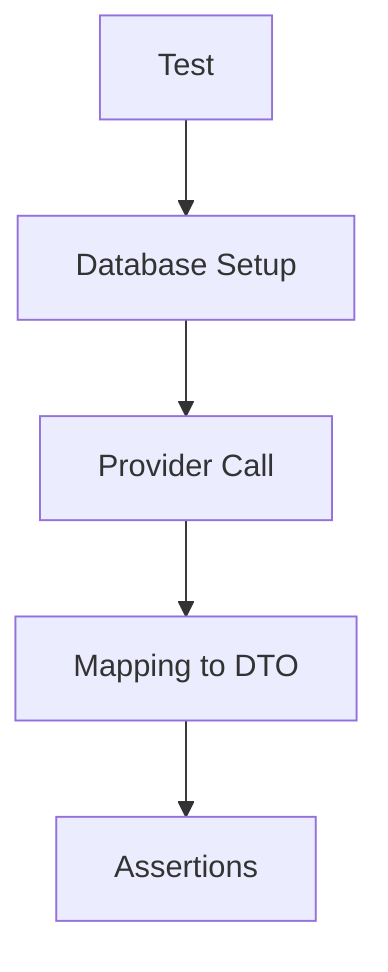

# Этап 3. Infrastructure слой экспорта — план для тестирования

## Цель этапа

- Что проверяем в этом этапе: Корректность репозиториев и адаптеров для доступа к данным.
- Какие критерии приемки закрываем: Данные извлекаются из БД и маппятся в DTO.

## Общие принципы тестирования

- Типы тестов: Unit, Integration, E2E.
- Разделяй ответственность тестов: Unit — доменные правила/DTO/валидации без внешних зависимостей.
- Каждый сценарий описывай в формате: **Дано → Проверяемое → Ожидаемый результат**.

## Структура тестовых файлов

Unit:

- `backend/tests/Suite/Export/Infrastructure/UserDataProviderTest.php` — Тесты для адаптера.

Integration:

- `backend/tests/Suite/Export/Integration/UserDataProviderIntegrationTest.php` — С реальной БД.

E2E:

- Нет на этом этапе.

## Сценарии

### Unit

1. **UserDataProvider маппит Entity в DTO**
   - Дано: Mock User entity.
   - Проверяемое: Вызов getUserData.
   - Ожидаемый результат: Возвращает UserDataDto с правильными полями.

### Integration

1. **UserDataProvider с реальной БД**
   - Дано: Запись в БД users.
   - Проверяемое: getUserData(userId).
   - Ожидаемый результат: DTO с данными из БД.

## Матрица покрытия требований

- AC-3: Только данные пользователя → `UserDataProviderIntegrationTest::testReturnsUserDataOnly()`

## Чек-лист выполнения (локально/CI)

- `make php-run CMD="php artisan test --filter=Export"`
- `make php-run CMD="vendor/bin/phpstan analyse src/Export"`

## Диаграмма тестируемого потока (Mermaid)

## Общие рекомендации

- Используй фабрики/фикстуры из проекта (если есть).
- Фиксируй время (если важно) и избегай флакки-тестов.
- Для E2E — проверяй не только статус-код, но и payload/контент.