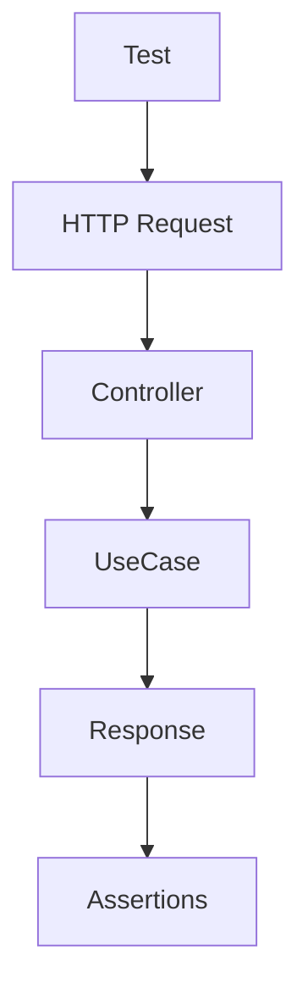

# Этап 4. Presentation слой экспорта — план для тестирования

## Цель этапа

- Что проверяем в этом этапе: HTTP флоу экспорта от запроса до ответа.
- Какие критерии приемки закрываем: Скачивание файла JSON.

## Общие принципы тестирования

- Типы тестов: Unit, Integration, E2E.
- Разделяй ответственность тестов: Unit — доменные правила/DTO/валидации без внешних зависимостей.
- Каждый сценарий описывай в формате: **Дано → Проверяемое → Ожидаемый результат**.

## Структура тестовых файлов

Unit:

- `backend/tests/Suite/Export/Presentation/ExportControllerTest.php` — Тесты контроллера.

Integration:

- Нет на этом этапе.

E2E:

- `backend/tests/Suite/Export/E2E/ExportFlowTest.php` — Полный HTTP флоу.

## Сценарии

### Unit

1. **ExportController вызывает UseCase**
   - Дано: Authenticated user.
   - Проверяемое: GET /export.
   - Ожидаемый результат: UseCase вызван с правильным userId.

### E2E

1. **Экспорт данных авторизованного пользователя**
   - Дано: Авторизованный пользователь с данными.
   - Проверяемое: GET /api/export.
   - Ожидаемый результат: Скачивается JSON файл с данными пользователя.

2. **Экспорт без авторизации**
   - Дано: Неавторизованный запрос.
   - Проверяемое: GET /api/export.
   - Ожидаемый результат: 401 Unauthorized.

3. **Экспорт при ошибке**
   - Дано: UseCase бросает исключение.
   - Проверяемое: GET /api/export.
   - Ожидаемый результат: 500 с сообщением об ошибке.

## Матрица покрытия требований

- AC-1: Виден экспорт в интерфейсе → E2E тест (предполагаем UI).
- AC-2: Скачивание файла → `ExportFlowTest::testDownloadJsonFile()`
- AC-5: Понятное сообщение при ошибке → `ExportFlowTest::testErrorMessage()`

## Чек-лист выполнения (локально/CI)

- `make php-run CMD="php artisan test --filter=Export"`
- `make php-run CMD="vendor/bin/phpstan analyse src/Export"`

## Диаграмма тестируемого потока (Mermaid)

## Общие рекомендации

- Используй фабрики/фикстуры из проекта (если есть).
- Фиксируй время (если важно) и избегай флакки-тестов.
- Для E2E — проверяй не только статус-код, но и payload/контент.