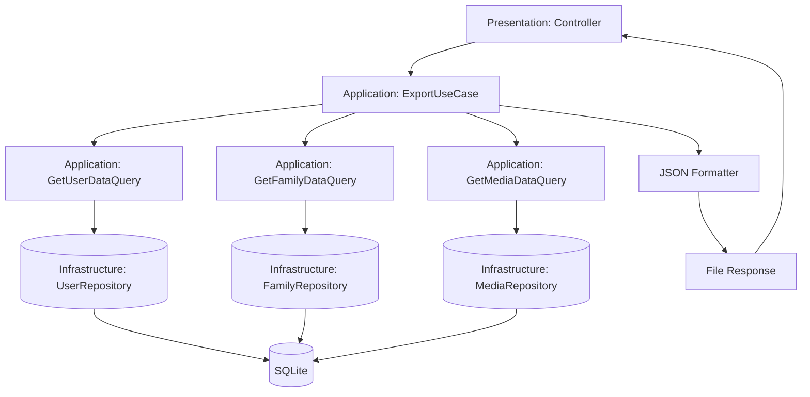

# Указатель задач: T123 Database-Export - Этап 1 MVP экспорта данных

## Обзор

Реализуем базовую функциональность экспорта данных пользователя в формате JSON согласно спецификации. Пользователь может инициировать экспорт из интерфейса, получить файл с данными учетной записи, членов семьи, отношений и метаданных медиа. Экспорт происходит синхронно, без асинхронной обработки.

- Цель: Предоставить пользователям возможность самостоятельного экспорта своих данных для резервного копирования и переноса.
- Пользовательская ценность: Безопасный доступ к собственным данным, возможность анализа и резервного копирования.
- Границы (вне scope): Асинхронная генерация, хранение файлов экспорта, экспорт бинарных медиа, импорт данных обратно.

## Быстрая справка

- Кол-во этапов: 4
- Примерное кол-во файлов (создать/изменить): 25/5
- Оценка времени: 8–12 часов (инкрементальная реализация)
- Зависимости: Модуль Auth (для данных пользователя), будущие модули FamilyTree и Media (интерфейсы)

## Связь с архитектурой и правилами

- Архитектура: [Architecture.md](../../Rule/Architecture.md)
- Процесс добавления фич: [FeatureWorkflow.md](../../Rule/FeatureWorkflow.md)
- PHP-правила: [CodeHints.md](../../Rule/CodeHints.md)

## Этапы реализации

1. **Этап 1: Доменная модель экспорта**
   - Создание сущностей, ValueObject и интерфейсов для экспорта данных.
   - [План для разработчика](Stages/Stage1_TaskForDev.md) | [План для тестирования](Stages/Stage1_TaskForTest.md)

2. **Этап 2: Application слой экспорта**
   - Реализация UseCase, Command и Query для сбора и формирования данных экспорта.
   - [План для разработчика](Stages/Stage2_TaskForDev.md) | [План для тестирования](Stages/Stage2_TaskForTest.md)

3. **Этап 3: Infrastructure слой экспорта**
   - Реализация репозиториев и адаптеров для доступа к данным из других модулей.
   - [План для разработчика](Stages/Stage3_TaskForDev.md) | [План для тестирования](Stages/Stage3_TaskForTest.md)

4. **Этап 4: Presentation слой экспорта**
   - Создание контроллера, роутов и интеграции с аутентификацией.
   - [План для разработчика](Stages/Stage4_TaskForDev.md) | [План для тестирования](Stages/Stage4_TaskForTest.md)

## Зависимости между этапами

- Этап 2 зависит от: Этап 1 (использует доменные интерфейсы и сущности)
- Этап 3 зависит от: Этап 2 (реализует интерфейсы репозиториев)
- Этап 4 зависит от: Этап 3 (использует инфраструктуру для доступа к данным)

## Диаграмма потока данных (Mermaid)

## Примечания

- Риски/ограничения: Объем данных может влиять на производительность; для MVP синхронная обработка.
- Альтернативы: Асинхронный экспорт через очереди (отложено до следующих этапов).