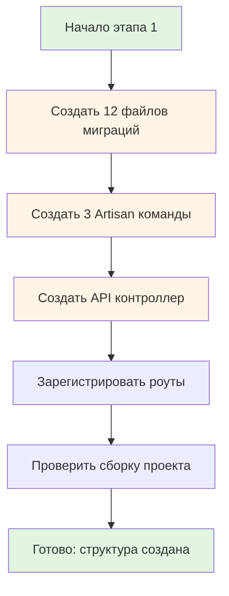
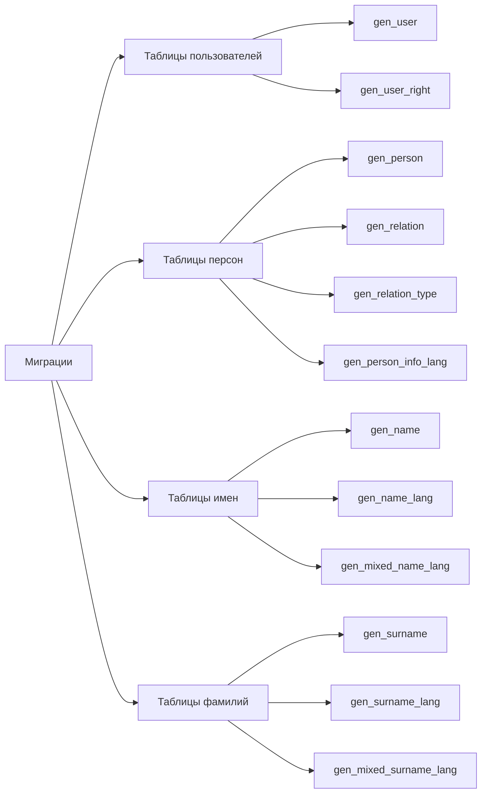
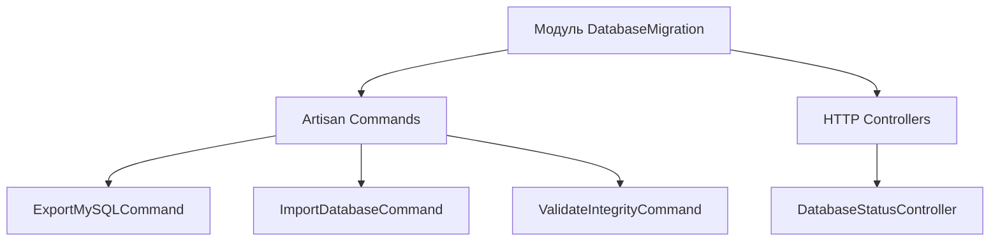

# Этап 1. Создание структуры файлов и заглушек — план для разработчика

## Цель этапа

- **Что добавляем/меняем**: Создаем полную структуру файлов для миграции БД MySQL → SQLite: миграции для основных
  таблиц, консольные команды (экспорт, импорт, валидация), API контроллер статуса БД.
- **Что является критерием готовности**: Все файлы созданы с заглушками методов, проект собирается без ошибок.

## Общие архитектурные принципы

- Данная задача является **инфраструктурной** и не создает новые модули бизнес-логики.
- Работа ведется напрямую с БД без применения Clean Architecture в полном объеме.
- Консольные команды и API контроллер работают напрямую с БД (без Repository).
- Следуем стандартам Laravel для миграций, команд и контроллеров.

## Архитектурные решения

Поскольку это инфраструктурная задача без бизнес-логики, применяем упрощенную структуру:

- **database/migrations**: Laravel-миграции для создания всех таблиц БД
- **app/Console/Commands**: Artisan-команды для работы с БД
- **app/Http/Controllers**: API контроллер для проверки статуса БД
- **routes**: Регистрация API роута

**Важно**: На данном этапе создаем только структуру файлов с заглушками. Реальная реализация будет на следующих этапах.

## Структура директорий

```text
backend/
├── database/
│   └── migrations/
│       ├── YYYY_MM_DD_HHMMSS_create_gen_user_table.php
│       ├── YYYY_MM_DD_HHMMSS_create_gen_user_right_table.php
│       ├── YYYY_MM_DD_HHMMSS_create_gen_relation_type_table.php
│       ├── YYYY_MM_DD_HHMMSS_create_gen_person_table.php
│       ├── YYYY_MM_DD_HHMMSS_create_gen_relation_table.php
│       ├── YYYY_MM_DD_HHMMSS_create_gen_name_table.php
│       ├── YYYY_MM_DD_HHMMSS_create_gen_name_lang_table.php
│       ├── YYYY_MM_DD_HHMMSS_create_gen_mixed_name_lang_table.php
│       ├── YYYY_MM_DD_HHMMSS_create_gen_surname_table.php
│       ├── YYYY_MM_DD_HHMMSS_create_gen_surname_lang_table.php
│       ├── YYYY_MM_DD_HHMMSS_create_gen_mixed_surname_lang_table.php
│       └── YYYY_MM_DD_HHMMSS_create_gen_person_info_lang_table.php
├── src/
│   └── DatabaseMigration/
│       ├── Presentation/
│       │   ├── Console/
│       │   │   └── Commands/
│       │   │       ├── ExportMySQLCommand.php
│       │   │       ├── ImportDatabaseCommand.php
│       │   │       └── ValidateIntegrityCommand.php
│       │   ├── Http/
│       │   │   └── Controllers/
│       │   │       └── DatabaseStatusController.php
│       │   └── Config/
│       │       └── DatabaseMigrationServiceProvider.php
│       └── Readme.md

├── routes/
│   └── api.php (изменить)
├── bootstrap/
│   └── providers.php (изменить)
```

## Модель предметной области

На данном этапе модель предметной области **не создается**. Работа ведется напрямую с БД через Laravel-компоненты.

Однако для понимания структуры БД, укажем основные таблицы:

### Основные таблицы

1. **gen_user** — пользователи системы
2. **gen_user_right** — права пользователей
3. **gen_relation_type** — типы связей между персонами (создается дополнительно)
4. **gen_person** — персоны в генеалогическом древе
5. **gen_relation** — связи между персонами
6. **gen_name** — основная таблица имен
7. **gen_name_lang** — языковые варианты имен с гендерными формами
8. **gen_mixed_name_lang** — связь имен с языковыми вариантами
9. **gen_surname** — основная таблица фамилий
10. **gen_surname_lang** — языковые варианты фамилий с гендерными формами
11. **gen_mixed_surname_lang** — связь фамилий с языковыми вариантами
12. **gen_person_info_lang** — многоязычные описания персон

**Примечание**: Таблицы gen_menu, gen_menu_order, gen_message, gen_message_text, gen_mixed_menu_mess не требуют миграции в новую БД.

## Контракты и потоки данных (Mermaid)

### Общий поток создания структуры



### Структура файлов миграций



### Структура команд и контроллера



## Изменяемые файлы

### Создать: Миграции (12 файлов)

Все миграции создаются через `php artisan make:migration` с автоматической генерацией timestamps.

1. `backend/database/migrations/YYYY_MM_DD_HHMMSS_create_gen_user_table.php`
2. `backend/database/migrations/YYYY_MM_DD_HHMMSS_create_gen_user_right_table.php`
3. `backend/database/migrations/YYYY_MM_DD_HHMMSS_create_gen_relation_type_table.php`
4. `backend/database/migrations/YYYY_MM_DD_HHMMSS_create_gen_person_table.php`
5. `backend/database/migrations/YYYY_MM_DD_HHMMSS_create_gen_relation_table.php`
6. `backend/database/migrations/YYYY_MM_DD_HHMMSS_create_gen_name_table.php`
7. `backend/database/migrations/YYYY_MM_DD_HHMMSS_create_gen_name_lang_table.php`
8. `backend/database/migrations/YYYY_MM_DD_HHMMSS_create_gen_mixed_name_lang_table.php`
9. `backend/database/migrations/YYYY_MM_DD_HHMMSS_create_gen_surname_table.php`
10. `backend/database/migrations/YYYY_MM_DD_HHMMSS_create_gen_surname_lang_table.php`
11. `backend/database/migrations/YYYY_MM_DD_HHMMSS_create_gen_mixed_surname_lang_table.php`
12. `backend/database/migrations/YYYY_MM_DD_HHMMSS_create_gen_person_info_lang_table.php`

### Создать: Модуль DatabaseMigration

1. `backend/src/DatabaseMigration/dochub.yaml`
2. `backend/src/DatabaseMigration/Readme.md`
3. `backend/src/DatabaseMigration/Presentation/Config/DatabaseMigrationServiceProvider.php`

### Создать: Консольные команды (3 файла)

1. `backend/src/DatabaseMigration/Presentation/Console/Commands/ExportMySQLCommand.php`
2. `backend/src/DatabaseMigration/Presentation/Console/Commands/ImportDatabaseCommand.php`
3. `backend/src/DatabaseMigration/Presentation/Console/Commands/ValidateIntegrityCommand.php`

### Создать: API контроллер (1 файл)

1. `backend/src/DatabaseMigration/Presentation/Http/Controllers/DatabaseStatusController.php`

### Изменить: Роуты

1. `backend/routes/api.php` — добавить роут `GET /api/status`

### Изменить: Providers

1. `backend/bootstrap/providers.php` — зарегистрировать DatabaseMigrationServiceProvider

## Последовательность действий

### Шаг 1: Создание структуры модуля DatabaseMigration

Создать базовую структуру модуля по правилам Clean Architecture.

#### 1.1 Создать директории модуля

```bash
mkdir -p backend/src/DatabaseMigration/Presentation/Console/Commands
mkdir -p backend/src/DatabaseMigration/Presentation/Config
```

#### 1.2 Создать базовые файлы модуля

**Содержимое файла `backend/src/DatabaseMigration/dochub.yaml`:**

```yaml
module: DatabaseMigration
description: Модуль для миграции данных из MySQL в SQLite
```

**Содержимое файла `backend/src/DatabaseMigration/Readme.md`:**

```markdown
# Модуль DatabaseMigration

Модуль для миграции схемы БД и данных из MySQL в SQLite.

## Структура

- **Presentation**: Команды для экспорта/импорта/валидации, ServiceProvider
```

**Содержимое файла `backend/src/DatabaseMigration/Presentation/Config/DatabaseMigrationServiceProvider.php`:**

```php
<?php

declare(strict_types=1);

namespace App\DatabaseMigration\Presentation\Config;

use Illuminate\Support\ServiceProvider;

/**
 * ServiceProvider для модуля DatabaseMigration.
 */
final class DatabaseMigrationServiceProvider extends ServiceProvider
{
    /**
     * Регистрация команд модуля.
     */
    public function register(): void
    {
        // Регистрация команд будет добавлена на этапе реализации
    }
}
```

#### 1.3 Зарегистрировать ServiceProvider

**Изменить файл `backend/bootstrap/providers.php`:**

Добавить в массив providers:

```php
use App\DatabaseMigration\Presentation\Config\DatabaseMigrationServiceProvider;

// ...

DatabaseMigrationServiceProvider::class,
```

### Шаг 2: Создание миграций (17 файлов)

Создаем миграции в правильном порядке (с учетом зависимостей):

#### 1.1 Справочные таблицы (создаются первыми)

```bash
php artisan make:migration create_gen_user_right_table
php artisan make:migration create_gen_relation_type_table
```

**Содержимое миграции gen_user_right_table:**

```php
<?php

use Illuminate\Database\Migrations\Migration;
use Illuminate\Database\Schema\Blueprint;
use Illuminate\Support\Facades\Schema;

return new class extends Migration
{
    public function up(): void
    {
        Schema::create('gen_user_right', function (Blueprint $table) {
            // TODO: Реализовать структуру таблицы на этапе 2
        });
    }

    public function down(): void
    {
        Schema::dropIfExists('gen_user_right');
    }
};
```

**Содержимое миграции gen_relation_type_table:**

```php
<?php

use Illuminate\Database\Migrations\Migration;
use Illuminate\Database\Schema\Blueprint;
use Illuminate\Support\Facades\Schema;

return new class extends Migration
{
    public function up(): void
    {
        Schema::create('gen_relation_type', function (Blueprint $table) {
            // TODO: Реализовать структуру таблицы на этапе 2
        });
    }

    public function down(): void
    {
        Schema::dropIfExists('gen_relation_type');
    }
};
```

#### 1.2 Основные таблицы пользователей

```bash
php artisan make:migration create_gen_user_table
```

**Содержимое миграции gen_user_table:**

```php
<?php

use Illuminate\Database\Migrations\Migration;
use Illuminate\Database\Schema\Blueprint;
use Illuminate\Support\Facades\Schema;

return new class extends Migration
{
    public function up(): void
    {
        Schema::create('gen_user', function (Blueprint $table) {
            // TODO: Реализовать структуру таблицы на этапе 2
        });
    }

    public function down(): void
    {
        Schema::dropIfExists('gen_user');
    }
};
```

#### 1.3 Таблицы имен и фамилий

```bash
php artisan make:migration create_gen_name_table
php artisan make:migration create_gen_name_lang_table
php artisan make:migration create_gen_mixed_name_lang_table
php artisan make:migration create_gen_surname_table
php artisan make:migration create_gen_surname_lang_table
php artisan make:migration create_gen_mixed_surname_lang_table
```

**Содержимое каждой миграции (аналогично):**

```php
<?php

use Illuminate\Database\Migrations\Migration;
use Illuminate\Database\Schema\Blueprint;
use Illuminate\Support\Facades\Schema;

return new class extends Migration
{
    public function up(): void
    {
        Schema::create('gen_name', function (Blueprint $table) {
            // TODO: Реализовать структуру таблицы на этапе 2
        });
    }

    public function down(): void
    {
        Schema::dropIfExists('gen_name');
    }
};
```

#### 1.4 Таблицы персон и связей

```bash
php artisan make:migration create_gen_person_table
php artisan make:migration create_gen_relation_table
php artisan make:migration create_gen_person_info_lang_table
```

**Примечание**: Все миграции создаются с заглушками. Реальная структура таблиц будет реализована на Этапе 2.

### Шаг 3: Создание консольных команд (3 файла)

#### 3.1 Команда экспорта из MySQL

```bash
php artisan make:command ExportMySQLCommand
```

**Содержимое файла `backend/src/DatabaseMigration/Presentation/Console/Commands/ExportMySQLCommand.php`:**

```php
<?php

declare(strict_types=1);

namespace App\DatabaseMigration\Presentation\Console\Commands;

use Illuminate\Console\Command;

/**
 * Команда экспорта данных из MySQL в JSON файл.
 */
final class ExportMySQLCommand extends Command
{
    /**
     * Имя команды.
     */
    protected $signature = 'db:export-mysql
        {--host= : MySQL host}
        {--database= : Database name}
        {--user= : MySQL user}
        {--password= : MySQL password}
        {--port=3306 : MySQL port}
        {--output= : Output file path}
        {--tables= : Comma-separated list of tables}';

    /**
     * Описание команды.
     */
    protected $description = 'Экспорт данных из MySQL в JSON файл';

    /**
     * Выполнить команду.
     */
    public function handle(): int
    {
        $this->info('TODO: Реализовать экспорт данных на этапе 3');

        return self::SUCCESS;
    }
}
```

#### 2.2 Команда импорта в SQLite

```bash
php artisan make:command ImportDatabaseCommand
```

**Содержимое файла `backend/src/DatabaseMigration/Presentation/Console/Commands/ImportDatabaseCommand.php`:**

```php
<?php

declare(strict_types=1);

namespace App\DatabaseMigration\Presentation\Console\Commands;

use Illuminate\Console\Command;

/**
 * Команда импорта данных из JSON в SQLite.
 */
final class ImportDatabaseCommand extends Command
{
    /**
     * Имя команды.
     */
    protected $signature = 'db:import
        {--file= : Path to export file}
        {--validate : Validate file without importing}
        {--tables= : Comma-separated list of tables}
        {--skip-existing : Skip records with existing IDs}
        {--truncate : Truncate tables before import}';

    /**
     * Описание команды.
     */
    protected $description = 'Импорт данных из JSON файла в SQLite';

    /**
     * Выполнить команду.
     */
    public function handle(): int
    {
        $this->info('TODO: Реализовать импорт данных на этапе 4');

        return self::SUCCESS;
    }
}
```

#### 2.3 Команда проверки целостности

```bash
php artisan make:command ValidateIntegrityCommand
```

**Содержимое файла `backend/src/DatabaseMigration/Presentation/Console/Commands/ValidateIntegrityCommand.php`:**

```php
<?php

declare(strict_types=1);

namespace App\DatabaseMigration\Presentation\Console\Commands;

use Illuminate\Console\Command;

/**
 * Команда проверки целостности данных в БД.
 */
final class ValidateIntegrityCommand extends Command
{
    /**
     * Имя команды.
     */
    protected $signature = 'db:validate-integrity
        {--verbose : Show detailed output}
        {--format=text : Output format (text|json)}
        {--fix : Auto-fix issues}';

    /**
     * Описание команды.
     */
    protected $description = 'Проверка целостности данных в БД';

    /**
     * Выполнить команду.
     */
    public function handle(): int
    {
        $this->info('TODO: Реализовать проверку целостности на этапе 5');

        return self::SUCCESS;
    }
}
```

### Шаг 3: Создание API контроллера

#### 3.1 Создать контроллер

```bash
php artisan make:controller DatabaseStatusController
```

**Содержимое файла `backend/app/Http/Controllers/DatabaseStatusController.php`:**

```php
<?php

declare(strict_types=1);

namespace App\DatabaseMigration\Presentation\Http\Controllers;

use Illuminate\Http\JsonResponse;

/**
 * Контроллер для проверки статуса базы данных.
 */
final class DatabaseStatusController extends Controller
{
    /**
     * Проверить статус базы данных.
     */
    public function status(): JsonResponse
    {
        // TODO: Реализовать проверку статуса на этапе 6
        return response()->json([
            'status' => 'ok',
            'message' => 'TODO: Implement database status check',
        ]);
    }
}
```

### Шаг 4: Регистрация роутов

**Изменить файл `backend/routes/api.php`:**

Добавить в конец файла:

```php
use App\DatabaseMigration\Presentation\Http\Controllers\DatabaseStatusController;

// Статус базы данных
Route::get('/status', [DatabaseStatusController::class, 'status']);
```

### Шаг 5: Проверка сборки проекта

После создания всех файлов выполнить:

```bash
# Проверка сборки
make php-run CMD="composer dump-autoload"

# Проверка доступности команд
make php-run CMD="php artisan list | grep db:"

# Проверка роутов
make php-run CMD="php artisan route:list | grep status"

# Запуск тестов (все должны быть skipped)
make php-run CMD="vendor/bin/phpunit tests/Suite/Infrastructure/Database"
```

**Ожидаемый результат:**

- Проект собирается без ошибок
- Все 3 команды доступны: `db:export-mysql`, `db:import`, `db:validate-integrity`
- Роут `GET /api/status` зарегистрирован

## Риски и альтернативы

### Риск 1: Несовместимость версий Laravel

**Описание**: Если версия Laravel в проекте отличается от ожидаемой (12.x), синтаксис команд и миграций может
отличаться.

**Митигация**: Проверить версию Laravel перед началом работы: `php artisan --version`. Адаптировать синтаксис под
конкретную версию.

### Риск 2: Конфликт имен команд

**Описание**: Если команды с такими именами уже существуют, возникнет конфликт.

**Митигация**: Проверить список команд перед созданием: `php artisan list | grep db:`. Использовать уникальные имена
при необходимости.

### Риск 3: Автоматическое форматирование кода

**Описание**: Автоматические форматтеры могут изменить структуру заглушек.

**Митигация**: Отключить автоматическое форматирование при создании заглушек. Проверить код после создания.

### Альтернатива 1: Использовать Eloquent Models вместо миграций

**Почему не выбрали**: Eloquent Models будут созданы на этапе 2 (доменная модель). На данном этапе достаточно миграций
для определения структуры БД.

### Альтернатива 2: Создать сервисы для команд

**Почему не выбрали**: Сервисы будут созданы на этапах 3-5 при реализации бизнес-логики. На данном этапе достаточно
заглушек в командах.

## Чек-лист готовности этапа

- [ ] Созданы все 12 файлов миграций с заглушками
- [ ] Созданы 3 консольные команды с заглушками
- [ ] Создан API контроллер с заглушкой
- [ ] Зарегистрирован роут `GET /api/status`
- [ ] Проект собирается без ошибок: `composer dump-autoload`
- [ ] Все команды доступны: `php artisan list | grep db:`
- [ ] Роут зарегистрирован: `php artisan route:list | grep status`
- [ ] Код соответствует стилю проекта (PSR-12, типизация, PHPDoc)
- [ ] Все файлы добавлены в git: `git status`

## Полный список создаваемых файлов

### Миграции (12 файлов)

1. `backend/database/migrations/YYYY_MM_DD_HHMMSS_create_gen_user_right_table.php`
2. `backend/database/migrations/YYYY_MM_DD_HHMMSS_create_gen_relation_type_table.php`
3. `backend/database/migrations/YYYY_MM_DD_HHMMSS_create_gen_user_table.php`
4. `backend/database/migrations/YYYY_MM_DD_HHMMSS_create_gen_name_table.php`
5. `backend/database/migrations/YYYY_MM_DD_HHMMSS_create_gen_name_lang_table.php`
6. `backend/database/migrations/YYYY_MM_DD_HHMMSS_create_gen_mixed_name_lang_table.php`
7. `backend/database/migrations/YYYY_MM_DD_HHMMSS_create_gen_surname_table.php`
8. `backend/database/migrations/YYYY_MM_DD_HHMMSS_create_gen_surname_lang_table.php`
9. `backend/database/migrations/YYYY_MM_DD_HHMMSS_create_gen_mixed_surname_lang_table.php`
10. `backend/database/migrations/YYYY_MM_DD_HHMMSS_create_gen_person_table.php`
11. `backend/database/migrations/YYYY_MM_DD_HHMMSS_create_gen_relation_table.php`
12. `backend/database/migrations/YYYY_MM_DD_HHMMSS_create_gen_person_info_lang_table.php`

### Модуль DatabaseMigration (3 файла)

1. `backend/src/DatabaseMigration/dochub.yaml`
2. `backend/src/DatabaseMigration/Readme.md`
3. `backend/src/DatabaseMigration/Presentation/Config/DatabaseMigrationServiceProvider.php`

### Команды (3 файла)

1. `backend/src/DatabaseMigration/Presentation/Console/Commands/ExportMySQLCommand.php`
2. `backend/src/DatabaseMigration/Presentation/Console/Commands/ImportDatabaseCommand.php`
3. `backend/src/DatabaseMigration/Presentation/Console/Commands/ValidateIntegrityCommand.php`

### Контроллер (1 файл)

1. `backend/src/DatabaseMigration/Presentation/Http/Controllers/DatabaseStatusController.php`

### Изменяемые файлы (2 файла)

1. `backend/routes/api.php` — добавить роут `GET /api/status`
2. `backend/bootstrap/providers.php` — зарегистрировать DatabaseMigrationServiceProvider

**Итого**: 12 миграций + 3 файла модуля + 3 команды + 1 контроллер + 2 изменяемых файла = **22 файла** (19 создать, 3 изменить)

## Примечания

### Порядок создания миграций

Миграции создаются в определенном порядке с учетом зависимостей:

1. **Справочники** (gen_user_right, gen_relation_type)
2. **Пользователи** (gen_user)
3. **Имена и фамилии** (gen_name, gen_name_lang, gen_mixed_name_lang, gen_surname, gen_surname_lang, gen_mixed_surname_lang)
4. **Персоны и связи** (gen_person, gen_relation, gen_person_info_lang)

Это обеспечит корректный порядок применения миграций при выполнении `php artisan migrate`.

### Соглашения об именовании

- **Миграции**: `create_{table_name}_table`
- **Команды**: `{Action}{Entity}Command` (ExportMySQLCommand, ImportDatabaseCommand)
- **Контроллеры**: `{Entity}{Action}Controller` (DatabaseStatusController)
- **Тесты**: `{ClassName}Test` (ExportMySQLCommandTest)

### Важные детали реализации

1. **Все классы помечены как `final`** — это best practice для избежания наследования в большинстве случаев
2. **Strict types включены** — `declare(strict_types=1)` в начале каждого файла
3. **PHPDoc комментарии** — для всех классов и методов на русском языке
4. **Типизация параметров и возвращаемых значений** — везде где возможно
5. **Использование констант Command** — `self::SUCCESS` вместо `0`

### Следующие этапы

После завершения данного этапа переходим к:

- **Этап 2**: Реализация структуры таблиц в миграциях
- **Этап 3**: Реализация команды экспорта из MySQL
- **Этап 4**: Реализация команды импорта в SQLite
- **Этап 5**: Реализация команды проверки целостности
- **Этап 6**: Реализация API контроллера и документации
