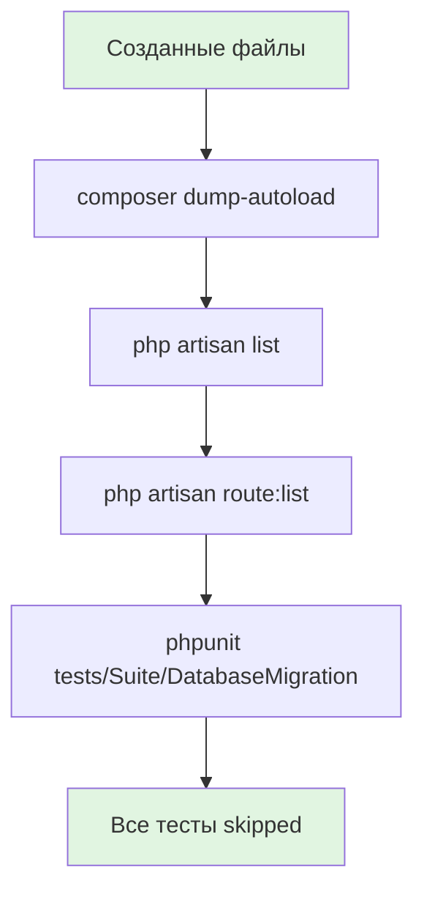

# Этап 1. Создание структуры файлов и заглушек — план для тестирования

## Цель этапа

- **Что проверяем в этом этапе**: Структура файлов для миграции БД MySQL → SQLite создана правильно: миграции, консольные команды (экспорт, импорт, валидация), API контроллер статуса БД и тесты с заглушками.
- **Критерии приемки**: Все файлы созданы с заглушками методов, проект собирается без ошибок, все тесты помечены как `markTestSkipped`, команды доступны через `artisan list`.

## Общие принципы тестирования

- Типы тестов: **E2E** — проверка доступности команд и API эндпоинта на уровне структуры.
- Разделяй ответственность тестов:
  - **E2E** — проверка создания команд, контроллеров и базовой доступности.
- Поскольку это этап создания структуры, все тесты содержат только заглушки с `markTestSkipped()` и проверяют, что структура создана правильно.

## Структура тестовых файлов

### E2E

- `backend/tests/Suite/DatabaseMigration/Presentation/Console/Command/ExportMySQLCommandTest.php` — тест команды экспорта из MySQL
- `backend/tests/Suite/DatabaseMigration/Presentation/Console/Command/ImportDatabaseCommandTest.php` — тест команды импорта в SQLite
- `backend/tests/Suite/DatabaseMigration/Presentation/Console/Command/ValidateIntegrityCommandTest.php` — тест команды проверки целостности
- `backend/tests/Suite/DatabaseMigration/Presentation/Http/Controller/DatabaseStatusControllerTest.php` — тест API контроллера статуса БД


### Создание тестов (4 файла)

#### Тест команды экспорта

Создать директорию и файл:

```bash
mkdir -p backend/tests/Suite/Infrastructure/Database/Command
```

**Содержимое файла `backend/tests/Suite/Infrastructure/Database/Command/ExportMySQLCommandTest.php`:**

```php
<?php

declare(strict_types=1);

namespace Tests\Suite\Infrastructure\Database\Command;

use Tests\TestCase;

/**
 * Тесты команды экспорта данных из MySQL.
 */
final class ExportMySQLCommandTest extends TestCase
{
    /**
     * Тест успешного экспорта данных.
     */
    public function test_export_success(): void
    {
        self::markTestSkipped('TODO: Реализовать тест на этапе 3');
    }

    /**
     * Тест экспорта с ошибкой подключения.
     */
    public function test_export_connection_error(): void
    {
        self::markTestSkipped('TODO: Реализовать тест на этапе 3');
    }

    /**
     * Тест экспорта с валидацией параметров.
     */
    public function test_export_validation(): void
    {
        self::markTestSkipped('TODO: Реализовать тест на этапе 3');
    }
}
```

#### Тест команды импорта

**Содержимое файла `backend/tests/Suite/Infrastructure/Database/Command/ImportDatabaseCommandTest.php`:**

```php
<?php

declare(strict_types=1);

namespace Tests\Suite\Infrastructure\Database\Command;

use Tests\TestCase;

/**
 * Тесты команды импорта данных в SQLite.
 */
final class ImportDatabaseCommandTest extends TestCase
{
    /**
     * Тест успешного импорта данных.
     */
    public function test_import_success(): void
    {
        self::markTestSkipped('TODO: Реализовать тест на этапе 4');
    }

    /**
     * Тест импорта с валидацией файла.
     */
    public function test_import_validation(): void
    {
        self::markTestSkipped('TODO: Реализовать тест на этапе 4');
    }

    /**
     * Тест импорта с флагом truncate.
     */
    public function test_import_truncate(): void
    {
        self::markTestSkipped('TODO: Реализовать тест на этапе 4');
    }

    /**
     * Тест импорта с флагом skip-existing.
     */
    public function test_import_skip_existing(): void
    {
        self::markTestSkipped('TODO: Реализовать тест на этапе 4');
    }
}
```

#### Тест команды валидации целостности

**Содержимое файла `backend/tests/Suite/Infrastructure/Database/Command/ValidateIntegrityCommandTest.php`:**

```php
<?php

declare(strict_types=1);

namespace Tests\Suite\Infrastructure\Database\Command;

use Tests\TestCase;

/**
 * Тесты команды проверки целостности БД.
 */
final class ValidateIntegrityCommandTest extends TestCase
{
    /**
     * Тест проверки целостности без ошибок.
     */
    public function test_validate_success(): void
    {
        self::markTestSkipped('TODO: Реализовать тест на этапе 5');
    }

    /**
     * Тест проверки целостности с ошибками.
     */
    public function test_validate_with_errors(): void
    {
        self::markTestSkipped('TODO: Реализовать тест на этапе 5');
    }

    /**
     * Тест автоматического исправления проблем.
     */
    public function test_validate_fix(): void
    {
        self::markTestSkipped('TODO: Реализовать тест на этапе 5');
    }

    /**
     * Тест вывода в формате JSON.
     */
    public function test_validate_json_output(): void
    {
        self::markTestSkipped('TODO: Реализовать тест на этапе 5');
    }
}
```

#### Тест API контроллера

Создать директорию и файл:

```bash
mkdir -p backend/tests/Suite/Infrastructure/Database/Controller
```

**Содержимое файла `backend/tests/Suite/Infrastructure/Database/Controller/DatabaseStatusControllerTest.php`:**

```php
<?php

declare(strict_types=1);

namespace Tests\Suite\Infrastructure\Database\Controller;

use Tests\TestCase;

/**
 * Тесты контроллера статуса базы данных.
 */
final class DatabaseStatusControllerTest extends TestCase
{
    /**
     * Тест успешного получения статуса БД.
     */
    public function test_status_success(): void
    {
        self::markTestSkipped('TODO: Реализовать тест на этапе 6');
    }

    /**
     * Тест получения статуса при ошибке подключения.
     */
    public function test_status_connection_error(): void
    {
        self::markTestSkipped('TODO: Реализовать тест на этапе 6');
    }

    /**
     * Тест получения статуса при отсутствии таблиц.
     */
    public function test_status_missing_tables(): void
    {
        self::markTestSkipped('TODO: Реализовать тест на этапе 6');
    }
}
```

## Сценарии

### E2E

1. **Проверка создания команды ExportMySQLCommand**
   - Дано: команда `backend/src/DatabaseMigration/Presentation/Console/Commands/ExportMySQLCommand.php` создана с заглушками
   - Проверяемое: тест `ExportMySQLCommandTest` помечен как skipped
   - Ожидаемый результат: тест пропускается с сообщением о TODO реализации на этапе 3

2. **Проверка создания команды ImportDatabaseCommand**
   - Дано: команда `backend/src/DatabaseMigration/Presentation/Console/Commands/ImportDatabaseCommand.php` создана с заглушками
   - Проверяемое: тест `ImportDatabaseCommandTest` помечен как skipped
   - Ожидаемый результат: тест пропускается с сообщением о TODO реализации на этапе 4

3. **Проверка создания команды ValidateIntegrityCommand**
   - Дано: команда `backend/src/DatabaseMigration/Presentation/Console/Commands/ValidateIntegrityCommand.php` создана с заглушками
   - Проверяемое: тест `ValidateIntegrityCommandTest` помечен как skipped
   - Ожидаемый результат: тест пропускается с сообщением о TODO реализации на этапе 5

4. **Проверка создания API контроллера DatabaseStatusController**
   - Дано: контроллер `backend/src/DatabaseMigration/Presentation/Http/Controllers/DatabaseStatusController.php` создан с заглушкой
   - Проверяемое: тест `DatabaseStatusControllerTest` помечен как skipped
   - Ожидаемый результат: тест пропускается с сообщением о TODO реализации на этапе 6

5. **Проверка доступности команд через artisan**
   - Дано: все команды зарегистрированы в ServiceProvider
   - Проверяемое: команды `db:export-mysql`, `db:import`, `db:validate-integrity` доступны в `php artisan list`
   - Ожидаемый результат: команды присутствуют в списке и имеют справку `--help`

6. **Проверка регистрации роута API**
   - Дано: роут `GET /api/status` зарегистрирован в `routes/api.php`
   - Проверяемое: роут доступен в `php artisan route:list`
   - Ожидаемый результат: роут присутствует и указывает на DatabaseStatusController

7. **Проверка сборки проекта**
   - Дано: все файлы созданы согласно структуре
   - Проверяемое: `composer dump-autoload` выполняется без ошибок
   - Ожидаемый результат: автолоадер обновлен успешно

8. **Проверка запуска всех тестов**
   - Дано: все тесты созданы с `markTestSkipped`
   - Проверяемое: `vendor/bin/phpunit tests/Suite/DatabaseMigration` выполняется без ошибок
   - Ожидаемый результат: 0 failures, X skipped, где X = количество тестовых методов

## Матрица покрытия требований

> Сопоставь критерии приемки из Spec.md с тестами.

- FR-2.1 (интерфейс команды экспорта): → `ExportMySQLCommandTest::test_export_success()` (skipped)
- FR-3.1 (интерфейс команды импорта): → `ImportDatabaseCommandTest::test_import_success()` (skipped)
- FR-4.1 (интерфейс команды валидации): → `ValidateIntegrityCommandTest::test_validate_success()` (skipped)
- FR-5.1 (спецификация эндпоинта): → `DatabaseStatusControllerTest::test_status_success()` (skipped)

## Диаграмма тестируемого потока (Mermaid)

> Диаграмма помогает тестировщику быстро понять, где проверять эффекты (доступность команд, роутов, сборку).



## Общие рекомендации

- Используй фабрики/фикстуры из проекта (если есть), но на этом этапе они не требуются.
- Фиксируй время (если важно), но на этапе структуры не актуально.
- Для E2E — проверяй не только успешный запуск команд, но и их доступность.
- Все тесты должны иметь понятные имена методов и сообщения markTestSkipped с указанием этапа реализации.
