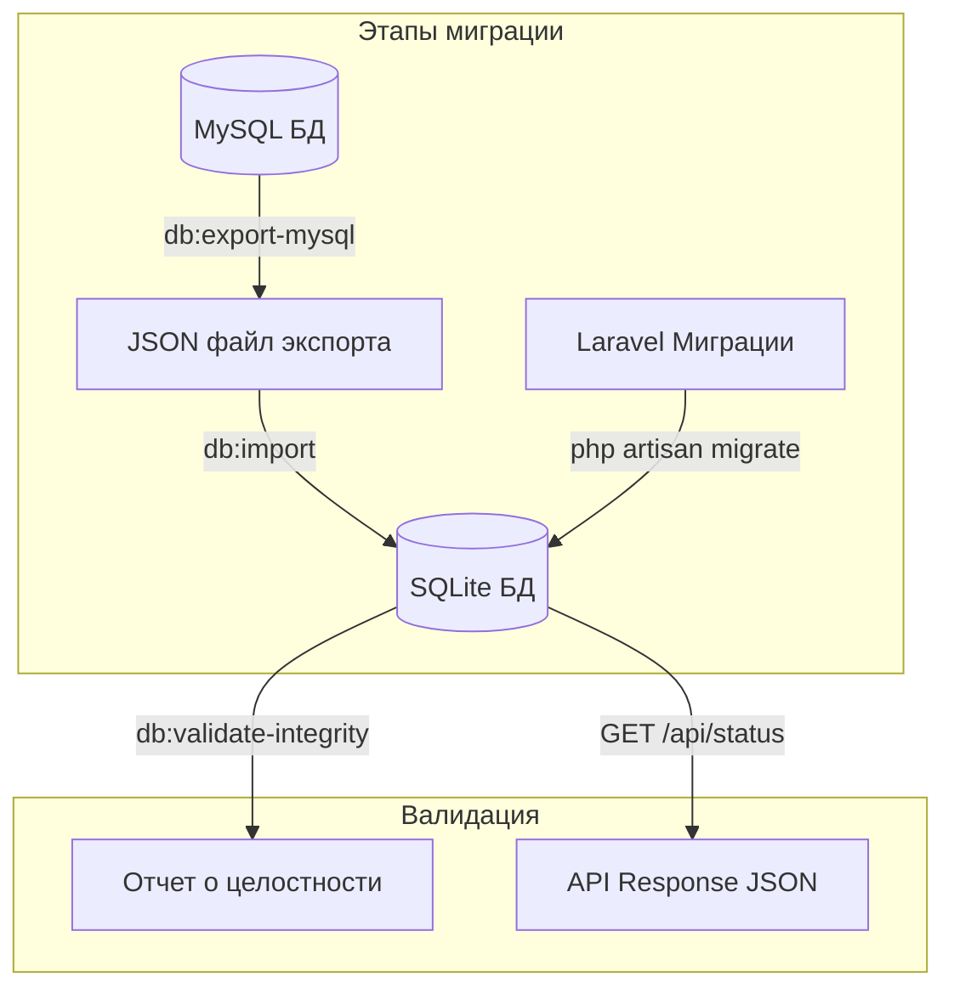
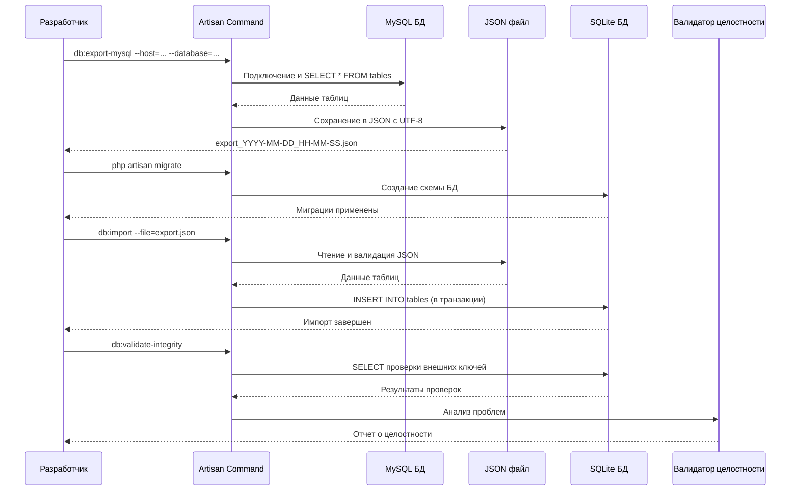

# Миграция схемы БД MySQL → SQLite и проверка целостности данных

## Обзор

Этот технический план описывает реализацию задачи TZ1_01 согласно спецификации [Spec.md](./Spec.md).

**Цель**: Перенести существующую схему базы данных и данные из MySQL в SQLite с полной валидацией целостности.

**Пользовательская ценность**:

- Воспроизводимое развертывание проекта через Docker/Makefile
- Сохранность всех данных семейного генеалогического древа
- Демонстрируемая работающая система с реальными данными
- Основа для дальнейшей разработки функциональности

**Границы (вне scope)**:

- Доменная модель и бизнес-логика (Stage 2)
- API для работы с персонами и связями (Stage 3-5)
- UI и визуализация древа (Stage 6)
- Аутентификация и авторизация (Stage 7)

## Быстрая справка

- Количество этапов: 6
- Оценка времени: 12-18 часов (ориентир)
- Зависимости: Laravel 12, SQLite, Docker

## Связь с архитектурой и правилами

- Архитектура: [Architecture.md](/.ai/rules/Architecture.md)
- Процесс добавления фич: [FeatureWorkflow.md](/.ai/rules/FeatureWorkflow.md)
- PHP-правила: [CodeHints.md](/.ai/rules/CodeHints.md)
- Рекомендации по написанию тестов: [Testing.md](/.ai/rules/Testing.md)

## Структура модулей

Данная задача работает на уровне **инфраструктуры** и не создает новые модули. Изменения касаются:

- **database/migrations/** — Laravel-миграции для создания схемы БД
- **app/Console/Commands/** — Консольные команды для экспорта/импорта/валидации
- **routes/api.php** — API эндпоинт статуса БД
- **Doc/Database/** — Документация структуры БД

Поскольку задача не содержит бизнес-логики и работает напрямую с БД, Clean Architecture здесь применяется упрощенно:

- Команды работают напрямую с БД (без Repository)
- API контроллер также работает напрямую с БД
- Тесты будут интеграционными (проверка команд и эндпоинта)

## Этапы реализации

### Этап 1: Создание структуры файлов и заглушек

Создать все необходимые миграции, команды, контроллер, тесты с методами-заглушками. Все тесты помечены как skipped.

**Что создаем**:

- 16 файлов миграций (15 таблиц + 1 для типов связей)
- 3 Artisan-команды (экспорт, импорт, валидация)
- 1 API контроллер (статус БД)
- Тесты для всех команд и контроллера (с markTestSkipped)

[План для разработчика](./Stages/Stage1_TaskForDev.md) | [План для тестирования](./Stages/Stage1_TaskForTest.md)

### Этап 2: Реализация Laravel-миграций

Реализовать все миграции с адаптацией MySQL → SQLite синтаксиса. Создать таблицу типов связей и заполнить базовыми типами.

**Что делаем**:

- Адаптировать типы данных MySQL → SQLite
- Создать индексы на внешних ключах
- Создать таблицу gen_relation_type с базовыми типами
- Протестировать миграции на чистой БД

[План для разработчика](./Stages/Stage2_TaskForDev.md) | [План для тестирования](./Stages/Stage2_TaskForTest.md)

### Этап 3: Реализация команды экспорта данных из MySQL

Реализовать команду `php artisan db:export-mysql` для экспорта данных из MySQL в JSON.

**Что делаем**:

- Подключение к MySQL
- Экспорт всех таблиц в JSON с корректной обработкой UTF-8
- Обработка дат, NULL-значений, чисел
- Вывод прогресса и сохранение файла

[План для разработчика](./Stages/Stage3_TaskForDev.md) | [План для тестирования](./Stages/Stage3_TaskForTest.md)

### Этап 4: Реализация команды импорта данных в SQLite

Реализовать команду `php artisan db:import` для импорта данных из JSON в SQLite.

**Что делаем**:

- Валидация файла экспорта
- Импорт в транзакции с правильным порядком таблиц
- Поддержка флагов --validate, --skip-existing, --truncate
- Вывод прогресса и обработка ошибок

[План для разработчика](./Stages/Stage4_TaskForDev.md) | [План для тестирования](./Stages/Stage4_TaskForTest.md)

### Этап 5: Реализация команды проверки целостности данных

Реализовать команду `php artisan db:validate-integrity` для валидации целостности БД.

**Что делаем**:

- Проверки всех внешних ключей
- Проверки дублирующих связей и самосвязей
- Вывод отчета в текстовом и JSON форматах
- Автоматическое исправление проблем (флаг --fix)

[План для разработчика](./Stages/Stage5_TaskForDev.md) | [План для тестирования](./Stages/Stage5_TaskForTest.md)

### Этап 6: Реализация API эндпоинта и документации

Реализовать API эндпоинт `GET /api/status` и создать документацию структуры БД.

**Что делаем**:

- API контроллер с проверкой подключения к БД
- Вывод статистики по таблицам
- Создание Doc/Database/Schema.md с описанием всех таблиц
- Примеры SQL-запросов и диаграммы связей

[План для разработчика](./Stages/Stage6_TaskForDev.md) | [План для тестирования](./Stages/Stage6_TaskForTest.md)

## Диаграмма потока данных (Mermaid)

## Детализация потока работы с данными

## Примечания

### Риски и ограничения

1. **Потеря данных при экспорте/импорте**: Минимизируется тщательным тестированием, валидацией и
   использованием JSON как промежуточного формата.
2. **Различия MySQL vs SQLite**: Адаптация типов данных через Laravel-миграции, использование стандартных типов.
3. **Проблемы с кодировкой**: JSON гарантирует UTF-8, явное указание charset при подключении к MySQL.
4. **Битые связи в данных**: Команда валидации выявит проблемы, флаг --fix позволит исправить автоматически.
5. **Отсутствие gen_relation_type**: Создается в миграциях с базовыми типами связей.

### Особенности реализации

1. **Порядок импорта критичен**: Таблицы импортируются с учетом зависимостей (сначала справочники,
   затем зависимые таблицы).
2. **Транзакции обязательны**: Импорт выполняется в транзакции для возможности отката при ошибках.
3. **Отсутствие FOREIGN KEY constraints**: SQLite не поддерживает ALTER TABLE для FK, используем только
   индексы и валидацию на уровне приложения.
4. **Многоязычность**: Работа с именами/фамилиями требует JOIN через промежуточные таблицы.
5. **Гендерные формы**: При выводе отчеств и фамилий учитывается пол персоны.

### Альтернативы

- **Использование FOREIGN KEY constraints**: Не реализуется из-за ограничений SQLite и сложности миграций.
- **Eloquent Models вместо прямого SQL**: На данном этапе не требуется, так как нет бизнес-логики.
  Будет реализовано на Stage 2.
- **Асинхронный импорт через очередь**: Избыточно для текущего объема данных (до 10000 записей).
