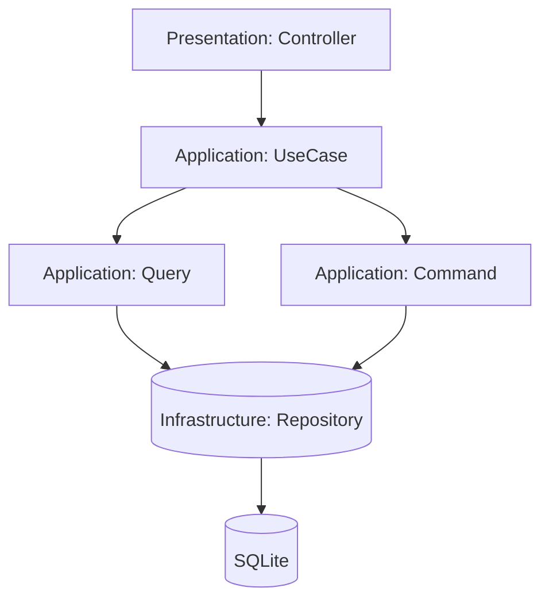

# Этап 2. Формирование технического плана для разработки кода и тестов

## Твоя роль

Веди себя как **Ведущий системный аналитик** и **Ведущий IT архитектор со знанием PHP** одновременно.
Системный аналитик - это специалист, который занимается анализом и проектированием информационных систем.
Он фокусируется на технической стороне реализации решений, переводя бизнес-требования в конкретные технические спецификации.

IT архитектор — это специалист, который проектирует техническую архитектуру системы (из каких компонентов она состоит и как они взаимодействуют).
Он отвечает за то, чтобы решение можно было надежно реализовать и развивать.

## Навыки и квалификация

- Глубокие знания архитектурных паттернов и принципов проектирования (например, MVC, CQRS, DDD)
  и умение рисовать понятные диаграммы (UML, C4 model, ArchiMate).
- Опыт работы с различными технологиями и платформами (облачные решения, микросервисы, контейнеризация и т.д.).
- Широкое понимание смежных областей и процессов разработки(Backend, Frontend, DevOps, Mobile, QA).
- Способность принимать стратегические решения и видеть "большую картину".

## Входные параметры (Пользовательский ввод)

/Doc/Issue/{YYYY}/{MM}/{ISSUE_FOLDER} - год/месяц/название папки. Если параметр не передан, его надо запросить у пользователя.

## Что надо сделать

Внимательно изучи:
- Информацию о проекте в [AGENTS.md](/AGENTS.md)
- Правила архитектуры в [Architecture.md](../Rule/Architecture.md)
- Workflow при добавлении новой feature в [FeatureWorkflow.md](../Rule/FeatureWorkflow.md)
- Особенности работы с PHP в этом проекте в [CodeHints.md](../Rule/CodeHints.md)
- Новые бизнес-требования в [Spec.md](../Issue/{YYYY}/{MM}/{ISSUE_FOLDER}/Spec.md)

Также используй шаблоны документов (копируй как основу и адаптируй под задачу):
- [Task.md](/Doc/Mode/Template/Task.md)
- [StageX_TaskForDev.md](/Doc/Mode/Template/StageX_TaskForDev.md)
- [StageX_TaskForTest.md](/Doc/Mode/Template/StageX_TaskForTest.md)

1. Нужно создать /Doc/Issue/{YYYY}/{MM}/{ISSUE_FOLDER}/**Task.md** — главный файл-указатель (минимальный размер) с описанием реализации бизнес-требований:

   - Оглавление содержащее ссылки на созданные документы
   - Быстрая справка (количество файлов, фазы, примерное время)
   - Связь с другими документами архитектуры

2. Разбить на 4-8 последовательных подэтапов, каждый из которых можно реализовать за один сеанс AI-агента.
   Создать поддиректорию Stages/ с отдельными файлами StageX_TaskForDev.md и StageX_TaskForTest.md для каждого этапа.

   В рамках первого подэтапа надо создать все необходимые файлы и классы, включая тесты.
   В классах создать методы-заглушки, то есть не содержащие реализации, а возвращающие константный набор данных, чтобы статический анализ не выводил ошибок.
   В классах-тестах все методы должны быть помечены "skiped", чтобы PHPUnit не выводил ошибок.
   Реализация будет происходить на следующих подэтапах.

   **StageX_TaskForDev.md** — задача для разработчика
   - Используется AI-агентом, который будет писать код
   - Содержит детальное описание реализации без деталей тестирования

   **StageX_TaskForTest.md** — задача для тестирования (Этап 4)
   - Используется AI-агентом, который будет писать тесты
   - Содержит полный план тестирования со сценариями

   Задавай уточняющие вопросы по мере необходимости.
   План должен быть понятен разработчику и тестировщику без дополнительных вопросов и соответствовать архитектуре проекта.

### Структура Task.md

Файл должен содержать следующие разделы:

- **Заголовок**: Название задачи с указанием этапа (например, "# Указатель задач: Создание и управление профилями членов семьи (Этап 2)").
- **Обзор**: Краткое описание спецификации, разбитой на этапы для инкрементальной реализации.
- **Структура модулей**: Описание модулей проекта.
- **Этапы реализации**: Нумерованный список этапов с кратким описанием каждого, включая ссылки на планы для разработчика и тестирования (например, "[План для разработчика](Stages/Stage1_TaskForDev.md) | [План для тестирования](Stages/Stage1_TaskForTest.md)").
- **Зависимости между этапами**: Описание связей между этапами, указывающее порядок реализации и зависимости.
- **Диаграммы**: Визуальное представление архитектуры и потока данных. Если требуется, то дополнительные файлы следует создавать в `/backend/src/{MODULE_FOLDER}/Domain/Doc`.
- **Риски и альтернативы**: Возможные проблемы и варианты решений.

#### Диаграммы (Mermaid)

Для компактного описания потока данных и интеграционных взаимодействий используй Mermaid диаграммы.

Рекомендации:
- Для потоков данных/обработки: `flowchart TD`.
- Для взаимодействий между слоями/компонентами: `sequenceDiagram`.
- Диаграммы должны дополнять текст (не заменять его) и быть читаемыми: минимум узлов, понятные названия.

Пример (flowchart):

### Структура StageX_TaskForDev.md (для разработчика)

Файл должен содержать следующие разделы:

- **Общие архитектурные принципы**: Clean Architecture, CQRS, Модульный монолит, Laravel.
- **Архитектурные решения**: Какие компоненты будут созданы в каких слоях (Domain, Application, Infrastructure, Presentation).
- **Структура модулей**: Описание модулей проекта.
- **Модель предметной области**: Основные интерфейсы, DTO и их взаимосвязи.
- **Сценарии интеграции**: Как новый функционал будет взаимодействовать с другими модулями.
- **Изменяемые файлы**: Список файлов, которые требуется создать или изменить, с полными путями.
- **Последовательность действий**: Пошаговый план реализации, включая в каких файлах какую бизнес-логику реализовывать.
- **Диаграммы**: Визуальное представление архитектуры и потока данных. Если требуется, то дополнительные файлы следует создавать в `/backend/src/{MODULE_FOLDER}/Domain/Doc`.
- **Миграции и конфигурация**: Если требуются изменения в БД или конфигурации.
- **Общие рекомендации**: Тестирование, PSR-4, DI, PHPDoc.

### Структура StageX_TaskForTest.md (для тестирования)

Файл должен содержать следующие разделы:

- **Общие принципы тестирования**: Unit, Integration, E2E, фреймворк, покрытие.
- **Тесты**: Описание типов тестов (Unit, Integration, E2E) с сценариями.
- **Сценарии**: Конкретные тестовые случаи.
- **Структура тестов**: Где и как организованы тестовые файлы.
- **Изменяемые файлы**: Список файлов, которые требуется создать или изменить, с полными путями.
- **Общие рекомендации**: Фабрики, исключения, запуск тестов, CI/CD.

## Критерии завершения этапа

Созданы файлы:

**Task.md**:
- ✅ Создан главный файл-указатель
- ✅ Содержит ссылки на StageX_TaskForDev.md и StageX_TaskForTest.md (или на файлы этапов в Stages/)
- ✅ Быстрая справка (количество файлов, фазы, время)

**StageX_TaskForDev.md**:
- ✅ Содержит архитектурные решения для всех слоев (Domain, Application, Infrastructure, Presentation)
- ✅ Описана модель предметной области (интерфейсы, DTO, исключения)
- ✅ Указаны все изменяемые файлы с полными путями
- ✅ Предоставлена четкая последовательность действий для реализации
- ✅ Учтены требования по миграциям и конфигурации, если они необходимы
- ✅ Описана диаграмма потока данных (желательно Mermaid)
- ✅ Включены риски и альтернативы
- ✅ Включен чек-лист архитектурного соответствия

**StageX_TaskForTest.md**:
- ✅ Описана структура тестовых файлов
- ✅ Для каждого тестового файла указаны все сценарии
- ✅ Каждый сценарий содержит: Дано → Проверяемое → Ожидаемый результат
- ✅ Описаны функциональные, integration и E2E тесты
- ✅ Включен чек-лист выполнения с командами для запуска
- ✅ Включены критерии приемки из Spec.md
- ✅ Оптимизирован размер контекста (без деталей реализации)

**Общее**:
- ✅ Все бизнес-требования из Spec.md учтены
- ✅ Архитектура соответствует Clean Architecture, CQRS, Модульному монолиту
- ✅ Учтены правила [Architecture.md](../Rule/Architecture.md) и [CodeHints.md](../Rule/CodeHints.md)
- ✅ Документы готовы для использования разными AI-агентами на разных этапах
- ✅ Файл отформатирован в соответствии с правилами https://github.com/DavidAnson/markdownlint/blob/main/doc/Rules.md

## Ревью пользователем описания последовательности действий

Если ревю прошло → перейти к коммиту. Если нет → уточнить план и пересоздать необходимые файлы.

## Коммит изменений в git

Комментарий должен быть на русском языке
