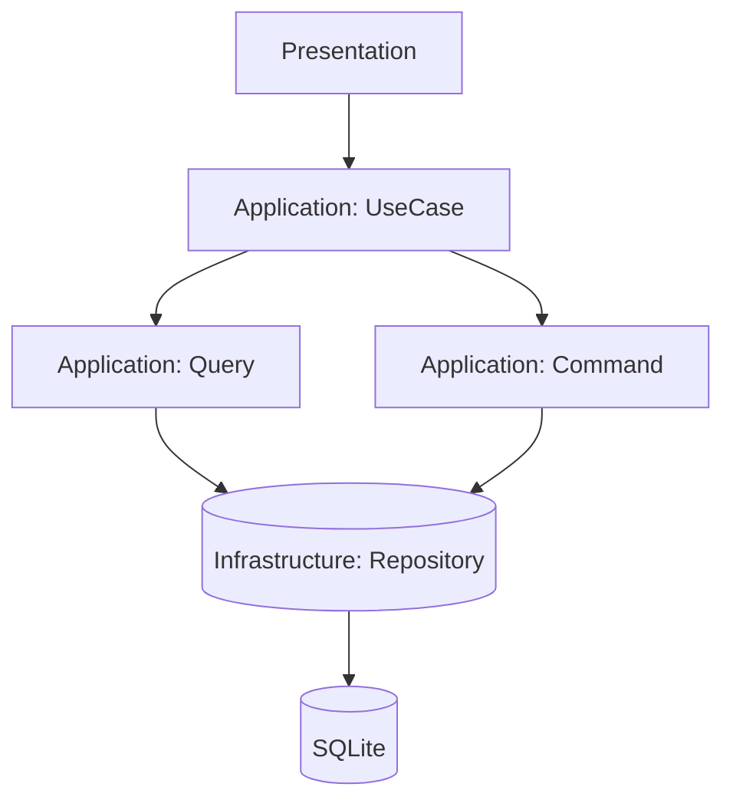

# Указатель задач: <Название фичи/подсистемы> (Этап 2)

## Обзор

Кратко опиши, что реализуем по [Spec.md](../Issue/{YYYY}/{MM}/{ISSUE_FOLDER}/Spec.md):

- Цель: …
- Пользовательская ценность: …
- Границы (вне scope): …

## Быстрая справка

- Кол-во этапов: <N>
- Примерное кол-во файлов (создать/изменить): <N>/<M>
- Оценка времени: <X–Y часов> (ориентир)
- Зависимости: <миграции/модули/внешние сервисы>

## Связь с архитектурой и правилами

- Архитектура: [Architecture.md](../Rule/Architecture.md)
- Процесс добавления фич: [FeatureWorkflow.md](../Rule/FeatureWorkflow.md)
- PHP-правила: [CodeHints.md](../Rule/CodeHints.md)

## Этапы реализации

> Каждый этап должен быть реализуем за один сеанс AI-агента.

Пример:
```markdown
1. **Этап 1: <краткое название>**
   - <краткое описание>
   - [План для разработчика](Stages/Stage1_TaskForDev.md) | [План для тестирования](Stages/Stage1_TaskForTest.md)
```

## Зависимости между этапами

Опиши зависимости явно:

- Этап 2 зависит от: Этап 1, потому что …
- Этап 3 зависит от: Этап 2, потому что …

## Диаграмма потока данных (Mermaid)

> Диаграмма должна дополнять текст (не заменять). Минимизируй количество узлов, используй названия слоев/компонентов проекта.



## Примечания

- Риски/ограничения: …
- Альтернативы (если есть): …
