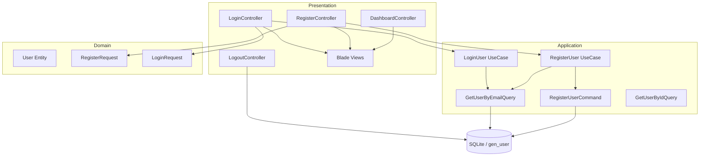
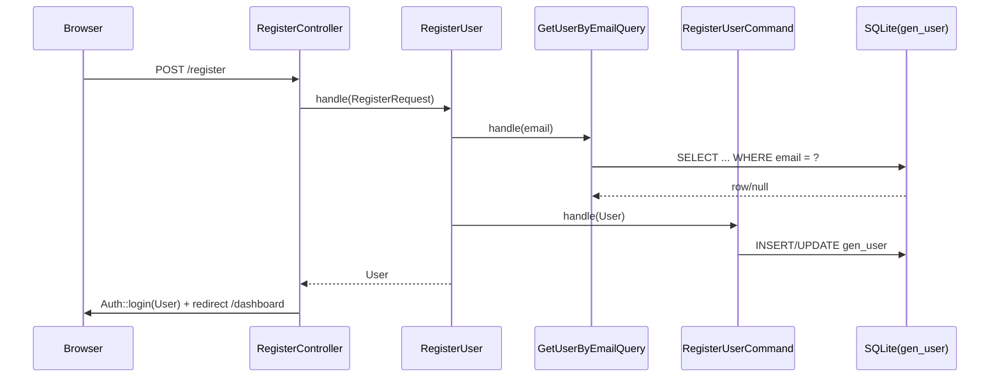

# Модуль Auth: базовая web-аутентификация

## Назначение

Модуль **Auth** реализует базовый web-флоу аутентификации для проекта
«Моё Древо»:

- регистрация пользователя;
- вход по email/паролю;
- выход из системы;
- защищённая страница Dashboard.

Модуль ориентирован на работу через Laravel guard `web` (сессии) и использует
таблицу БД `gen_user`.

## 1. Описание архитектуры и структуры модуля

Модуль спроектирован в терминах Clean Architecture и CQRS:

- **Domain**: сущность пользователя и DTO запросов.
- **Application**: UseCase + команды/запросы (Command/Query) для доступа к
  данным.
- **Presentation**: HTTP-контроллеры и Blade-представления.

Фактическая реализация имеет важное отклонение от «классического» разделения:

- отдельного слоя **Infrastructure** (репозитории/адаптеры) нет;
- доступ к БД выполняется напрямую из Application слоя через фасад `DB`.

Точки прямого доступа к БД:

- запись:
  [`RegisterUserCommand::handle()`](backend/src/Auth/Application/Command/RegisterUserCommand.php:12)
- чтение:
  [`GetUserByEmailQuery::handle()`](backend/src/Auth/Application/Query/GetUserByEmailQuery.php:15)

### Схема слоёв (фактическая)

### Подключение модуля

- Провайдер представлений регистрируется в
  [`backend/bootstrap/providers.php`](backend/bootstrap/providers.php:1).
- Namespace view `auth::` подключается через
  [`AuthServiceProvider::boot()`](backend/src/Auth/Presentation/Config/AuthServiceProvider.php:11).

## 2. Описание предметной области (Domain)

### Сущность User

Сущность пользователя представлена классом
[`User`](backend/src/Auth/Domain/Entity/User.php:9).

Особенности:

- расширяет `Illuminate\Foundation\Auth\User` (Laravel `Authenticatable`)
  для совместимости с механизмом сессий;
- хранит данные как неизменяемые поля конструктора (read-only свойства).

Маппинг на таблицу `gen_user` (фактический):

- `id` ↔ `id` — идентификатор пользователя.
- `login` ↔ `login` — логин.
- `password` ↔ `password` — хеш пароля (см.
  [`RegisterUser::handle()`](backend/src/Auth/Application/UseCase/RegisterUser.php:24)).
- `firstName` ↔ `fname` — имя.
- `middleName` ↔ `sname` — отчество (nullable).
- `lastName` ↔ `surname` — фамилия.
- `email` ↔ `email` — email.
- `userType` ↔ `user_type` — тип пользователя.
- `active` ↔ `active` — активность.
- `createdAt` ↔ `create_date` — дата создания.

#### «Remember me»

Методы для remember-token реализованы заглушками:

- [`User::getRememberToken()`](backend/src/Auth/Domain/Entity/User.php:42)
- [`User::setRememberToken()`](backend/src/Auth/Domain/Entity/User.php:47)
- [`User::getRememberTokenName()`](backend/src/Auth/Domain/Entity/User.php:51)

При этом UI содержит чекбокс «Запомнить меня»
(см. [`login.blade.php`](backend/src/Auth/Presentation/View/login.blade.php:42)).

Следствие: механизм long-lived remember-token в текущей реализации
**не поддерживается**.

### DTO запросов

- DTO регистрации:
  [`RegisterRequest`](backend/src/Auth/Domain/Request/RegisterRequest.php:7).
  Содержит `login`, `password`, ФИО, `email`.
- DTO входа:
  [`LoginRequest`](backend/src/Auth/Domain/Request/LoginRequest.php:7).
  Содержит `email`, `password`, `remember`.

ValueObject (например `Email`, `Password`) в модуле не выделены.
Валидация выполняется на уровне Presentation слоя.

## 3. Описание реализации бизнес-логики (Application)

### Регистрация (UseCase)

UseCase регистрации:
[`RegisterUser::handle()`](backend/src/Auth/Application/UseCase/RegisterUser.php:24).

Алгоритм:

1. Проверяет уникальность email через
   [`GetUserByEmailQuery::handle()`](backend/src/Auth/Application/Query/GetUserByEmailQuery.php:15).
2. Хеширует пароль через `Hash::make`.
3. Создаёт доменную сущность
   [`User`](backend/src/Auth/Domain/Entity/User.php:9).
4. Сохраняет пользователя в БД через
   [`RegisterUserCommand::handle()`](backend/src/Auth/Application/Command/RegisterUserCommand.php:12).

Флоу данных:

### Вход (UseCase)

UseCase входа:
[`LoginUser::handle()`](backend/src/Auth/Application/UseCase/LoginUser.php:22).

Алгоритм:

1. Получает пользователя по email через
   [`GetUserByEmailQuery::handle()`](backend/src/Auth/Application/Query/GetUserByEmailQuery.php:15).
2. Проверяет пароль через `Hash::check`.
3. Возвращает сущность пользователя.

Важно: UseCase **не создаёт сессию** (не вызывает `Auth::login`).

### Команды и запросы (CQRS)

Команды:

- Сохранение пользователя:
  [`RegisterUserCommand::handle()`](backend/src/Auth/Application/Command/RegisterUserCommand.php:12).
  Используется `DB::table('gen_user')->updateOrInsert(...)`.

Запросы:

- Поиск по email:
  [`GetUserByEmailQuery::handle()`](backend/src/Auth/Application/Query/GetUserByEmailQuery.php:15).
- Поиск по ID:
  [`GetUserByIdQuery::handle()`](backend/src/Auth/Application/Query/GetUserByIdQuery.php:15).

### Обработка ошибок

В текущей реализации используются `\RuntimeException`:

- «Email already exists» —
  [`RegisterUser::handle()`](backend/src/Auth/Application/UseCase/RegisterUser.php:24).
- «Invalid credentials» —
  [`LoginUser::handle()`](backend/src/Auth/Application/UseCase/LoginUser.php:22).

Доменные исключения (например `UserAlreadyExistsException`,
`InvalidCredentialsException`) не реализованы.

## 4. Документация API интерфейсов (Presentation)

Web-маршруты определены в
[`backend/routes/web.php`](backend/routes/web.php:1).

### Контроллеры

- [`RegisterController`](backend/src/Auth/Presentation/Http/Controller/RegisterController.php:15)
- [`LoginController`](backend/src/Auth/Presentation/Http/Controller/LoginController.php:15)
- [`LogoutController`](backend/src/Auth/Presentation/Http/Controller/LogoutController.php:11)
- [`DashboardController`](backend/src/Auth/Presentation/Http/Controller/DashboardController.php:10)

### Маршруты

- `GET /register` (name: `register`)
  - обработчик:
    [`RegisterController::showRegistrationForm()`](backend/src/Auth/Presentation/Http/Controller/RegisterController.php:22)
  - доступ: гость
- `POST /register`
  - обработчик:
    [`RegisterController::register()`](backend/src/Auth/Presentation/Http/Controller/RegisterController.php:27)
  - доступ: гость
- `GET /login` (name: `login`)
  - обработчик:
    [`LoginController::showLoginForm()`](backend/src/Auth/Presentation/Http/Controller/LoginController.php:22)
  - доступ: гость
- `POST /login`
  - обработчик:
    [`LoginController::login()`](backend/src/Auth/Presentation/Http/Controller/LoginController.php:27)
  - доступ: гость
- `POST /logout` (name: `logout`)
  - обработчик:
    [`LogoutController::logout()`](backend/src/Auth/Presentation/Http/Controller/LogoutController.php:13)
  - доступ: авторизованный пользователь
- `GET /dashboard` (name: `dashboard`)
  - обработчик:
    [`DashboardController::index()`](backend/src/Auth/Presentation/Http/Controller/DashboardController.php:12)
  - доступ: авторизованный пользователь (middleware `auth`)

### Валидация входных данных

#### Регистрация (HTTP)

Валидация выполняется в
[`RegisterController::register()`](backend/src/Auth/Presentation/Http/Controller/RegisterController.php:27):

- `login`: `required|string|max:45`
- `email`: `required|string|email|max:100|unique:gen_user`
- `password`: `required|string|min:8`
- `first_name`: `required|string|max:45`
- `middle_name`: `nullable|string|max:45`
- `last_name`: `required|string|max:45`

Примечание:

- поле `password_confirmation` присутствует в форме
  (см. [`register.blade.php`](backend/src/Auth/Presentation/View/register.blade.php:98)),
  но в контроллере не проверяется правилом `confirmed`.

#### Вход (HTTP)

Валидация выполняется в
[`LoginController::login()`](backend/src/Auth/Presentation/Http/Controller/LoginController.php:27):

- `email`: `required|string|email|max:100`
- `password`: `required|string|min:8`
- `remember`: `boolean`

### Поведение контроллеров

- Регистрация:
  - контроллер вызывает UseCase
    [`RegisterUser::handle()`](backend/src/Auth/Application/UseCase/RegisterUser.php:24);
  - затем выполняет аутентификацию через
    [`Auth::login()`](backend/src/Auth/Presentation/Http/Controller/RegisterController.php:57);
  - редиректит на `dashboard`.
- Вход:
  - контроллер вызывает UseCase
    [`LoginUser::handle()`](backend/src/Auth/Application/UseCase/LoginUser.php:22);
  - затем редиректит на `dashboard`.
  - сессия не создаётся, так как в
    [`LoginController::login()`](backend/src/Auth/Presentation/Http/Controller/LoginController.php:27)
    отсутствует вызов `Auth::login(...)`.
- Выход:
  - выполняет
    [`Auth::logout()`](backend/src/Auth/Presentation/Http/Controller/LogoutController.php:15),
    инвалидирует сессию и регенерирует CSRF-токен.

### Представления (Blade)

Шаблоны подключаются через namespace `auth::`
(см. [`AuthServiceProvider::boot()`](backend/src/Auth/Presentation/Config/AuthServiceProvider.php:11)):

- лэйаут:
  [`app.blade.php`](backend/src/Auth/Presentation/View/layouts/app.blade.php:1)
- регистрация:
  [`register.blade.php`](backend/src/Auth/Presentation/View/register.blade.php:1)
- вход:
  [`login.blade.php`](backend/src/Auth/Presentation/View/login.blade.php:1)
- dashboard:
  [`dashboard.blade.php`](backend/src/Auth/Presentation/View/dashboard.blade.php:1)

## 5. Интеграция с внешними системами (Infrastructure)

Внешние интеграции (HTTP API, очереди, сторонние сервисы) в рамках модуля
Auth отсутствуют.

Интеграция с хранилищем данных выполняется через Laravel фасад `DB`:

- запись в таблицу `gen_user` —
  [`RegisterUserCommand::handle()`](backend/src/Auth/Application/Command/RegisterUserCommand.php:12)
- чтение из таблицы `gen_user` —
  [`GetUserByEmailQuery::handle()`](backend/src/Auth/Application/Query/GetUserByEmailQuery.php:15)
  и
  [`GetUserByIdQuery::handle()`](backend/src/Auth/Application/Query/GetUserByIdQuery.php:15)

Структура таблицы `gen_user` создаётся миграцией импорта структуры:

- [`2026_01_15_144340_import_database_structure.php`](backend/database/migrations/2026_01_15_144340_import_database_structure.php:205)

## 6. Зависимости

### Переменные окружения

Ключевые настройки окружения (пример):

- `DB_CONNECTION=sqlite`, `DB_DATABASE=database.sqlite` —
  [`backend/.env.example`](backend/.env.example:24)
- параметры хеширования паролей: `BCRYPT_ROUNDS=12` —
  [`backend/.env.example`](backend/.env.example:16)
- сессии: `SESSION_DRIVER=array` —
  [`backend/.env.example`](backend/.env.example:27)

Примечание: драйвер `array` хранит сессии только в памяти процесса.
Для реального web-сценария обычно требуется драйвер с персистентным
хранилищем (например, `database` или `file`).

### Зависимости от других модулей

- **Core**: подключение web-роутинга выполняется провайдером
  [`RouteServiceProvider`](backend/src/Core/Presentation/Config/RouteServiceProvider.php:10),
  который группирует
  [`RouteServiceProvider::mapWebRoutes()`](backend/src/Core/Presentation/Config/RouteServiceProvider.php:17).

### Внешние библиотеки

- Laravel Framework — зависимости backend см.
  [`backend/composer.json`](backend/composer.json:1).

## 8. Тестирование модуля

Тесты размещены в `backend/tests/Suite/Auth/`:

- Domain: `backend/tests/Suite/Auth/Domain/`
- Functional (UseCase): `backend/tests/Suite/Auth/Functional/`
  - регистрация:
    [`RegisterUserTest`](backend/tests/Suite/Auth/Functional/RegisterUserTest.php:13)
  - вход:
    [`LoginUserTest`](backend/tests/Suite/Auth/Functional/LoginUserTest.php:13)
- Presentation: `backend/tests/Suite/Auth/Presentation/`
  - проверка рендера форм:
    [`RegisterControllerTest`](backend/tests/Suite/Auth/Presentation/RegisterControllerTest.php:11),
    [`LoginControllerTest`](backend/tests/Suite/Auth/Presentation/LoginControllerTest.php:11)
- E2E: `backend/tests/Suite/Auth/E2E/`
  - web-флоу регистрации и защита dashboard:
    [`WebAuthenticationFlowTest`](backend/tests/Suite/Auth/E2E/WebAuthenticationFlowTest.php:11)

## 9. Сценарии использования

### Сценарий 1: Регистрация нового пользователя

1. Пользователь открывает `/register`.
   Обработчик:
   [`RegisterController::showRegistrationForm()`](backend/src/Auth/Presentation/Http/Controller/RegisterController.php:22).
2. Отправляет форму регистрации `POST /register`.
3. Контроллер валидирует входные данные
   (см. правила в
   [`RegisterController::register()`](backend/src/Auth/Presentation/Http/Controller/RegisterController.php:27)).
4. UseCase
   [`RegisterUser::handle()`](backend/src/Auth/Application/UseCase/RegisterUser.php:24)
   создаёт пользователя и сохраняет в `gen_user`.
5. Контроллер выполняет `Auth::login($user)` и перенаправляет на `/dashboard`.

### Сценарий 2: Вход в систему

1. Пользователь открывает `/login`.
   Обработчик:
   [`LoginController::showLoginForm()`](backend/src/Auth/Presentation/Http/Controller/LoginController.php:22).
2. Отправляет `POST /login`.
3. Контроллер валидирует входные данные
   (см.
   [`LoginController::login()`](backend/src/Auth/Presentation/Http/Controller/LoginController.php:27)).
4. UseCase
   [`LoginUser::handle()`](backend/src/Auth/Application/UseCase/LoginUser.php:22)
   проверяет email/пароль.
5. Контроллер перенаправляет на `/dashboard`.

Примечание: создание сессии (фактическая аутентификация в Laravel)
в текущей реализации отсутствует — см. раздел 4.

### Сценарий 3: Выход из системы

1. Авторизованный пользователь отправляет `POST /logout`.
2. Контроллер вызывает
   [`LogoutController::logout()`](backend/src/Auth/Presentation/Http/Controller/LogoutController.php:13):
   выполняет `Auth::logout()`, инвалидирует сессию и регенерирует CSRF.
3. Пользователь перенаправляется на `/login`.

### Сценарий 4: Защита Dashboard

- Маршрут `/dashboard` защищён middleware `auth`
  (см. [`routes/web.php`](backend/routes/web.php:20)).
- Гость получает редирект на `/login`.
  Поведение покрыто тестом
  [`WebAuthenticationFlowTest::testDashboardProtectionForGuests()`](backend/tests/Suite/Auth/E2E/WebAuthenticationFlowTest.php:43).
